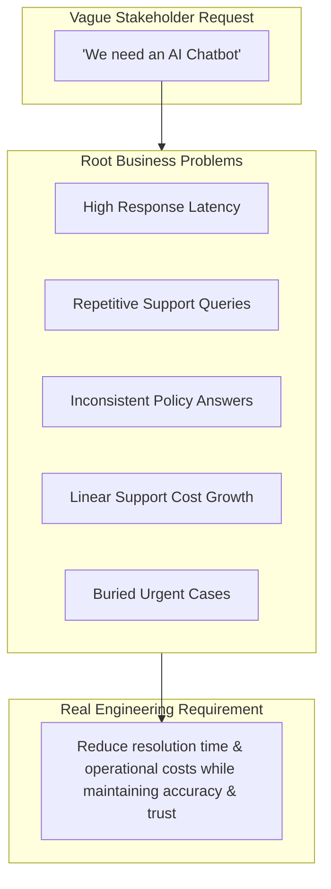
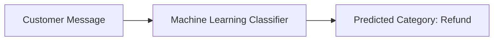
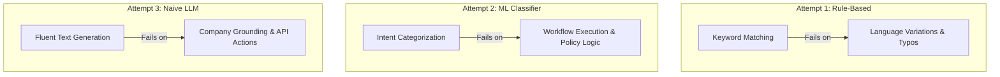
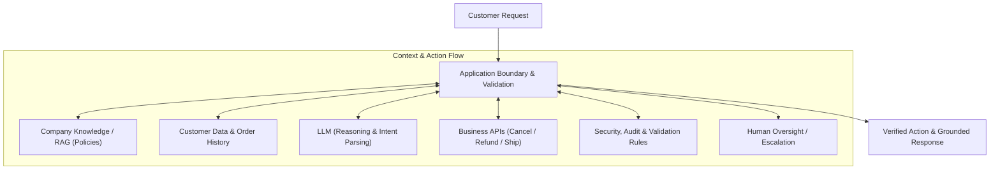
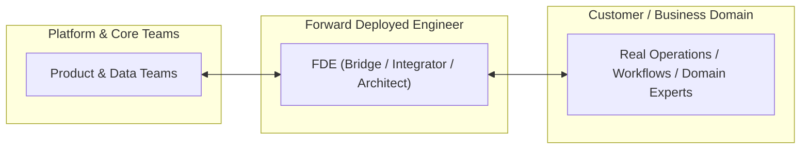
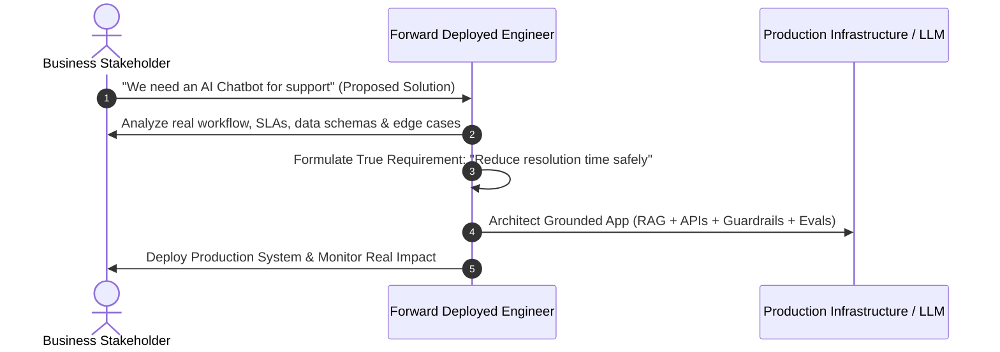

# Chapter 1: Introduction to Forward Deployed Engineering (FDE)

## 1.1 From a Business Problem to a Real Engineering Solution

### The E-Commerce Case Study
Consider a large e-commerce enterprise receiving **50,000 customer-support requests every day**. Customers submit queries ranging across multiple categories and operational issues:

- *"Where is my order?"* / *"Track my package."*
- *"I received the wrong product."*
- *"Can I return an item after 15 days?"*
- *"My payment was deducted, but the order was not created."*
- *"Please cancel my order and initiate a refund."*
- *"The delivery agent marked my order as delivered, but I never received it."*

When business stakeholders approach engineering teams, they often phrase their requirement as:
> **"We want an AI chatbot that can answer customer questions."**

### Finding the Real Requirement
From a software and systems engineering perspective, a statement like *"We want an AI chatbot"* is merely a **proposed solution**, not the actual requirement. It provides minimal clarity on system constraints, data sources, security boundaries, or operational goals.

Business leadership does not care about having a chatbot for its own sake. They care about resolving underlying operational pain points:
1. **Response Delays:** Customers waiting too long for responses.
2. **Repetitive Workload:** Support executives repeatedly answering identical, routine questions.
3. **Inconsistency:** Different support representatives providing conflicting policy answers.
4. **Scalability Bottlenecks:** Support headcount and operational costs scaling linearly with revenue/order volume.
5. **High-Priority Neglect:** Critical/urgent cases getting buried under thousands of routine inquiries.
6. **Cross-Departmental Friction:** Customers bouncing between multiple departments for a single order issue.
7. **Unavailability:** Inability to support customers outside standard working hours.

Therefore, the **true engineering requirement** is:
> **"Reduce the time required to resolve customer problems without reducing accuracy or customer trust."**



---

## 1.2 Iterative Architectural Attempts

To understand why modern LLM systems are built the way they are, we trace the evolution of technical attempts to solve this support problem.

### Attempt 1: Rule-Based Customer Support
Before machine learning, software engineers attempted to build rule-based systems using explicit conditional logic:

```text
IF message contains "order status" THEN show order tracking page
IF message contains "refund"       THEN show refund policy
IF message contains "cancel"       THEN show cancellation instructions
```

#### Why Handwritten Rules Fail:
- **Natural Language Diversity:** Humans do not communicate via standard system commands. One user asks *"Where is my order?"*, while another states *"It has been seven days and my package has not arrived"*, and another writes in Hinglish *"Mera order kha ha"*.
- **Typos & Abbreviations:** Spelling mistakes (*"recieved"*, *"pkg"*) break rigid string matches.
- **Contextual Complexity:** Rules conflict, fail to track previous conversation state, and struggle with multi-part questions (*"Cancel my order and refund to my original card because it arrived damaged"*).

### Attempt 2: Machine Learning Intent Classification
To handle linguistic variations, engineers trained Machine Learning (ML) classifiers (e.g., Naïve Bayes, SVMs, or BERT-based classifiers) to map incoming text to pre-defined categories:

| Customer Input Example | Predicted Intent Category |
| :--- | :--- |
| *"Where is my package?"* | `Order_Status` |
| *"Cancel my purchase"* | `Cancellation` |
| *"When will I get my money back?"* | `Refund` |
| *"The product arrived broken"* | `Damaged_Product` |



#### The Limitation of Classification:
Classification categorizes the message, but **it does not resolve the customer's problem**. Identifying that a message belongs to `Refund` does not automatically:
- Read and evaluate company refund policies against order delivery timestamps.
- Fetch order details from internal databases.
- Verify customer identity and permissions.
- Calculate refund eligibility or execute the API refund call.
- Handle edge cases or escalate to human managers cleanly.

### Attempt 3: Naïve General-Purpose LLM Integration
With Large Language Models (LLMs), developers pass customer questions directly to an LLM:

```text
System: You are a customer-support assistant. Answer the customer's question.
User: Can I return a laptop after 20 days?
LLM Output: Yes, laptops can be returned within 30 days of delivery.
```

#### The Grounding & Reliability Gap:
The LLM response sounds fluent, authoritative, and professional. However, if the company's actual policy allows laptop returns for **only 7 days**, the LLM's answer is **factually incorrect and legally binding**.

> **Crucial Engineering Principle:**  
> **Generating a fluent answer and generating a correct business answer are two completely different problems.**

A general-purpose LLM does not inherently possess private enterprise context:
- Current company policies and recent terms updates.
- Real-time customer order history and shipping state.
- Inventory levels and payment gateway transaction logs.
- Internal authorization and security rules.



---

## 1.3 Production-Grade Grounded AI System Architecture

To convert an LLM from an ungrounded text generator into a reliable production system, software engineers build a **grounded application layer** around the model.

Text generation is not an action. When a customer requests: *"Cancel my order and refund my payment"*, the LLM output *"Your order has been cancelled"* does not execute a database transaction. A production architecture must coordinate state and execution:



### Key Production Engineering Considerations:
1. **Authorization:** Is the authenticated user authorized to modify or cancel this specific order ID?
2. **State Validation:** Has the order already been shipped or processed by the warehouse?
3. **Execution Safety:** Should an LLM directly invoke write/delete APIs, or generate structured tool-call requests validated by application code?
4. **Human-in-the-Loop:** Does the refund amount exceed an automatic approval threshold requiring manager authorization?
5. **Observability & Auditability:** Are all LLM prompts, retrieved contexts, and API actions logged with deterministic trace IDs?
6. **Latency & Cost:** What is the per-token cost and end-to-end response latency across LLM providers?

---

## 1.4 What is a Forward Deployed Engineer (FDE)?

### Deconstruct the Term: "Forward Deployed"
- **Deployed:** Unlike traditional software engineers who remain isolated within core platform development, an FDE is embedded directly near the operational frontlines—working with customers, business stakeholders, operations teams, and domain experts.
- **Forward:** Operating at the boundary where raw business domain problems meet technical software architecture.



### Definition of a Forward Deployed Engineer
> **A Forward Deployed Engineer (FDE) is a software engineer who works closely with customers or operational teams to understand high-impact domain problems, architect technical solutions around real enterprise systems, and drive those solutions into production.**

### Core Competency Spectrum of an FDE:
- **Software Engineering:** Writing production-grade code, designing clean APIs, and managing distributed data pipelines.
- **Product Thinking:** Translating vague user complaints into rigorous technical specifications.
- **System Architecture:** Integrating AI models with legacy enterprise databases, auth systems, and third-party microservices.
- **Rapid Prototyping & Evaluation:** Building production proofs-of-concept and setting up quantitative evaluation benchmarks (Evals).
- **Production Delivery & Maintenance:** Ensuring security, low latency, cost efficiency, observability, and smooth handoff to core engineering.

### Request vs. Requirement Discovery Workflow


