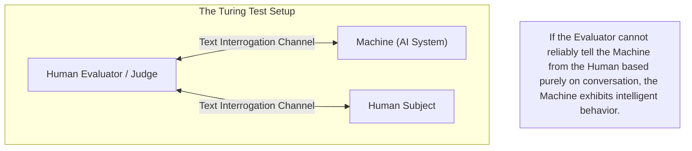
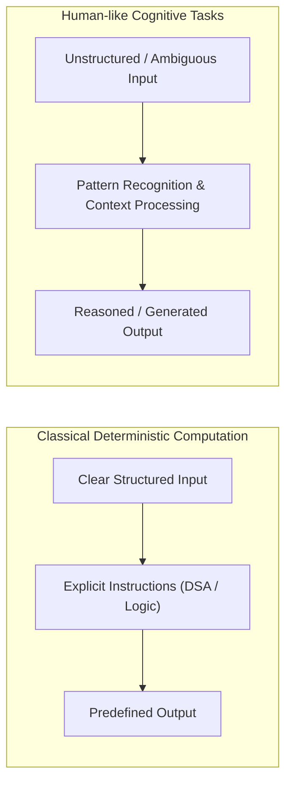
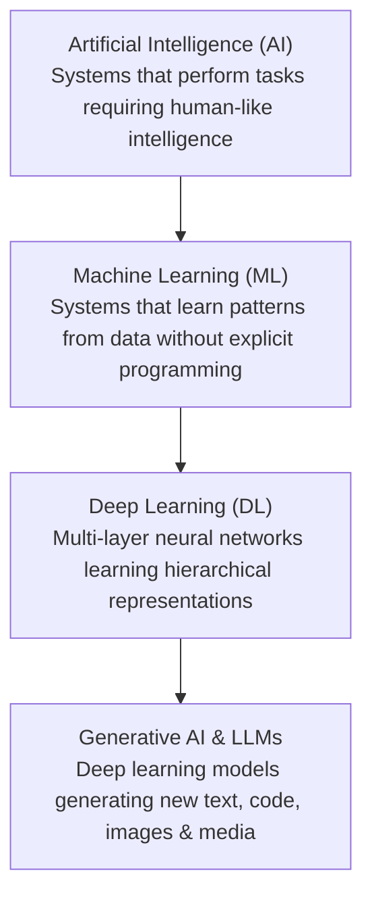
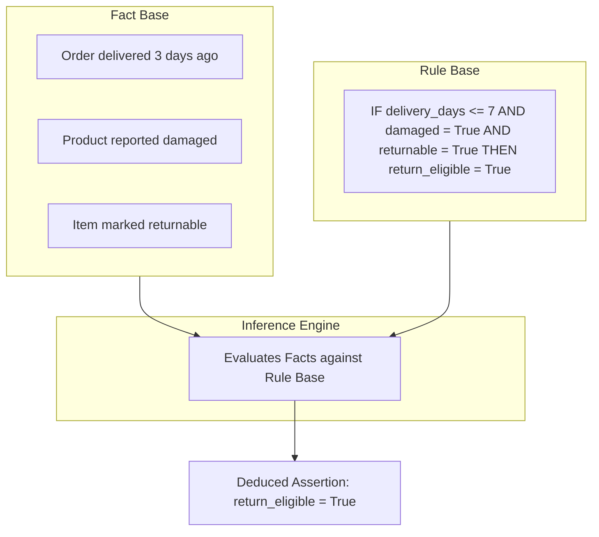
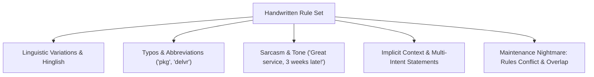

# Chapter 2: Foundations of Artificial Intelligence & Rule-Based Systems

## 2.1 The Origins of Artificial Intelligence

### Turing's Fundamental Question (1950)
The formal conceptual foundation of Artificial Intelligence traces back to Alan Turing’s seminal 1950 paper, *Computing Machinery and Intelligence*. Turing opened the paper with a simple yet profound question:
> **"Can machines think?"**

Recognizing that defining "thinking" leads to endless philosophical debate, Turing proposed an empirical operational test known as the **Turing Test** (originally the *Imitation Game*).



The key insight of the Turing Test was shifting the focus from abstract internal consciousness to **observable intelligent behavior**:
- Understanding written natural language.
- Maintaining contextual consistency.
- Formulating coherent responses based on reasoning.

In 1956, **John McCarthy** officially coined the term **"Artificial Intelligence"** at the Dartmouth Conference, defining the field as the science and engineering of making intelligent machines.

---

## 2.2 Classical Computing vs. Intelligent Behavior

Traditional computer programming is built on deterministic execution where human engineers supply explicit, step-by-step algorithms:

```text
Input (20, 30) + Operation (ADD) ---> Output (50)
```

Constructs like variables, conditions, loops, recursion, and data structures excel when:
1. **Inputs are well-defined and structured.**
2. **The exact procedural steps can be mapped out in advance.**
3. **The output is completely deterministic.**



Human cognitive tasks—such as recognizing handwritten text, understanding sarcastic conversation, navigating unfamiliar physical environments, or extracting intent—cannot be reduced to rigid static algorithms.

---

## 2.3 The Hierarchy of Artificial Intelligence

Artificial Intelligence is a broad umbrella discipline. Generative AI and Large Language Models represent a specific modern subset within this larger taxonomy:



---

## 2.4 Rule-Based AI & Expert Systems

Early AI research (1960s–1980s) focused on **Symbolic AI** and **Rule-Based Systems** (also called **Expert Systems**). The central premise was: if human experts make decisions based on domain rules, machines can replicate expertise if humans explicitly encode those rules.

### Core Architecture of a Rule-Based System
A standard expert system consists of three structural components:
1. **Fact Base (Knowledge Base):** State variables representing current true facts about the world.
2. **Rule Base:** A set of `IF (conditions) THEN (actions/assertions)` production rules.
3. **Inference Engine:** The logical engine that matches facts against rules to deduce new facts or trigger actions.



#### Example Implementation in Code:
```java
// Formal Fact & Rule Logic
if (daysSinceDelivery <= 7 && isDamaged && isReturnable) {
    order.setReturnEligible(true);
} else {
    order.setReturnEligible(false);
}
```

---

## 2.5 ELIZA — An Early Conversational Chatbot (1966)

Developed by Joseph Weizenbaum at MIT in 1966, **ELIZA** was one of the earliest conversational programs. ELIZA simulated a Rogerian psychotherapist primarily through simple pattern matching and substitution rules.

### Mechanism of Action:
ELIZA decomposed user strings using template rules and swapped pronouns to reflect responses:

```text
User Input:   "I am feeling unhappy."
Rule Match:   "I am <X>"  --> Transform to: "Why are you <X>?"
ELIZA Output: "Why are you feeling unhappy?"

User Input:   "My friends do not understand me."
Rule Match:   "My <Y> do not <Z>" --> Transform to: "Why do you think your <Y> do not <Z>?"
ELIZA Output: "Why do you think your friends do not understand you?"
```

### The "Illusion of Understanding"
ELIZA created a convincing illusion of human empathy and comprehension. Users frequently attributed deep emotional intelligence and understanding to the machine, despite ELIZA having zero internal world model, memory, or factual reasoning.

> **Key Takeaway for Modern AI Engineers:**  
> **Conversational fluency does not imply factual reliability.** A system can produce syntactically flawless text while remaining completely ignorant of facts, truth, or underlying context.

---

## 2.6 Why Handwritten Rules Do Not Scale

While rule-based logic works for rigid deterministic software, it fails catastrophically when applied to open-domain natural language.

### The Combinatorial Explosion Problem
Consider building a rule-based support parser for just one category: `Order_Tracking`. A human customer can express this single intent in thousands of ways:

- *"Where is my order?"*
- *"Track my package."*
- *"My parcel has not arrived."*
- *"Delivery kab hogi?"* (Hinglish)
- *"Order abhi tak nahi mila."*
- *"The expected delivery date passed yesterday."*
- *"Your app says dispatched, but nothing arrived."*



### Bottlenecks of Symbolic Systems:
1. **Rule Friction & Conflicts:** As the rule count grows into thousands, new rules contradict existing ones.
2. **Brittle Edge Cases:** Any novel phrasing, typo, or slang invalidates the string match.
3. **High Maintenance Cost:** Engineering teams spend endless effort manually crafting patch rules for edge cases.

This fundamental limitation forced the AI community to shift from **manually writing rules** to **learning rules automatically from data**—giving rise to **Machine Learning**.
