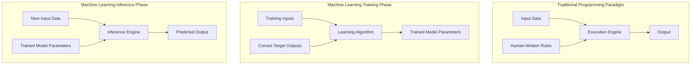
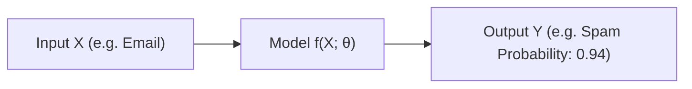
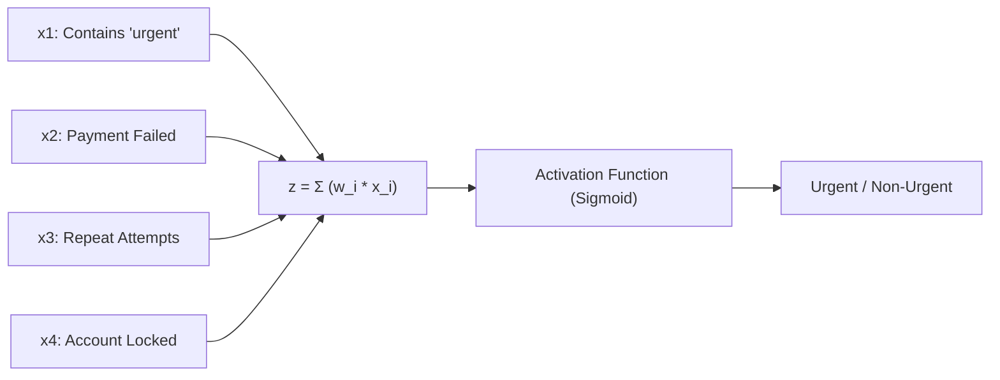
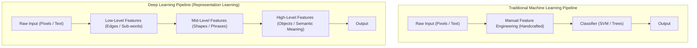
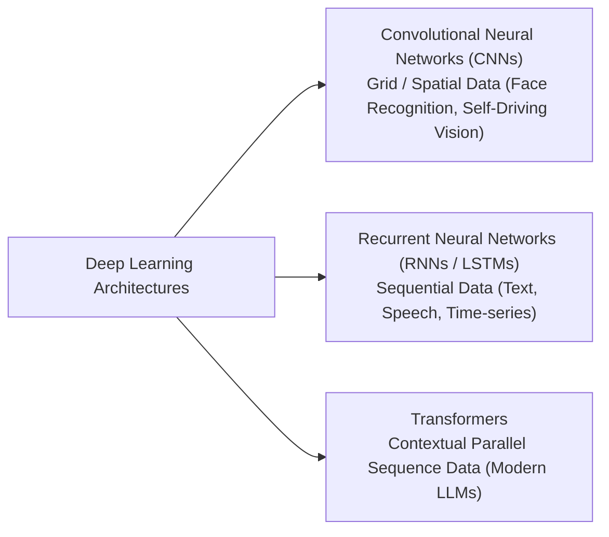

# Chapter 3: Machine Learning & Deep Learning Foundations

## 3.1 The Machine Learning Paradigm Shift

### Learning Patterns Instead of Writing Every Rule
When teaching a human child to identify a dog, we do not define rigid mathematical rules (e.g. *"4 legs, fur, tail, 2 ears"*), because these rules apply equally to cats, wolves, and foxes. Instead, we show many examples: *"This is a dog. This is also a dog. That is a cat."* Over time, the child develops internal visual patterns to classify dogs accurately.

Machine Learning operates on the exact same core principle: **provide labeled training data and allow a learning algorithm to adjust internal numerical parameters until it accurately maps inputs to desired outputs.**

---

## 3.2 Core Terminology & Mechanics

### What is a Model?
At its core mathematical abstraction:
> **A Model is a computational function $f(X; \Theta)$ that maps an input vector $X$ to an output vector $Y$ using learned parameter weights $\Theta$.**

$$Y = f(X; \Theta)$$

- **Training Phase:** Iterative optimization process where training data is fed through the model, errors are evaluated via a loss function, and model parameters $\Theta$ are updated using gradient descent.
- **Inference Phase:** Passing new, unseen inputs $X$ through the frozen model with parameters $\Theta$ to generate predicted outputs $Y$.

### Prompting vs. Model Training
A frequent misconception among software developers is assuming that passing detailed context in a prompt "trains" the LLM.

| Aspect | Model Inference (Prompting) | Model Training (Fine-Tuning / Pretraining) |
| :--- | :--- | :--- |
| **Parameter Impact** | Model parameters $\Theta$ remain **frozen and unchanged**. | Model parameters $\Theta$ are **permanently modified**. |
| **Context Scope** | Temporary input window during execution turn. | Long-term knowledge base encoded in weights. |
| **Resource Cost** | Low latency, compute per API call. | High compute, GPU cluster operations. |

### Supervised vs. Unsupervised Learning
- **Supervised Learning:** Training data includes pairs of inputs and ground-truth labels (e.g. `Email` $\rightarrow$ `Spam / Not Spam`).
- **Unsupervised Learning:** The model analyzes unlabelled data to discover inherent structural patterns or clusters (e.g. grouping 100,000 uncategorized support tickets into operational clusters: *Delivery Issues*, *Payment Failures*, *Product Defects*).

> **Critical Warning:** **Machine Learning does not automatically learn objective truth.** Models learn statistical correlations present in their training data. If training data is biased, outdated, or incomplete, the model output will reflect those exact flaws.

---

## 3.3 The Bottleneck of Traditional ML: Feature Engineering

Before Deep Learning, traditional machine learning models (e.g. Logistic Regression, Decision Trees, SVMs) required **Feature Engineering**—the manual transformation of raw input data into numerical feature vectors by human domain experts.

### Synthetic Neuron Linear Classifier Example
Consider predicting whether a customer support ticket is **Urgent** ($z$):

$$\text{Urgency Score } z = w_1 x_1 + w_2 x_2 + w_3 x_3 + w_4 x_4$$

Where human engineers hand-craft explicit input features:
- $x_1$: Binary flag — Contains the keyword `"urgent"`.
- $x_2$: Binary flag — Payment status is `Failed`.
- $x_3$: Integer count — Number of previous support attempts by customer.
- $x_4$: Binary flag — Customer account is `Locked`.
- $w_1, w_2, w_3, w_4$: Parameter weights learned by the linear model.

### Why Feature Engineering Became a Severe Bottleneck:
1. **Enormous Human Effort:** Engineers had to manually construct hundreds of domain-specific features for every distinct problem.
2. **Human Blindspots:** Humans frequently fail to spot complex, non-linear feature interactions in high-dimensional data.
3. **Zero Transferability:** Feature sets designed for text intent classification provided zero utility for image recognition or audio processing.

---

## 3.4 Deep Learning & Representation Learning

**Deep Learning** solved the feature engineering bottleneck by introducing multi-layered artificial neural networks capable of **Representation Learning**.

Instead of relying on human engineers to hand-craft features, Deep Learning models learn hierarchical feature representations directly from raw, unstructured data (pixels, raw text, audio waveforms).

### Hierarchical Feature Extraction Example (Computer Vision):
- **Layer 1 (Input):** Raw pixel brightness values.
- **Layer 2 (Low-Level):** Detects lines, edges, and contrast boundaries.
- **Layer 3 (Mid-Level):** Combines edges into geometric shapes, eyes, and noses.
- **Layer 4 (High-Level):** Combines shapes into full facial representations or dog breeds.
- **Layer 5 (Output):** Final classification prediction.

### Architectural Specialization in Deep Learning
As neural network research matured, specialized architectures emerged for different data modalities:

