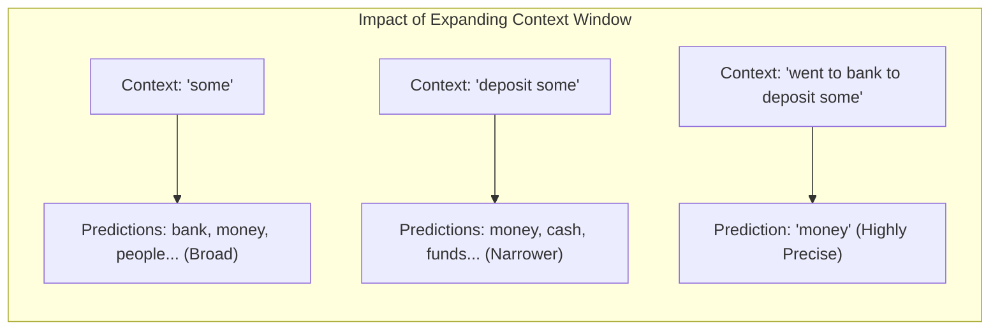
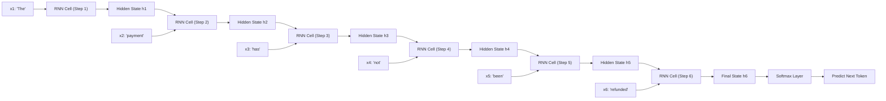
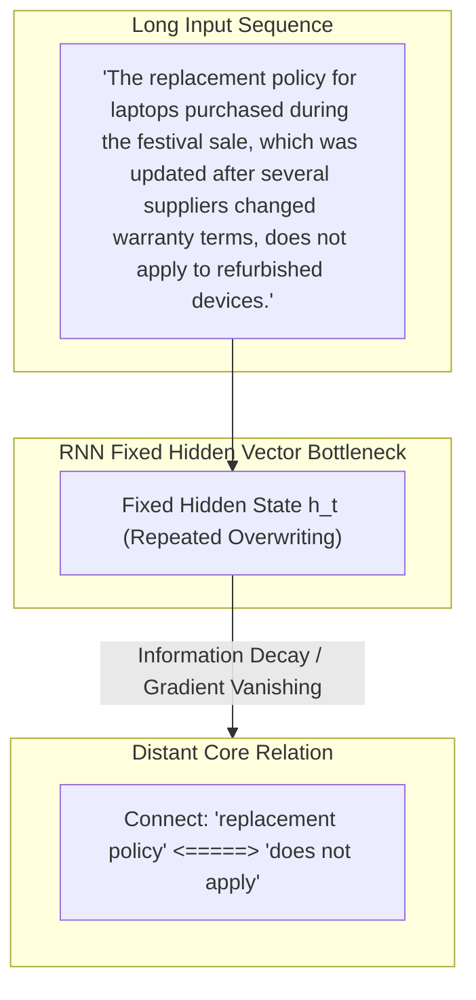

# Chapter 4: Language Modeling, Statistical N-Grams & Recurrent Neural Networks

## 4.1 Why Natural Language Processing (NLP) is Uniquely Hard

Computers process clear, structured numerical tables efficiently, but human natural language presents distinct linguistic hurdles that traditional software algorithms cannot handle easily.

### Key Linguistic Challenges:
1. **Context Sensitivity & Polysemy:** The identical word carries vastly different meanings based on surrounding words.
   - *"I deposited money in the **bank**."* $\rightarrow$ Financial Institution
   - *"We sat on the **bank** of the river."* $\rightarrow$ River Edge
2. **Word Order Significance:** Changing word positions alters complete semantic meaning.
   - *"The dog chased the man."* $\neq$ *"The man chased the dog."*
3. **Negations:** A single token reverses the truth condition of an entire document.
   - *"The customer **received** the refund."* vs. *"The customer **did not receive** the refund."*
4. **Pronoun Coreference Resolution:** Resolving ambiguous pronouns requires contextual world knowledge.
   - *"Aditya placed the laptop on the table because **it** was heavy."* ($\text{it} \rightarrow \text{laptop}$)
   - *"Aditya placed the laptop on the table because **it** was unstable."* ($\text{it} \rightarrow \text{table}$)
5. **Sarcasm, Pragmatics & Tone:**
   - *"Amazing service. My order is only three weeks late!"*  
     Keyword filters flag *"Amazing service"* as positive sentiment; humans recognize negative sarcasm instantly.
6. **Productive Nature of Language:** Humans constantly synthesize unique sentences never spoken before. A system cannot memorize all sentences; it must learn generative rules that generalize.

---

## 4.2 Statistical Language Models & N-Grams

A **Language Model** estimates the probability distribution over sequences of words and predicts likely upcoming tokens given preceding context:

$$P(w_1, w_2, \dots, w_m) = \prod_{i=1}^{m} P(w_i \mid w_1, w_2, \dots, w_{i-1})$$

### Frequency-Based Statistical Counting
Before neural networks, statistical language models estimated probabilities by counting word occurrences in massive text corpora.

#### Example Calculation:
Suppose our training corpus contains three sentences:
1. *"I **like machine** learning."*
2. *"I **like Java** programming."*
3. *"Students **like machine** learning."*

We observe that following the word **"like"**:
- **"machine"** appears 2 times.
- **"Java"** appears 1 time.

The maximum likelihood conditional probabilities are:

$$P(\text{machine} \mid \text{like}) = \frac{2}{3} \approx 66.7\%$$

$$P(\text{Java} \mid \text{like}) = \frac{1}{3} \approx 33.3\%$$

---

### N-Gram Models
An **N-Gram** is a continuous sequence of $N$ items (words/tokens).

- **Unigram ($N=1$):** Single tokens evaluated independently ($P(w_i)$).
- **Bigram ($N=2$):** Predicts next word using 1 previous word context ($P(w_i \mid w_{i-1})$).
- **Trigram ($N=3$):** Predicts next word using 2 previous words context ($P(w_i \mid w_{i-2}, w_{i-1})$).

### Major Limitations of N-Gram Models:
1. **The Sparsity Problem:** If a specific $N$-gram sequence (e.g. *"The buyer asked for reimbursement"*) never appeared in the training corpus, the model assigns it a probability of $0$, failing to generalize.
2. **Zero Semantic Understanding:** Count-based models treat `"customer"` and `"buyer"`, or `"refund"` and `"reimbursement"`, as completely unrelated distinct tokens.
3. **Severe Context Truncation:** Increasing $N$ to capture longer context causes exponential growth in memory parameters ($V^N$, where $V$ is vocabulary size).

---

## 4.3 Neural Language Models & Recurrent Neural Networks (RNNs)

To overcome N-gram sparsity, neural networks were introduced to project words into continuous vector spaces (embeddings) and process sequence data dynamically.

### Sequential Processing in RNNs
A **Recurrent Neural Network (RNN)** processes language sequentially, token by token, maintaining a hidden state vector $h_t$ that acts as a recurrent memory:

$$h_t = \tanh(W_{hh} h_{t-1} + W_{xh} x_t + b_h)$$

---

## 4.4 The Information Bottleneck & Long-Range Dependency Problem

While RNNs naturalized sequence processing and preserved word order, they introduced a major structural flaw when sequence lengths grew.

### The Information Bottleneck
An RNN compresses all historical context from hundreds of preceding words into a **single fixed-size hidden state vector $h_t$**.

Imagine reading a 20-page legal policy line-by-line while forced to maintain only a single sticky note of total notes. By the time you reach page 20, critical details from page 1 have been overwritten or diluted.

### The Long-Range Dependency Challenge
A **Long-Range Dependency** occurs when interpreting a word near the end of a document requires exact reference information located far back at the beginning.

In long texts:
- **Gradient Vanishing / Exploding:** Backpropagation through time across many steps causes gradient signals to vanish or explode.
- **Early Context Decay:** Information from early tokens gets drowned out by intermediate filler tokens.

Solving this severe sequential bottleneck required a fundamental paradigm shift away from recurrent step-by-step processing—leading directly to the **Attention Mechanism** and **Transformer Architecture**.
