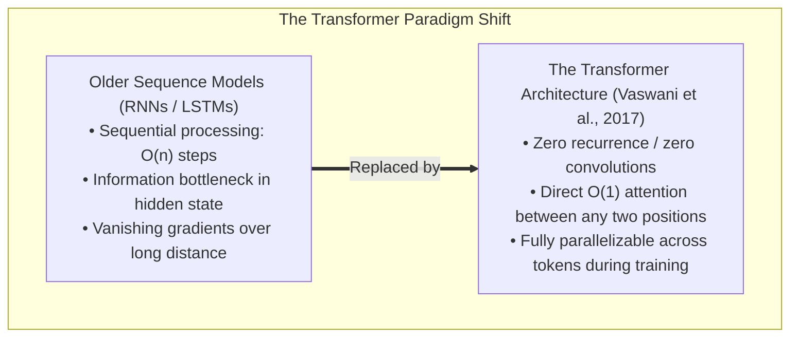
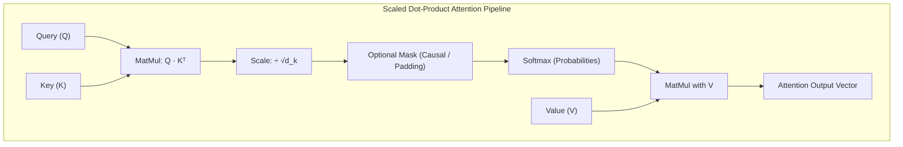
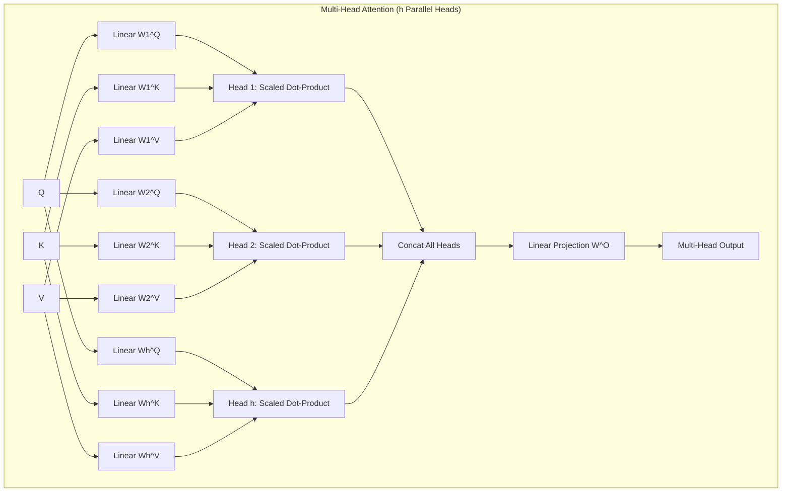
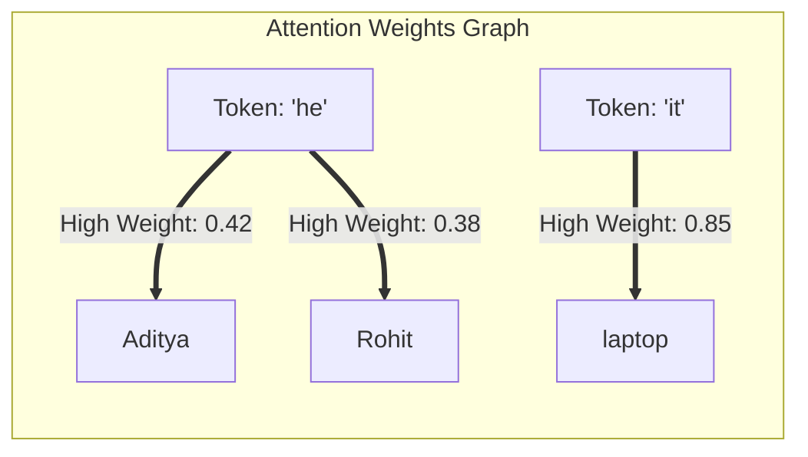
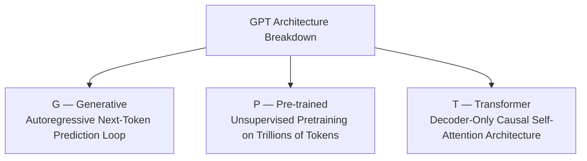
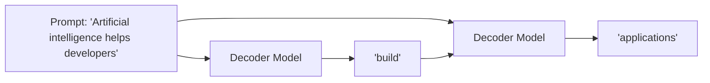

# Chapter 5: Attention Mechanism, Transformers & Modern LLMs

## 5.1 The Attention Breakthrough & "Attention Is All You Need"

In June 2017, Google researchers published the seminal paper [**"Attention Is All You Need"** (Vaswani et al., arXiv:1706.03762)](https://arxiv.org/pdf/1706.03762), introducing the **Transformer Architecture**. This paper triggered a massive paradigm shift in Artificial Intelligence by dispensing with recurrence (RNNs, LSTMs) and convolutions entirely, building sequence models based **solely on attention mechanisms**.



---

## 5.2 Mathematical Mechanics of Attention

Attention can be understood mathematically as a database retrieval mechanism where a set of **Queries ($Q$)**, **Keys ($K$)**, and **Values ($V$)** are mapped to an output.

### 1. Scaled Dot-Product Attention
Given matrices $Q$ (Query), $K$ (Key), and $V$ (Value), where $d_k$ is the dimensionality of the keys:

$$\text{Attention}(Q, K, V) = \text{softmax}\left(\frac{Q K^T}{\sqrt{d_k}}\right) V$$



#### Why Scale by $\frac{1}{\sqrt{d_k}}$?
For large values of $d_k$, the dot products $Q K^T$ grow large in magnitude. Large values push the $\text{softmax}$ function into regions that have **extremely small gradients** (vanishing gradient problem during backpropagation). Dividing by $\sqrt{d_k}$ scales the variance of the dot products back to $1.0$, keeping gradients healthy and training stable.

---

### 2. Multi-Head Attention (MHA)
Instead of computing a single attention function over $d_{\text{model}}$-dimensional vectors, the Transformer projects queries, keys, and values $h$ times with different, learned linear projections to $d_k$, $d_k$, and $d_v$ dimensions.

$$\text{MultiHead}(Q, K, V) = \text{Concat}(\text{head}_1, \text{head}_2, \dots, \text{head}_h) W^O$$

$$\text{where } \text{head}_i = \text{Attention}(Q W_i^Q, K W_i^K, V W_i^V)$$

Where projection parameter matrices are:
- $W_i^Q \in \mathbb{R}^{d_{\text{model}} \times d_k}$
- $W_i^K \in \mathbb{R}^{d_{\text{model}} \times d_k}$
- $W_i^V \in \mathbb{R}^{d_{\text{model}} \times d_v}$
- $W^O \in \mathbb{R}^{h d_v \times d_{\text{model}}}$



#### Why Multi-Head Attention?
Multi-Head Attention allows the model to **jointly attend to information from different representation subspaces at different positions simultaneously**:
- **Head 1:** Focuses on syntactic coreference (e.g. connecting *"he"* $\rightarrow$ *"Aditya"*).
- **Head 2:** Focuses on semantic verb-object relationships (e.g. connecting *"needed"* $\rightarrow$ *"laptop"*).
- **Head 3:** Focuses on temporal sequence markers or positional offsets.

---

## 5.3 The Transformer Architecture (Encoder-Decoder)

The original Transformer proposed in Vaswani et al. (2017) uses an **Encoder-Decoder** architecture designed for sequence-to-sequence translation tasks.

```mermaid
flowchart TD
    subgraph Transformer_Full_Architecture ["Original Transformer Architecture (Vaswani et al., 2017)"]
        
        subgraph Encoder_Stack ["Encoder Stack (N = 6 Layers)"]
            InEmb["Input Token Embeddings"] + PosEnc1["Positional Encodings"] --> EncLayer["Encoder Layer N"]
            
            subgraph Enc_Sublayer ["Encoder Block"]
                MHA_Enc["Multi-Head Self-Attention"] --> AddNorm1["Add & LayerNorm"]
                AddNorm1 --> FFN_Enc["Feed Forward Network (FFN)"] --> AddNorm2["Add & LayerNorm"]
            end
            
            EncLayer --> EncOut["Encoder Context Representation"]
        end

        subgraph Decoder_Stack ["Decoder Stack (N = 6 Layers)"]
            OutEmb["Output Token Embeddings (Shifted Right)"] + PosEnc2["Positional Encodings"] --> DecLayer["Decoder Layer N"]
            
            subgraph Dec_Sublayer ["Decoder Block"]
                MaskedMHA["Masked Multi-Head Self-Attention (Causal)"] --> AddNormDec1["Add & LayerNorm"]
                AddNormDec1 & EncOut --> CrossMHA["Multi-Head Cross-Attention (Q:Dec, K/V:Enc)"] --> AddNormDec2["Add & LayerNorm"]
                AddNormDec2 --> FFN_Dec["Feed Forward Network (FFN)"] --> AddNormDec3["Add & LayerNorm"]
            end
            
            DecLayer --> LinearLogits["Linear Layer & Softmax"] --> TargetProb["Output Probabilities (Next Token)"]
        end
    end
```

### Component Breakdown:

1. **Positional Encodings (Sinusoidal Encodings):**  
   Because the Transformer contains no recurrence or convolutions, it has no inherent sense of token order. To inject positional information, sinusoidal encodings are added to input embeddings:
   
   $$PE_{(pos, 2i)} = \sin\left(\frac{pos}{10000^{2i/d_{\text{model}}}}\right)$$
   $$PE_{(pos, 2i+1)} = \cos\left(\frac{pos}{10000^{2i/d_{\text{model}}}}\right)$$
   
   *Benefit:* Enables the model to easily learn relative positional relationships ($PE_{pos+k}$ can be represented as a linear function of $PE_{pos}$).

2. **Position-wise Feed-Forward Networks (FFN):**  
   Applied to each position separately and identically:
   
   $$\text{FFN}(x) = \max(0, x W_1 + b_1) W_2 + b_2$$

3. **Residual Connections & Layer Normalization:**  
   Every sub-layer uses residual connections followed by Layer Normalization:
   
   $$\text{Output} = \text{LayerNorm}(x + \text{SubLayer}(x))$$

---

## 5.4 Self-Attention vs. Recurrent vs. Convolutional Layers

Vaswani et al. (2017) explicitly compared Self-Attention against Recurrent and Convolutional layers across three metrics:

| Layer Type | Computational Complexity per Layer | Sequential Operations ($O$) | Maximum Path Length |
| :--- | :--- | :--- | :--- |
| **Self-Attention** | $O(n^2 \cdot d)$ | $O(1)$ | $O(1)$ |
| **Recurrent (RNN / LSTM)** | $O(n \cdot d^2)$ | $O(n)$ | $O(n)$ |
| **Convolutional** | $O(k \cdot n \cdot d^2)$ | $O(1)$ | $O(\log_k(n))$ |

- **$n$**: Sequence length.
- **$d$**: Representation dimension.
- **$k$**: Kernel size of convolution.

### Key Conclusions from the Paper:
1. **$O(1)$ Sequential Operations:** Self-attention connects all positions with a constant number of executed operations, enabling maximum GPU parallelization during training.
2. **$O(1)$ Maximum Path Length:** Shortest path length between any distant tokens prevents gradient vanishing across long documents.

---

## 5.5 Pronoun Coreference & Disambiguation Examples

### Pronoun Coreference Resolution via Attention
Consider:
> **"Aditya gave Rohit the laptop because he needed it for work."**

Self-attention dynamically resolves ambiguous pronouns:
- When processing the token **"he"**, attention assigns highest weights to **"Aditya"** and **"Rohit"**.
- When processing the token **"it"**, attention assigns highest weight to **"laptop"**.



### Context-Dependent Polysemy Disambiguation
- **Sentence A:** *"I **deposited money** in the **bank**."*  
  Token `"bank"` attends to `"deposited"` and `"money"` $\rightarrow$ Activated representation: **Financial Institution**.
- **Sentence B:** *"We **sat** on the **bank** of the **river**."*  
  Token `"bank"` attends to `"sat"` and `"river"` $\rightarrow$ Activated representation: **Geographic Shore**.

---

## 5.6 Attention Is Not Intelligence by Itself

While Attention provides a mathematical mechanism for weighting contextual relevance, **it does not constitute complete intelligence or factual verification by itself.**

> **Critical Distinction for FDEs:**  
> An attention mechanism **does not guarantee** that a model:
> 1. Verifies if a generated claim is factually true.
> 2. Accesses live internet or private enterprise database records.
> 3. Can safely execute write/delete database operations.
> 4. Will not hallucinate confident false statements.

---

## 5.7 Modern LLMs & Anatomy of GPT (Decoder-Only Architecture)

Modern LLMs evolved from the original Encoder-Decoder Transformer into **Decoder-Only Architectures** (such as OpenAI's GPT series, Meta's Llama, and Google's Gemini decoder variants). In **December 2022**, OpenAI released **ChatGPT**, demonstrating the power of decoder-only LLMs at global scale.

### Deconstructing GPT: **G — P — T**



### 1. **G — Generative**
Generates text autoregressively through **repeated next-token prediction**:

$$x_{t+1} \sim P(x \mid x_1, x_2, \dots, x_t)$$



### 2. **P — Pre-Trained**
Pre-trained on massive datasets $\rightarrow$ creates a general-purpose foundation model adaptable across support, coding, search, and document analysis.

### 3. **T — Transformer (Decoder-Only)**
GPT models specifically utilize a **Decoder-Only Transformer**. The Decoder uses a **Causal Mask** in its self-attention layer, enforcing that position $t$ can only attend to previous tokens $<t$, ensuring the model cannot "look into the future" during next-token generation.
