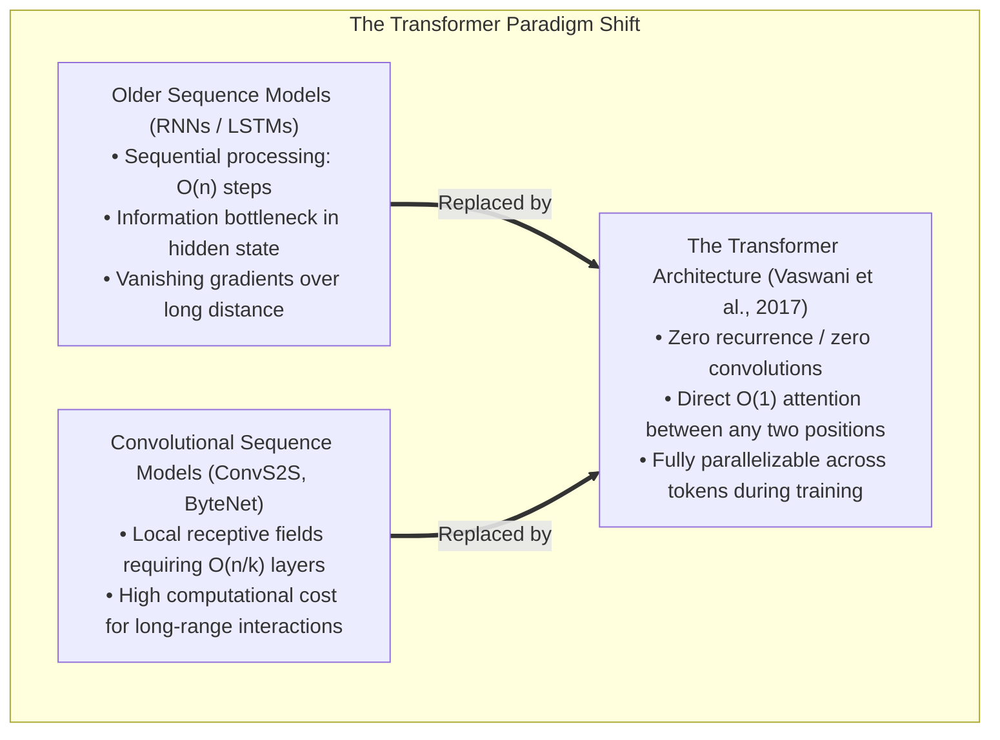
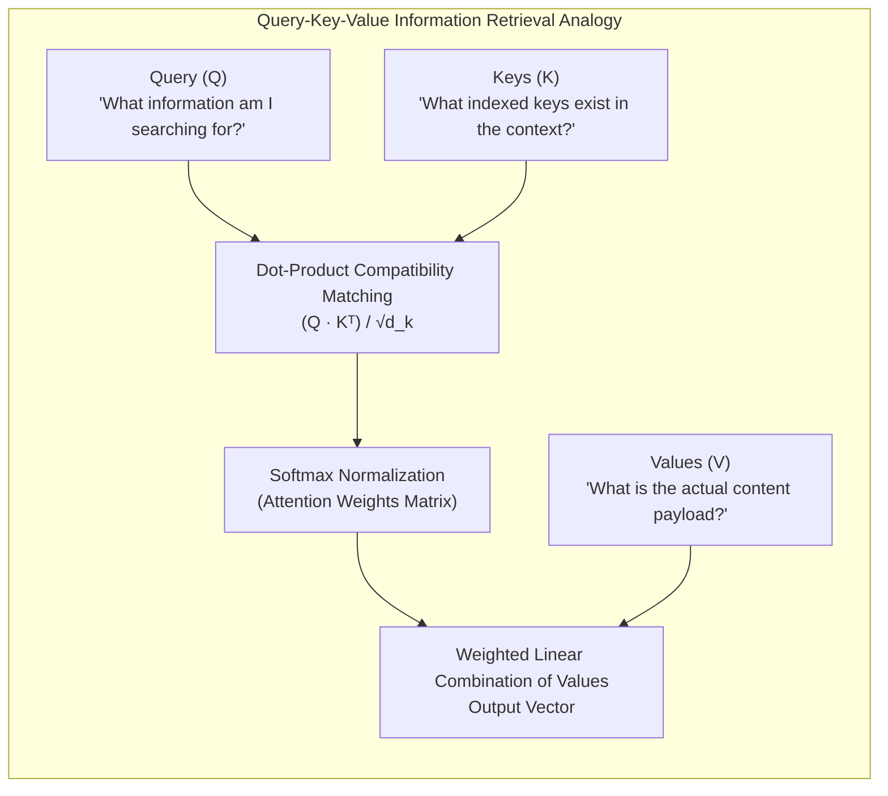
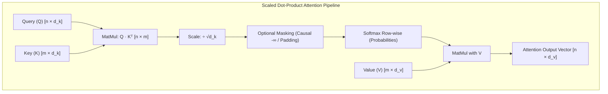
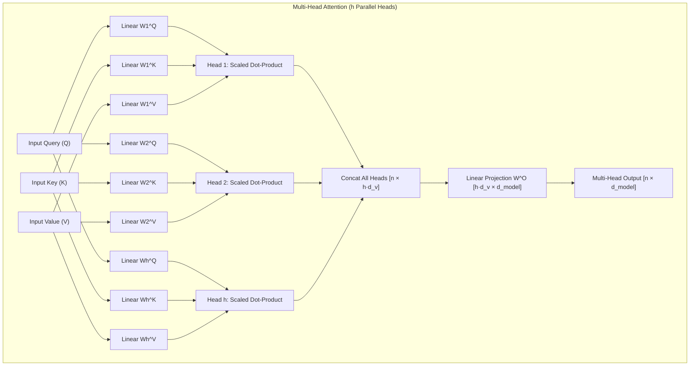
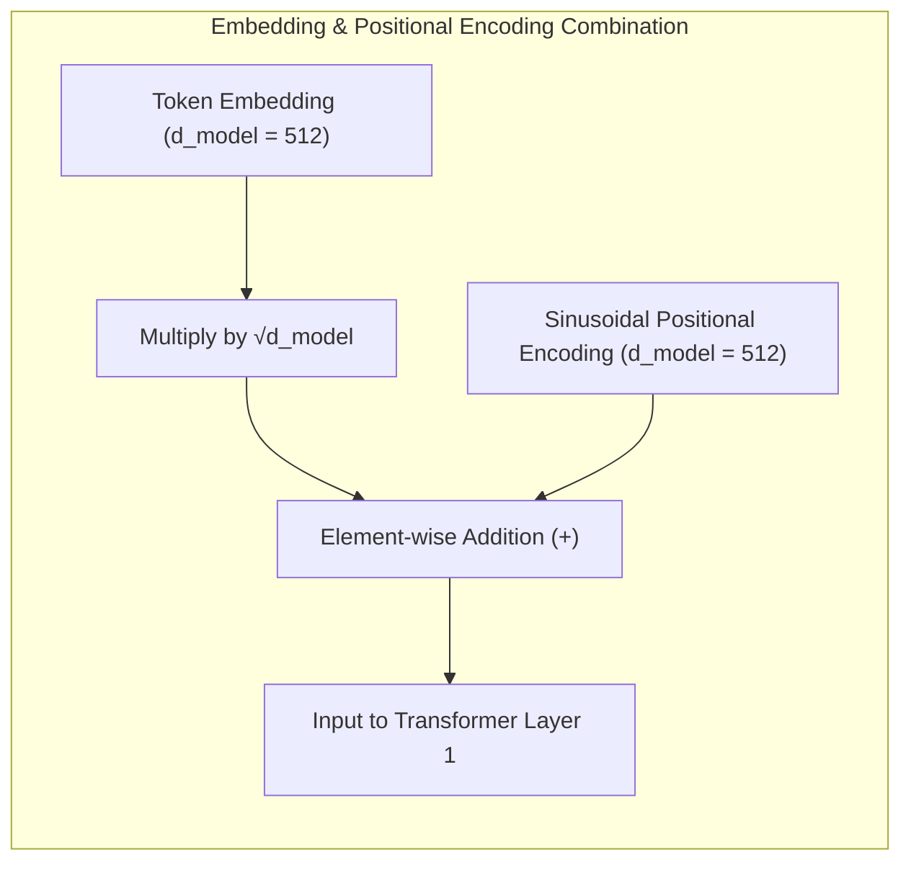
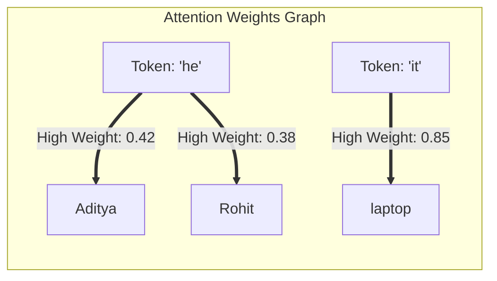
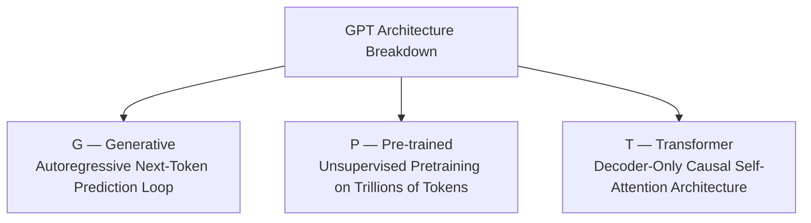

# Chapter 5: Attention Mechanism, Transformers & Modern LLMs

## 5.1 The Attention Breakthrough & "Attention Is All You Need"

In June 2017, Google researchers published the seminal paper [**"Attention Is All You Need"** (Vaswani et al., arXiv:1706.03762)](https://arxiv.org/pdf/1706.03762), introducing the **Transformer Architecture**. This paper triggered a massive paradigm shift in Artificial Intelligence by dispensing with recurrence (RNNs, LSTMs, GRUs) and convolutions entirely, building sequence models based **solely on attention mechanisms**.



### Historical Context & Why Recurrence / Convolutions Failed
Prior to 2017, state-of-the-art sequence transduction relied on Recurrent Neural Networks (RNNs) or Convolutional Neural Networks (CNNs) structured in an Encoder-Decoder paradigm:
1. **The Recurrent Constraint ($O(n)$ Sequential Operations):**  
   Recurrent models factor computation along symbol positions, computing hidden states $h_t = f(h_{t-1}, x_t)$. This sequential dependency prevents parallelization *within* a training example. Memory constraints prevent scaling batch sizes across long sequence lengths $n$.
2. **The Convolutional Path Length Constraint ($O(n/k)$ or $O(\log_k n)$ Steps):**  
   Convolutional models (e.g., ConvS2S, ByteNet) compute representations in parallel, but the number of operations required to relate signals from two arbitrary positions grows with distance—linearly $O(n/k)$ for ConvS2S or logarithmically $O(\log_k n)$ for dilated convolutions. This makes learning long-distance dependencies difficult.
3. **The Transformer Solution ($O(1)$ Operations & Path Length):**  
   The Transformer connects all positions with a constant number of executed operations ($O(1)$ path length), eliminating sequential bottlenecks and enabling complete GPU matrix parallelization during training.

---

## 5.2 Mathematical Mechanics of Attention

Attention can be understood mathematically as a database retrieval mechanism where a set of **Queries ($Q$)**, **Keys ($K$)**, and **Values ($V$)** are mapped to an output representation vector.



### 1. Scaled Dot-Product Attention

Given input matrices $Q \in \mathbb{R}^{n \times d_k}$ (Query), $K \in \mathbb{R}^{m \times d_k}$ (Key), and $V \in \mathbb{R}^{m \times d_v}$ (Value), where $d_k$ is the dimensionality of the keys and queries, and $d_v$ is the dimensionality of the values:

$$\text{Attention}(Q, K, V) = \text{softmax}\left(\frac{Q K^T}{\sqrt{d_k}}\right) V$$



#### Detailed Mathematical Derivation: Why Scale by $\frac{1}{\sqrt{d_k}}$?

The two primary attention compatibility functions are **Additive Attention** (Bahdanau et al.) and **Dot-Product (Multiplicative) Attention**. Dot-product attention is identical to Scaled Dot-Product Attention except for the scaling factor $\frac{1}{\sqrt{d_k}}$.

* **Theoretical & Practical Performance:** While both have similar theoretical complexity, dot-product attention is significantly faster and more space-efficient in practice because it utilizes highly optimized Matrix Multiplication (BLAS / GEMM) operations on modern GPUs.
* **The Variance Problem:** For small values of $d_k$, additive and unscaled dot-product attention perform similarly. However, for large values of $d_k$, unscaled dot-product attention performs significantly worse.
* **Mathematical Proof:**  
  Assume the components of query vector $q \in \mathbb{R}^{d_k}$ and key vector $k \in \mathbb{R}^{d_k}$ are independent random variables with mean $0$ and variance $1$:
  $$\mathbb{E}[q_i] = 0, \quad \text{Var}(q_i) = 1, \quad \mathbb{E}[k_i] = 0, \quad \text{Var}(k_i) = 1$$
  
  The dot product is given by $q \cdot k = \sum_{i=1}^{d_k} q_i k_i$. The expectation of the dot product is:
  $$\mathbb{E}[q \cdot k] = \sum_{i=1}^{d_k} \mathbb{E}[q_i k_i] = \sum_{i=1}^{d_k} \mathbb{E}[q_i] \mathbb{E}[k_i] = 0$$
  
  The variance of the product of two independent variables with zero mean is $\text{Var}(q_i k_i) = \text{Var}(q_i) \text{Var}(k_i) = 1 \cdot 1 = 1$. Therefore:
  $$\text{Var}(q \cdot k) = \sum_{i=1}^{d_k} \text{Var}(q_i k_i) = \sum_{i=1}^{d_k} 1 = d_k$$
  
  Standard deviation of $q \cdot k$ is $\sqrt{d_k}$. As $d_k$ increases, the magnitude of the dot products grows to $\mathcal{O}(\sqrt{d_k})$.
* **Consequence on Softmax & Gradients:**  
  When inputs to the $\text{softmax}(z_i) = \frac{e^{z_i}}{\sum_j e^{z_j}}$ function become large, the softmax function saturates and assigns probability near $1.0$ to the maximum element and near $0.0$ to all others. In these regions, the softmax gradient $\frac{\partial \text{softmax}}{\partial z}$ becomes **vanishingly small**, impeding gradient propagation during backpropagation.
* **The Solution:**  
  Dividing by $\sqrt{d_k}$ rescales the variance of the dot products back to $1.0$:
  $$\text{Var}\left(\frac{q \cdot k}{\sqrt{d_k}}\right) = \frac{1}{d_k} \text{Var}(q \cdot k) = \frac{d_k}{d_k} = 1$$
  This stabilizes softmax outputs, preventing gradient vanishing and ensuring smooth model convergence.

---

### 2. Multi-Head Attention (MHA)

Instead of performing a single attention function over $d_{\text{model}}$-dimensional queries, keys, and values, Vaswani et al. found it beneficial to linearly project $Q$, $K$, and $V$ $h$ times with different learned linear projections to $d_k$, $d_k$, and $d_v$ dimensions, respectively.

$$\text{MultiHead}(Q, K, V) = \text{Concat}(\text{head}_1, \text{head}_2, \dots, \text{head}_h) W^O$$

$$\text{where } \text{head}_i = \text{Attention}(Q W_i^Q, K W_i^K, V W_i^V)$$

#### Learned Projection Parameter Matrices:
- $W_i^Q \in \mathbb{R}^{d_{\text{model}} \times d_k}$
- $W_i^K \in \mathbb{R}^{d_{\text{model}} \times d_k}$
- $W_i^V \in \mathbb{R}^{d_{\text{model}} \times d_v}$
- $W^O \in \mathbb{R}^{h d_v \times d_{\text{model}}}$

In the paper's base model:
- $h = 8$ parallel attention heads
- $d_{\text{model}} = 512$
- $d_k = d_v = d_{\text{model}} / h = 512 / 8 = 64$



#### Computational Efficiency & Subspace Representation
- **Cost Efficiency:** Because each head operates on a reduced dimension $d_k = d_{\text{model}} / h$, the total computational cost of Multi-Head Attention is identical to that of single-head attention with full $d_{\text{model}}$ dimensionality.
- **Why Multi-Head Attention?**  
  With a single attention head, averaging attention weights over all positions inhibits the model from simultaneously attending to information from different representation subspaces. Multi-Head Attention allows the model to jointly attend to information from different representation subspaces at different positions:
  - **Head 1:** Focuses on syntactic coreference (e.g. connecting *"he"* $\rightarrow$ *"Aditya"*).
  - **Head 2:** Focuses on semantic verb-object relationships (e.g. connecting *"needed"* $\rightarrow$ *"laptop"*).
  - **Head 3:** Focuses on temporal sequence markers or positional offsets.

---

## 5.3 The Full Transformer Architecture (Encoder-Decoder)

The original Transformer proposed in Vaswani et al. (2017) uses an **Encoder-Decoder** architecture designed for sequence-to-sequence translation tasks (such as WMT English-to-German and English-to-French).

```mermaid
flowchart TD
    subgraph Transformer_Full_Architecture ["Original Transformer Architecture (Vaswani et al., 2017)"]
        
        subgraph Encoder_Stack ["Encoder Stack (N = 6 Layers)"]
            InEmb["Input Token Embeddings"] --> MultSqrtE["Multiply by √d_model"]
            MultSqrtE + PosEnc1["Sinusoidal Positional Encodings"] --> EncLayer["Encoder Layer N (N=6)"]
            
            subgraph Enc_Sublayer ["Encoder Block"]
                MHA_Enc["Multi-Head Self-Attention"] --> AddNorm1["Add & LayerNorm"]
                AddNorm1 --> FFN_Enc["Position-wise FFN (d_ff = 2048)"] --> AddNorm2["Add & LayerNorm"]
            end
            
            EncLayer --> EncOut["Encoder Output Representations (K, V)"]
        end

        subgraph Decoder_Stack ["Decoder Stack (N = 6 Layers)"]
            OutEmb["Output Token Embeddings (Shifted Right)"] --> MultSqrtD["Multiply by √d_model"]
            MultSqrtD + PosEnc2["Sinusoidal Positional Encodings"] --> DecLayer["Decoder Layer N (N=6)"]
            
            subgraph Dec_Sublayer ["Decoder Block"]
                MaskedMHA["Masked Multi-Head Self-Attention (Causal)"] --> AddNormDec1["Add & LayerNorm"]
                AddNormDec1 & EncOut --> CrossMHA["Multi-Head Cross-Attention (Q:Dec, K/V:Enc)"] --> AddNormDec2["Add & LayerNorm"]
                AddNormDec2 --> FFN_Dec["Position-wise FFN (d_ff = 2048)"] --> AddNormDec3["Add & LayerNorm"]
            end
            
            DecLayer --> LinearLogits["Linear Projection (Weight Tied)"] --> SoftmaxOut["Softmax Output Probabilities"]
        end
    end
```

### Complete Architectural Breakdown:

#### 1. Encoder Stack ($N = 6$ Layers)
- Composed of $N = 6$ identical stacked layers.
- Each layer contains two sub-layers:
  1. **Multi-Head Self-Attention:** $Q, K, V$ are derived from the output of the previous layer.
  2. **Position-wise Feed-Forward Network (FFN).**
- Residual connections are applied around each sub-layer, followed by Layer Normalization:
  $$\text{Output} = \text{LayerNorm}(x + \text{SubLayer}(x))$$
- All sub-layers and embedding layers produce outputs of dimension $d_{\text{model}} = 512$ to facilitate residual connections.

#### 2. Decoder Stack ($N = 6$ Layers)
- Composed of $N = 6$ identical stacked layers.
- In addition to the two sub-layers in each encoder layer, the decoder inserts a **third sub-layer**:
  1. **Masked Multi-Head Self-Attention:** Prevents positions from attending to subsequent future positions (causal masking).
  2. **Multi-Head Cross-Attention (Encoder-Decoder Attention):** Queries ($Q$) come from the previous decoder layer, while Keys ($K$) and Values ($V$) come from the output of the Encoder stack.
  3. **Position-wise Feed-Forward Network (FFN).**

#### 3. Three Distinct Applications of Multi-Head Attention in the Transformer:
1. **Encoder Self-Attention:** $Q, K, V$ come from the same place (output of previous encoder layer). Each position in the encoder can attend to all positions in the previous encoder layer.
2. **Decoder Causal Self-Attention:** Each position in the decoder can attend to all positions up to and including that position. Unattended future positions are masked by setting their pre-softmax input values to $-\infty$.
3. **Encoder-Decoder Cross-Attention:** Queries come from the previous decoder layer, and Keys/Values come from the encoder output. This allows every decoder token to attend over all input tokens in the source sequence.

#### 4. Position-wise Feed-Forward Networks (FFN)
Applied to each position separately and identically across all tokens:
$$\text{FFN}(x) = \max(0, x W_1 + b_1) W_2 + b_2$$

- Dimensionality: Input and output dimension $d_{\text{model}} = 512$, inner-layer hidden dimension $d_{ff} = 2048$ (**4x expansion ratio**).
- Alternatively described as two convolutions with kernel size $1$ and stride $1$. While parameters are identical across positions, parameters differ from layer to layer.

#### 5. Embeddings, Scaling & Weight Sharing
- Learned embeddings convert input and target tokens into vectors of dimension $d_{\text{model}} = 512$.
- In the embedding layers, weights are multiplied by $\sqrt{d_{\text{model}}}$ ($\approx 22.62$) before adding positional encodings.
- **Three-Way Weight Sharing (Tied Weights):** The Transformer shares the exact same weight matrix between the source embedding layer, target embedding layer, and pre-softmax linear projection layer, significantly reducing overall trainable parameters.

---

## 5.4 Positional Encodings & Linear Offset Property

Because the Transformer contains no recurrence or convolutions, it inherently lacks any built-in notion of token order or position. To provide sequence order awareness, Vaswani et al. add **Positional Encodings** directly to input embeddings at the bottom of the encoder and decoder stacks.



### Sinusoidal Positional Encoding Formulation
Using sine and cosine functions of different frequencies across dimensions $2i$ and $2i+1$:

$$PE_{(pos, 2i)} = \sin\left(\frac{pos}{10000^{2i/d_{\text{model}}}}\right)$$

$$PE_{(pos, 2i+1)} = \cos\left(\frac{pos}{10000^{2i/d_{\text{model}}}}\right)$$

Where $pos$ is token sequence position, $i$ is vector dimension index ($0 \le i < d_{\text{model}}/2$). Wavelengths form a geometric progression from $2\pi$ to $10000 \cdot 2\pi$.

### The Linear Offset Property (Relative Position Representation)
Vaswani et al. chose sinusoidal encodings because for any fixed position offset $k$, $PE_{pos+k}$ can be represented as a **linear function of $PE_{pos}$**.

#### Mathematical Proof:
Using trigonometric addition formulas:
$$\sin(\alpha + \beta) = \sin(\alpha)\cos(\beta) + \cos(\alpha)\sin(\beta)$$
$$\cos(\alpha + \beta) = \cos(\alpha)\cos(\beta) - \sin(\alpha)\sin(\beta)$$

Let $\omega_i = \frac{1}{10000^{2i/d_{\text{model}}}}$. For position $pos + k$:
$$PE_{(pos+k, 2i)} = \sin(\omega_i (pos + k)) = \sin(\omega_i pos)\cos(\omega_i k) + \cos(\omega_i pos)\sin(\omega_i k)$$
$$PE_{(pos+k, 2i+1)} = \cos(\omega_i (pos + k)) = \cos(\omega_i pos)\cos(\omega_i k) - \sin(\omega_i pos)\sin(\omega_i k)$$

Expressed as a linear matrix transformation (2D Rotation Matrix):
$$\begin{pmatrix} PE_{(pos+k, 2i)} \\ PE_{(pos+k, 2i+1)} \end{pmatrix} = \begin{pmatrix} \cos(\omega_i k) & \sin(\omega_i k) \\ -\sin(\omega_i k) & \cos(\omega_i k) \end{pmatrix} \begin{pmatrix} PE_{(pos, 2i)} \\ PE_{(pos, 2i+1)} \end{pmatrix}$$

This property allows linear attention mechanisms to easily learn to attend to **relative positions**, because inner products between positional encodings depend purely on relative distance $k$.

### Sinusoidal vs. Learned Positional Embeddings
Vaswani et al. evaluated learned positional embeddings (Gehring et al., 2017) against sinusoidal encodings (Table 3, row E):
- **Results:** Both produced nearly identical BLEU scores ($25.8$ BLEU on EN-DE dev).
- **Decision:** Sinusoidal encodings were selected because they allow the model to **extrapolate to sequence lengths longer than those encountered during training**.

---

## 5.5 Self-Attention vs. Recurrent vs. Convolutional Layers

Vaswani et al. explicitly compared Self-Attention layers against Recurrent and Convolutional layers across three key criteria:
1. Total computational complexity per layer.
2. Parallelizable computation (minimum sequential operations).
3. Maximum path length between long-range dependencies in the network.

| Layer Type | Computational Complexity per Layer | Sequential Operations | Maximum Path Length |
| :--- | :--- | :--- | :--- |
| **Self-Attention** | $O(n^2 \cdot d)$ | $O(1)$ | $O(1)$ |
| **Recurrent (RNN / LSTM)** | $O(n \cdot d^2)$ | $O(n)$ | $O(n)$ |
| **Convolutional** | $O(k \cdot n \cdot d^2)$ | $O(1)$ | $O(\log_k(n))$ |
| **Restricted Self-Attention** | $O(r \cdot n \cdot d)$ | $O(1)$ | $O(n/r)$ |

- **$n$**: Sequence length.
- **$d$**: Representation dimension ($d_{\text{model}}$).
- **$k$**: Convolutional kernel size.
- **$r$**: Restricted neighborhood window size.

### Detailed Insights & Paper Conclusions:
1. **$O(1)$ Path Length:** Shorter paths between distant tokens make learning long-range dependencies easier. Self-attention provides a direct $O(1)$ path between any two tokens in a sequence.
2. **$O(1)$ Sequential Operations:** Self-attention executes in a single matrix operation, enabling maximum GPU parallelization, whereas recurrent layers require $O(n)$ sequential forward steps.
3. **When Self-Attention is Cheaper ($n < d$):**  
   Self-attention complexity $O(n^2 \cdot d)$ is lower than recurrent complexity $O(n \cdot d^2)$ whenever sequence length $n$ is smaller than representation dimension $d$. In standard modern NLP representations (e.g. WordPiece / BPE tokens where sequence length $n = 512$ and model dimension $d = 512$ or $1024$), self-attention layers are faster.
4. **Restricted Self-Attention:** For extremely long sequences ($n > d$), self-attention can be restricted to consider only a neighborhood of size $r$ centered around each position, reducing complexity to $O(r \cdot n \cdot d)$ (the foundational concept behind modern Sparse and Sliding-Window Attention).

---

## 5.6 Paper Training Methodology, Regularization & Empirical Benchmarks

### 1. Datasets & Preprocessing
- **WMT 2014 English-German:** ~4.5 million sentence pairs. Source-target shared vocabulary of ~37,000 Byte-Pair Encoding (BPE) tokens.
- **WMT 2014 English-French:** ~36 million sentence pairs. Split tokens into a 32,000 WordPiece vocabulary.
- **Batching:** Batched by approximate sequence length, containing ~25,000 source tokens and ~25,000 target tokens per batch.

### 2. Hardware & Schedule
- **Hardware:** Single machine with **8 NVIDIA P100 GPUs**.
- **Base Model ($N=6, d_{\text{model}}=512, d_{ff}=2048, h=8$):** Trained for 100,000 steps ($\approx 12$ hours), $0.4$ seconds per step. Total parameters: ~65 Million.
- **Big Model ($N=6, d_{\text{model}}=1024, d_{ff}=4096, h=16$):** Trained for 300,000 steps ($\approx 3.5$ days), $1.0$ seconds per step. Total parameters: ~213 Million.

### 3. Optimizer & Learning Rate Schedule
Used the **Adam Optimizer** with hyperparameters: $\beta_1 = 0.9$, $\beta_2 = 0.98$, $\epsilon = 10^{-9}$.

The learning rate was varied according to an inverse square root decay schedule with linear warmup:

$$\text{lrate} = d_{\text{model}}^{-0.5} \cdot \min\left(\text{step\_num}^{-0.5}, \text{step\_num} \cdot \text{warmup\_steps}^{-1.5}\right)$$

Where $\text{warmup\_steps} = 4000$.

```mermaid
flowchart LR
    subgraph LR_Schedule ["Learning Rate Warmup & Decay Curve"]
        Step0["Step 0 (lrate = 0)"] -->|Linear Warmup (0 to 4000 steps)| Peak["Step 4000 (Peak lrate)"]
        Peak -->|Inverse Square Root Decay (1/√step)| Tail["Step 300,000 (Decayed lrate)"]
    end
```

### 4. Regularization Techniques
- **Residual Dropout:** Applied dropout ($P_{\text{drop}} = 0.1$) to the output of each sub-layer before addition and normalization, as well as to sums of embeddings and positional encodings. (Increased to $P_{\text{drop}} = 0.3$ for Big EN-DE model).
- **Label Smoothing:** Applied label smoothing value $\epsilon_{ls} = 0.1$ (Szegedy et al.). While label smoothing hurts perplexity because the model learns to be more uncertain, it **improves BLEU score and overall translation accuracy**.

### 5. Translation State-of-the-Art Results (Table 2)

| Model Architecture | EN-DE BLEU | EN-FR BLEU | Training Cost (FLOPs) EN-DE | Training Cost (FLOPs) EN-FR |
| :--- | :--- | :--- | :--- | :--- |
| ByteNet | 23.75 | 39.2 | — | — |
| GNMT + RL | 24.60 | 39.92 | $2.3 \times 10^{19}$ | $1.4 \times 10^{20}$ |
| ConvS2S | 25.16 | 40.46 | $9.6 \times 10^{18}$ | $1.5 \times 10^{20}$ |
| GNMT + RL Ensemble | 26.30 | 41.16 | $1.8 \times 10^{20}$ | $1.1 \times 10^{21}$ |
| ConvS2S Ensemble | 26.36 | 41.29 | $7.7 \times 10^{19}$ | $1.2 \times 10^{21}$ |
| **Transformer (base model)** | **27.3** | **38.1** | $\mathbf{3.3 \times 10^{18}}$ | $\mathbf{3.3 \times 10^{18}}$ |
| **Transformer (big)** | **28.4** | **41.8** | $\mathbf{2.3 \times 10^{19}}$ | $\mathbf{2.3 \times 10^{19}}$ |

- **Key Result:** The Transformer (big) established a new state-of-the-art BLEU score of **28.4** on EN-DE (outperforming all previous models and ensembles by over 2.0 BLEU) and **41.8** on EN-FR, at less than $\frac{1}{4}$ the training cost of previous models.

### 6. Critical Model Variations & Ablation Findings (Table 3)
- **Varying Attention Heads (Row A):** Single-head attention ($h=1, d_k=512$) drops performance by **0.9 BLEU** compared to 8 heads ($24.9$ vs $25.8$). However, having too many heads ($h=32, d_k=16$) also degrades quality.
- **Reducing Key Size $d_k$ (Row B):** Reducing key size $d_k$ hurts model quality ($25.1$ BLEU), demonstrating that dot-product compatibility matching requires sufficient vector capacity.
- **Model Scaling & Dropout (Rows C & D):** Bigger models ($d_{\text{model}}=1024$) significantly improve performance, and dropout is essential to prevent severe overfitting.

### 7. English Constituency Parsing Generalization (Table 4)
To test task generalization, Vaswani et al. evaluated a 4-layer Transformer on English constituency parsing on the Penn Treebank (WSJ dataset):
- On WSJ-only training (40k sentences), the Transformer achieved **91.3 F1**, outperforming previous sequence-to-sequence RNN models and the BerkeleyParser.
- In semi-supervised training (17M sentences), it achieved **92.7 F1**, demonstrating strong structural generalization without task-specific tuning.

---

## 5.7 Pronoun Coreference & Disambiguation Examples

### Pronoun Coreference Resolution via Attention
Consider:
> **"Aditya gave Rohit the laptop because he needed it for work."**

Self-attention dynamically resolves ambiguous pronouns:
- When processing the token **"he"**, attention assigns highest weights to **"Aditya"** and **"Rohit"**.
- When processing the token **"it"**, attention assigns highest weight to **"laptop"**.



### Context-Dependent Polysemy Disambiguation
- **Sentence A:** *"I **deposited money** in the **bank**."*  
  Token `"bank"` attends to `"deposited"` and `"money"` $\rightarrow$ Activated representation: **Financial Institution**.
- **Sentence B:** *"We **sat** on the **bank** of the **river**."*  
  Token `"bank"` attends to `"sat"` and `"river"` $\rightarrow$ Activated representation: **Geographic Shore**.

---

## 5.8 Attention Is Not Intelligence by Itself

While Attention provides a mathematical mechanism for weighting contextual relevance, **it does not constitute complete intelligence or factual verification by itself.**

> **Critical Distinction for FDEs:**  
> An attention mechanism **does not guarantee** that a model:
> 1. Verifies if a generated claim is factually true.
> 2. Accesses live internet or private enterprise database records.
> 3. Can safely execute write/delete database operations.
> 4. Will not hallucinate confident false statements.

---

## 5.9 Modern LLMs & Anatomy of GPT (Decoder-Only Architecture)

Modern LLMs evolved from the original Encoder-Decoder Transformer into **Decoder-Only Architectures** (such as OpenAI's GPT series, Meta's Llama, and Google's Gemini decoder variants). In **December 2022**, OpenAI released **ChatGPT**, demonstrating the power of decoder-only LLMs at global scale.

### Deconstructing GPT: **G — P — T**



### 1. **G — Generative**
Generates text autoregressively through **repeated next-token prediction**:

$$x_{t+1} \sim P(x \mid x_1, x_2, \dots, x_t)$$


### 2. **P — Pre-Trained**
Pre-trained on massive datasets $\rightarrow$ creates a general-purpose foundation model adaptable across support, coding, search, and document analysis.

### 3. **T — Transformer (Decoder-Only)**
GPT models specifically utilize a **Decoder-Only Transformer**. The Decoder uses a **Causal Mask** in its self-attention layer, enforcing that position $t$ can only attend to previous tokens $<t$, ensuring the model cannot "look into the future" during next-token generation.

### 4. Modern Attention Variants in Enterprise Production Systems:
- **KV-Caching:** Stores computed key ($K$) and value ($V$) projections of past tokens in GPU VRAM during autoregressive decoding, turning inference generation from $\mathcal{O}(n^2)$ recomputation into $\mathcal{O}(1)$ step efficiency per generated token.
- **Grouped-Query Attention (GQA) & Multi-Query Attention (MQA):** Reduces the number of key/value heads relative to query heads (e.g., Llama 3 uses GQA with 8 KV heads for 32 Q heads), shrinking KV cache memory footprint by **$4\times - 8\times$** and enabling larger context windows.
- **FlashAttention (Dao et al.):** An IO-aware exact attention algorithm that reorders GPU SRAM memory accesses using tiling and online softmax, reducing GPU memory reads/writes from $\mathcal{O}(n^2)$ to $\mathcal{O}(n)$ and accelerating training/inference by $2\times - 4\times$.
- **Rotary Position Embeddings (RoPE):** Applies a rotational transformation matrix to Query and Key vectors directly in complex space, replacing absolute sinusoidal encodings and enabling seamless context window extension.

