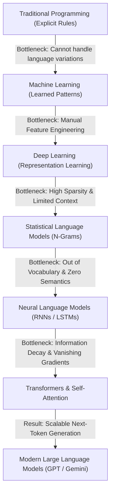
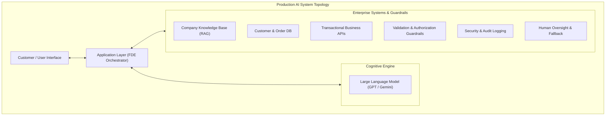
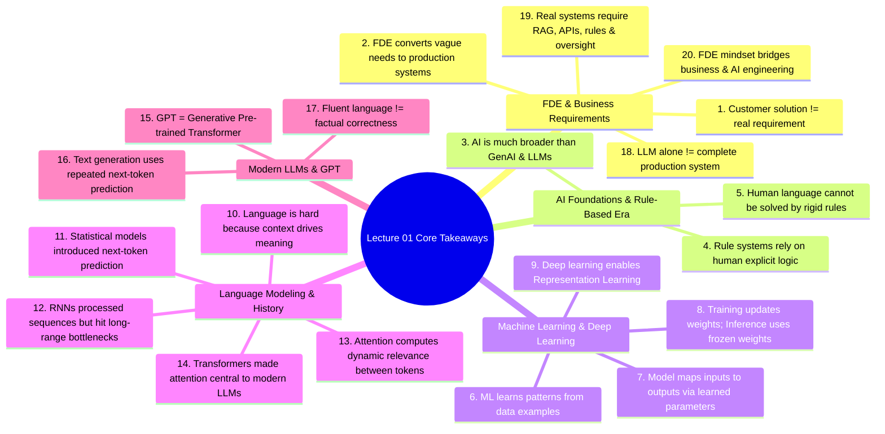

# Chapter 6: Production Systems Architecture & Key Takeaways

## 6.1 The Evolutionary Journey of AI Technology

Generative AI and Large Language Models did not appear overnight. Every technological shift in AI history emerged directly to resolve specific engineering bottlenecks of the preceding approach:

### Evolutionary Summary Matrix

| Generation / Era | Core Approach | Key Breakthrough | Primary Limitation / Bottleneck |
| :--- | :--- | :--- | :--- |
| **Rule-Based Systems** | Handwritten `IF-THEN` rules & Facts | Clear logic, deterministic | Impossible to maintain for natural language; brittle rules. |
| **Machine Learning** | Statistical pattern learning from data | Eliminated manual rule creation | Required manual **Feature Engineering** per domain. |
| **Deep Learning** | Multi-layer artificial neural networks | **Representation Learning** (auto feature extraction) | Sequential architectures (RNNs) hit context bottlenecks. |
| **Statistical Models (N-Grams)**| Word co-occurrence counting | Probability estimates of text continuations | Sparsity problem; context window restricted to $N \le 3$. |
| **RNNs / LSTMs** | Sequential hidden state updating | Preserved word order across variable lengths | **Information Bottleneck**; early context decay. |
| **Transformers & LLMs** | Self-Attention mechanisms | $O(1)$ direct context links; GPU parallel computation | Requires enterprise system scaffolding for grounding & safety. |

---

## 6.2 Connection Back to Forward Deployed Engineering

A Forward Deployed Engineer does not view Large Language Models as mystical or magical black boxes. An LLM is simply a powerful **probabilistic reasoning engine** within a larger software stack.

Building an enterprise-ready AI system requires placing production engineering scaffolding around the LLM:

### Mandatory Criteria for Production AI Systems:
1. **Useful:** Resolves the true underlying business problem, not just user curiosity.
2. **Secure:** Enforces strict role-based access control (RBAC), data privacy, and prompt injection defense.
3. **Grounded:** Backed strictly by verified enterprise knowledge bases to prevent hallucinations.
4. **Testable & Observable:** Evaluated against continuous automated benchmark suites (Evals) with end-to-end tracing.
5. **Reliable:** Handles provider downtime, rate limits, and API failures gracefully.
6. **Connected & Actionable:** Safely executes business transactions through audited microservice APIs.

---

## 6.3 The 20 Fundamental Key Takeaways

### Detailed Summary of Takeaways:
1. **Request vs. Requirement:** A customer’s proposed technical solution (e.g. *"Build a chatbot"*) is rarely the actual business requirement.
2. **The FDE Role:** Forward Deployed Engineers work embedded near real customer problems, translating business needs into production-ready software architectures.
3. **AI Taxonomy:** Artificial Intelligence is a much broader field than Generative AI or LLMs.
4. **Symbolic Logic:** Rule-based systems depend on humans explicitly defining domain knowledge and logic.
5. **Linguistic Complexity:** Human language contains too many contextual variations, idioms, and nuances to handle completely through handwritten rules.
6. **Machine Learning Shift:** Machine learning allows software systems to learn useful predictive patterns directly from data examples.
7. **Model Abstraction:** A model is fundamentally a computational function mapping inputs to outputs using learned numerical parameters.
8. **Training vs. Inference:** Training updates model parameter weights; normal inference executes predictions using frozen, already-trained weights.
9. **Representation Learning:** Deep learning enables models to automatically discover hierarchical internal feature representations directly from raw data.
10. **Context Superiority:** Natural language is uniquely difficult because token meaning depends heavily on surrounding context.
11. **Statistical Foundations:** Statistical language models introduced the core concept of predicting likely text continuations.
12. **The RNN Bottleneck:** Recurrent Neural Networks (RNNs) processed language sequentially but suffered severe context decay over long-range dependencies.
13. **The Role of Attention:** Attention allows different token positions in a sequence to dynamically examine and weight information from other relevant positions.
14. **The Transformer Impact:** Transformers made self-attention central to sequence modeling, enabling massive GPU parallelization and forming the basis of modern LLMs.
15. **Decoding GPT:** GPT stands for **G**enerative **P**re-trained **T**ransformer.
16. **Autoregressive Generation:** GPT-style models generate text through repeated, autoregressive next-token prediction.
17. **Fluency vs. Factuality:** Syntactic language fluency does not guarantee factual correctness or truth verification.
18. **Application Scaffolding:** An LLM alone is not a complete, production-ready enterprise application.
19. **Production Requirements:** Real AI systems require RAG knowledge integration, APIs, business logic, security guardrails, evaluation suites, and human oversight.
20. **Engineering Mindset:** Bridging the gap between a raw probabilistic AI model and a secure, reliable production platform is where the mindset of a Forward Deployed Engineer becomes essential.
