# Lecture 01: Introduction to Forward Deployed Engineering & Generative AI Foundations
> **Comprehensive Chapter-Wise Notes**  
> *Derived from Lecture 01 Notes PDF and Excalidraw Conceptual Diagrams*

---

## Table of Contents
1. [Chapter 1: Introduction to Forward Deployed Engineering (FDE)](#chapter-1-introduction-to-forward-deployed-engineering-fde)
2. [Chapter 2: Foundations of Artificial Intelligence & Rule-Based Systems](#chapter-2-foundations-of-artificial-intelligence--rule-based-systems)
3. [Chapter 3: Machine Learning & Deep Learning Foundations](#chapter-3-machine-learning--deep-learning-foundations)
4. [Chapter 4: Language Modeling, Statistical N-Grams & Recurrent Neural Networks](#chapter-4-language-modeling-statistical-n-grams--recurrent-neural-networks)
5. [Chapter 5: Attention Mechanism, Transformers & Modern LLMs](#chapter-5-attention-mechanism-transformers--modern-llms)
6. [Chapter 6: Production Systems Architecture & Key Takeaways](#chapter-6-production-systems-architecture--key-takeaways)

---

# Chapter 1: Introduction to Forward Deployed Engineering (FDE)

## 1.1 From a Business Problem to a Real Engineering Solution

### The E-Commerce Case Study
Consider a large e-commerce enterprise receiving **50,000 customer-support requests every day**. Customers submit queries ranging across multiple categories and operational issues:

- *"Where is my order?"* / *"Track my package."*
- *"I received the wrong product."*
- *"Can I return an item after 15 days?"*
- *"My payment was deducted, but the order was not created."*
- *"Please cancel my order and initiate a refund."*
- *"The delivery agent marked my order as delivered, but I never received it."*

When business stakeholders approach engineering teams, they often phrase their requirement as:
> **"We want an AI chatbot that can answer customer questions."**

### Finding the Real Requirement
From a software and systems engineering perspective, a statement like *"We want an AI chatbot"* is merely a **proposed solution**, not the actual requirement. It provides minimal clarity on system constraints, data sources, security boundaries, or operational goals.

Business leadership does not care about having a chatbot for its own sake. They care about resolving underlying operational pain points:
1. **Response Delays:** Customers waiting too long for responses.
2. **Repetitive Workload:** Support executives repeatedly answering identical, routine questions.
3. **Inconsistency:** Different support representatives providing conflicting policy answers.
4. **Scalability Bottlenecks:** Support headcount and operational costs scaling linearly with revenue/order volume.
5. **High-Priority Neglect:** Critical/urgent cases getting buried under thousands of routine inquiries.
6. **Cross-Departmental Friction:** Customers bouncing between multiple departments for a single order issue.
7. **Unavailability:** Inability to support customers outside standard working hours.

Therefore, the **true engineering requirement** is:
> **"Reduce the time required to resolve customer problems without reducing accuracy or customer trust."**

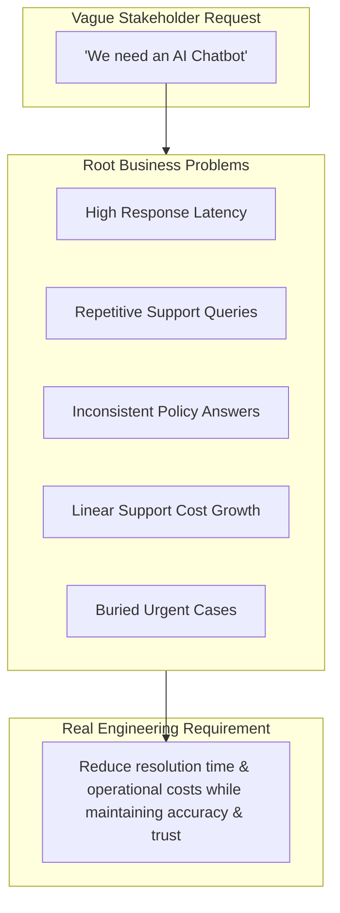

---

## 1.2 Iterative Architectural Attempts

To understand why modern LLM systems are built the way they are, we trace the evolution of technical attempts to solve this support problem.

### Attempt 1: Rule-Based Customer Support
Before machine learning, software engineers attempted to build rule-based systems using explicit conditional logic:

```text
IF message contains "order status" THEN show order tracking page
IF message contains "refund"       THEN show refund policy
IF message contains "cancel"       THEN show cancellation instructions
```

#### Why Handwritten Rules Fail:
- **Natural Language Diversity:** Humans do not communicate via standard system commands. One user asks *"Where is my order?"*, while another states *"It has been seven days and my package has not arrived"*, and another writes in Hinglish *"Mera order kha ha"*.
- **Typos & Abbreviations:** Spelling mistakes (*"recieved"*, *"pkg"*) break rigid string matches.
- **Contextual Complexity:** Rules conflict, fail to track previous conversation state, and struggle with multi-part questions (*"Cancel my order and refund to my original card because it arrived damaged"*).

### Attempt 2: Machine Learning Intent Classification
To handle linguistic variations, engineers trained Machine Learning (ML) classifiers (e.g., Naïve Bayes, SVMs, or BERT-based classifiers) to map incoming text to pre-defined categories:

| Customer Input Example | Predicted Intent Category |
| :--- | :--- |
| *"Where is my package?"* | `Order_Status` |
| *"Cancel my purchase"* | `Cancellation` |
| *"When will I get my money back?"* | `Refund` |
| *"The product arrived broken"* | `Damaged_Product` |

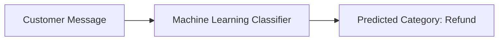

#### The Limitation of Classification:
Classification categorizes the message, but **it does not resolve the customer's problem**. Identifying that a message belongs to `Refund` does not automatically:
- Read and evaluate company refund policies against order delivery timestamps.
- Fetch order details from internal databases.
- Verify customer identity and permissions.
- Calculate refund eligibility or execute the API refund call.
- Handle edge cases or escalate to human managers cleanly.

### Attempt 3: Naïve General-Purpose LLM Integration
With Large Language Models (LLMs), developers pass customer questions directly to an LLM:

```text
System: You are a customer-support assistant. Answer the customer's question.
User: Can I return a laptop after 20 days?
LLM Output: Yes, laptops can be returned within 30 days of delivery.
```

#### The Grounding & Reliability Gap:
The LLM response sounds fluent, authoritative, and professional. However, if the company's actual policy allows laptop returns for **only 7 days**, the LLM's answer is **factually incorrect and legally binding**.

> **Crucial Engineering Principle:**  
> **Generating a fluent answer and generating a correct business answer are two completely different problems.**

A general-purpose LLM does not inherently possess private enterprise context:
- Current company policies and recent terms updates.
- Real-time customer order history and shipping state.
- Inventory levels and payment gateway transaction logs.
- Internal authorization and security rules.

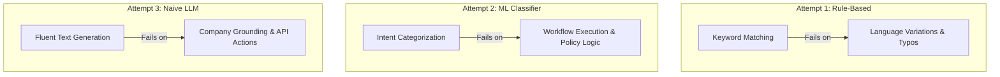

---

## 1.3 Production-Grade Grounded AI System Architecture

To convert an LLM from an ungrounded text generator into a reliable production system, software engineers build a **grounded application layer** around the model.

Text generation is not an action. When a customer requests: *"Cancel my order and refund my payment"*, the LLM output *"Your order has been cancelled"* does not execute a database transaction. A production architecture must coordinate state and execution:

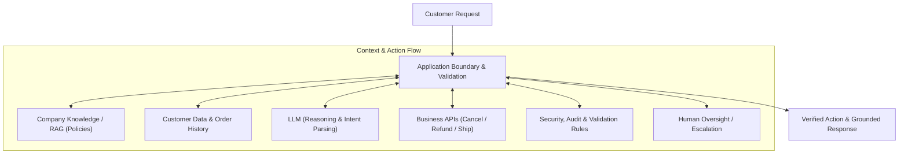

### Key Production Engineering Considerations:
1. **Authorization:** Is the authenticated user authorized to modify or cancel this specific order ID?
2. **State Validation:** Has the order already been shipped or processed by the warehouse?
3. **Execution Safety:** Should an LLM directly invoke write/delete APIs, or generate structured tool-call requests validated by application code?
4. **Human-in-the-Loop:** Does the refund amount exceed an automatic approval threshold requiring manager authorization?
5. **Observability & Auditability:** Are all LLM prompts, retrieved contexts, and API actions logged with deterministic trace IDs?
6. **Latency & Cost:** What is the per-token cost and end-to-end response latency across LLM providers?

---

## 1.4 What is a Forward Deployed Engineer (FDE)?

### Deconstruct the Term: "Forward Deployed"
- **Deployed:** Unlike traditional software engineers who remain isolated within core platform development, an FDE is embedded directly near the operational frontlines—working with customers, business stakeholders, operations teams, and domain experts.
- **Forward:** Operating at the boundary where raw business domain problems meet technical software architecture.

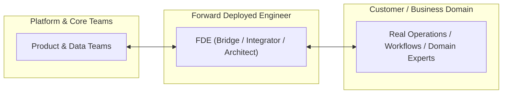

### Definition of a Forward Deployed Engineer
> **A Forward Deployed Engineer (FDE) is a software engineer who works closely with customers or operational teams to understand high-impact domain problems, architect technical solutions around real enterprise systems, and drive those solutions into production.**

### Core Competency Spectrum of an FDE:
- **Software Engineering:** Writing production-grade code, designing clean APIs, and managing distributed data pipelines.
- **Product Thinking:** Translating vague user complaints into rigorous technical specifications.
- **System Architecture:** Integrating AI models with legacy enterprise databases, auth systems, and third-party microservices.
- **Rapid Prototyping & Evaluation:** Building production proofs-of-concept and setting up quantitative evaluation benchmarks (Evals).
- **Production Delivery & Maintenance:** Ensuring security, low latency, cost efficiency, observability, and smooth handoff to core engineering.

### Request vs. Requirement Discovery Workflow

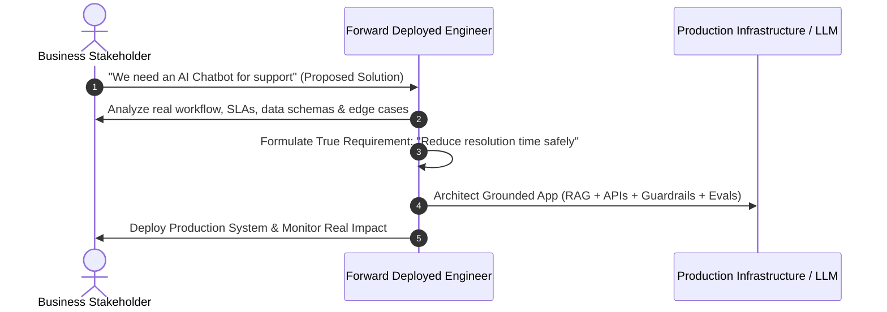

---

# Chapter 2: Foundations of Artificial Intelligence & Rule-Based Systems

## 2.1 The Origins of Artificial Intelligence

### Turing's Fundamental Question (1950)
The formal conceptual foundation of Artificial Intelligence traces back to Alan Turing’s seminal 1950 paper, *Computing Machinery and Intelligence*. Turing opened the paper with a simple yet profound question:
> **"Can machines think?"**

Recognizing that defining "thinking" leads to endless philosophical debate, Turing proposed an empirical operational test known as the **Turing Test** (originally the *Imitation Game*).

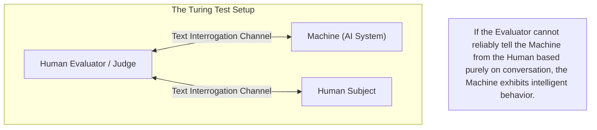

The key insight of the Turing Test was shifting the focus from abstract internal consciousness to **observable intelligent behavior**:
- Understanding written natural language.
- Maintaining contextual consistency.
- Formulating coherent responses based on reasoning.

In 1956, **John McCarthy** officially coined the term **"Artificial Intelligence"** at the Dartmouth Conference, defining the field as the science and engineering of making intelligent machines.

---

## 2.2 Classical Computing vs. Intelligent Behavior

Traditional computer programming is built on deterministic execution where human engineers supply explicit, step-by-step algorithms:

```text
Input (20, 30) + Operation (ADD) ---> Output (50)
```

Constructs like variables, conditions, loops, recursion, and data structures excel when:
1. **Inputs are well-defined and structured.**
2. **The exact procedural steps can be mapped out in advance.**
3. **The output is completely deterministic.**

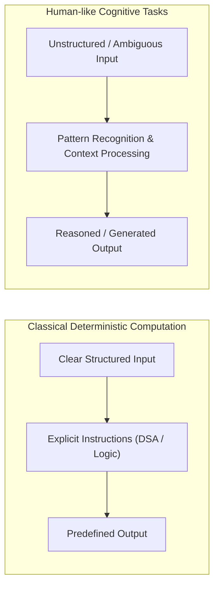

Human cognitive tasks—such as recognizing handwritten text, understanding sarcastic conversation, navigating unfamiliar physical environments, or extracting intent—cannot be reduced to rigid static algorithms.

---

## 2.3 The Hierarchy of Artificial Intelligence

Artificial Intelligence is a broad umbrella discipline. Generative AI and Large Language Models represent a specific modern subset within this larger taxonomy:

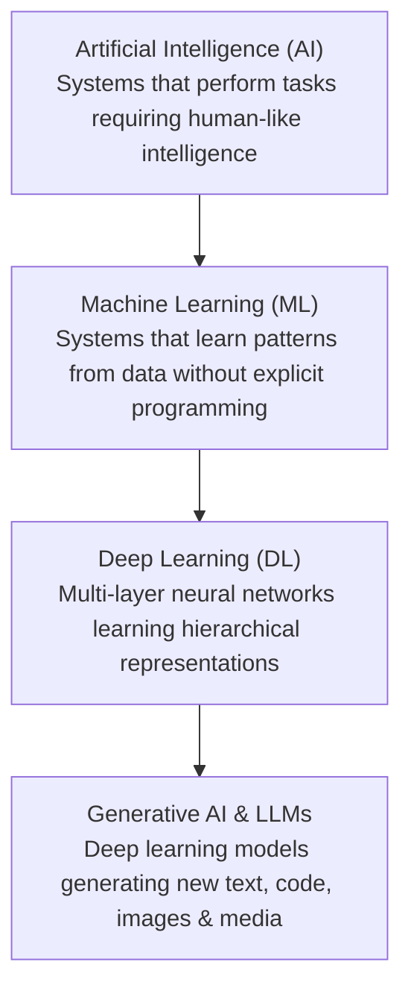

---

## 2.4 Rule-Based AI & Expert Systems

Early AI research (1960s–1980s) focused on **Symbolic AI** and **Rule-Based Systems** (also called **Expert Systems**). The central premise was: if human experts make decisions based on domain rules, machines can replicate expertise if humans explicitly encode those rules.

### Core Architecture of a Rule-Based System
A standard expert system consists of three structural components:
1. **Fact Base (Knowledge Base):** State variables representing current true facts about the world.
2. **Rule Base:** A set of `IF (conditions) THEN (actions/assertions)` production rules.
3. **Inference Engine:** The logical engine that matches facts against rules to deduce new facts or trigger actions.

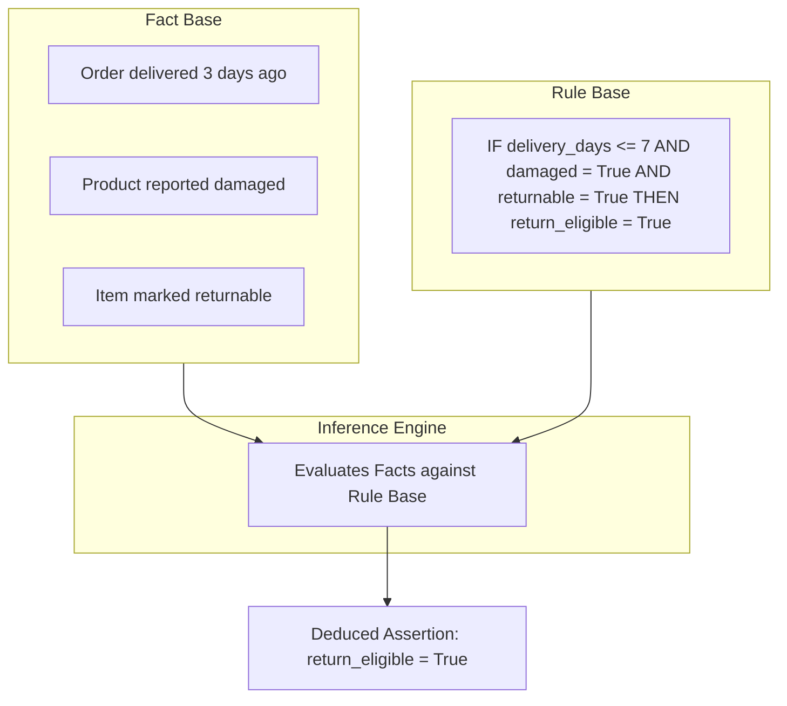

#### Example Implementation in Code:
```java
// Formal Fact & Rule Logic
if (daysSinceDelivery <= 7 && isDamaged && isReturnable) {
    order.setReturnEligible(true);
} else {
    order.setReturnEligible(false);
}
```

---

## 2.5 ELIZA — An Early Conversational Chatbot (1966)

Developed by Joseph Weizenbaum at MIT in 1966, **ELIZA** was one of the earliest conversational programs. ELIZA simulated a Rogerian psychotherapist primarily through simple pattern matching and substitution rules.

### Mechanism of Action:
ELIZA decomposed user strings using template rules and swapped pronouns to reflect responses:

```text
User Input:   "I am feeling unhappy."
Rule Match:   "I am <X>"  --> Transform to: "Why are you <X>?"
ELIZA Output: "Why are you feeling unhappy?"

User Input:   "My friends do not understand me."
Rule Match:   "My <Y> do not <Z>" --> Transform to: "Why do you think your <Y> do not <Z>?"
ELIZA Output: "Why do you think your friends do not understand you?"
```

### The "Illusion of Understanding"
ELIZA created a convincing illusion of human empathy and comprehension. Users frequently attributed deep emotional intelligence and understanding to the machine, despite ELIZA having zero internal world model, memory, or factual reasoning.

> **Key Takeaway for Modern AI Engineers:**  
> **Conversational fluency does not imply factual reliability.** A system can produce syntactically flawless text while remaining completely ignorant of facts, truth, or underlying context.

---

## 2.6 Why Handwritten Rules Do Not Scale

While rule-based logic works for rigid deterministic software, it fails catastrophically when applied to open-domain natural language.

### The Combinatorial Explosion Problem
Consider building a rule-based support parser for just one category: `Order_Tracking`. A human customer can express this single intent in thousands of ways:

- *"Where is my order?"*
- *"Track my package."*
- *"My parcel has not arrived."*
- *"Delivery kab hogi?"* (Hinglish)
- *"Order abhi tak nahi mila."*
- *"The expected delivery date passed yesterday."*
- *"Your app says dispatched, but nothing arrived."*

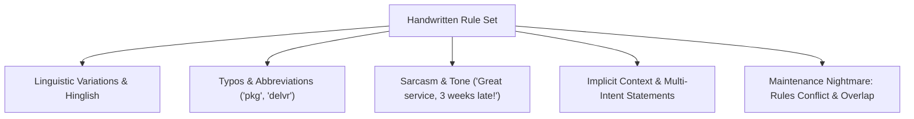

### Bottlenecks of Symbolic Systems:
1. **Rule Friction & Conflicts:** As the rule count grows into thousands, new rules contradict existing ones.
2. **Brittle Edge Cases:** Any novel phrasing, typo, or slang invalidates the string match.
3. **High Maintenance Cost:** Engineering teams spend endless effort manually crafting patch rules for edge cases.

---

# Chapter 3: Machine Learning & Deep Learning Foundations

## 3.1 The Machine Learning Paradigm Shift

### Learning Patterns Instead of Writing Every Rule
When teaching a human child to identify a dog, we do not define rigid mathematical rules (e.g. *"4 legs, fur, tail, 2 ears"*), because these rules apply equally to cats, wolves, and foxes. Instead, we show many examples: *"This is a dog. This is also a dog. That is a cat."* Over time, the child develops internal visual patterns to classify dogs accurately.

Machine Learning operates on the exact same core principle: **provide labeled training data and allow a learning algorithm to adjust internal numerical parameters until it accurately maps inputs to desired outputs.**

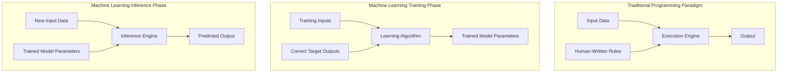

---

## 3.2 Core Terminology & Mechanics

### What is a Model?
At its core mathematical abstraction:
> **A Model is a computational function $f(X; \Theta)$ that maps an input vector $X$ to an output vector $Y$ using learned parameter weights $\Theta$.**

$$Y = f(X; \Theta)$$

- **Training Phase:** Iterative optimization process where training data is fed through the model, errors are evaluated via a loss function, and model parameters $\Theta$ are updated using gradient descent.
- **Inference Phase:** Passing new, unseen inputs $X$ through the frozen model with parameters $\Theta$ to generate predicted outputs $Y$.

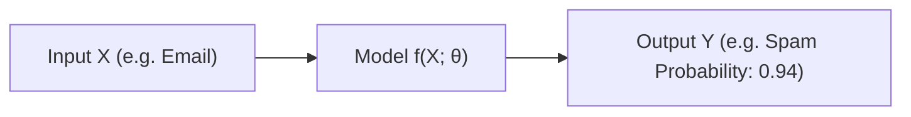

### Prompting vs. Model Training
A frequent misconception among software developers is assuming that passing detailed context in a prompt "trains" the LLM.

| Aspect | Model Inference (Prompting) | Model Training (Fine-Tuning / Pretraining) |
| :--- | :--- | :--- |
| **Parameter Impact** | Model parameters $\Theta$ remain **frozen and unchanged**. | Model parameters $\Theta$ are **permanently modified**. |
| **Context Scope** | Temporary input window during execution turn. | Long-term knowledge base encoded in weights. |
| **Resource Cost** | Low latency, compute per API call. | High compute, GPU cluster operations. |

### Supervised vs. Unsupervised Learning
- **Supervised Learning:** Training data includes pairs of inputs and ground-truth labels (e.g. `Email` $\rightarrow$ `Spam / Not Spam`).
- **Unsupervised Learning:** The model analyzes unlabelled data to discover inherent structural patterns or clusters (e.g. grouping 100,000 uncategorized support tickets into operational clusters: *Delivery Issues*, *Payment Failures*, *Product Defects*).

> **Critical Warning:** **Machine Learning does not automatically learn objective truth.** Models learn statistical correlations present in their training data. If training data is biased, outdated, or incomplete, the model output will reflect those exact flaws.

---

## 3.3 The Bottleneck of Traditional ML: Feature Engineering

Before Deep Learning, traditional machine learning models (e.g. Logistic Regression, Decision Trees, SVMs) required **Feature Engineering**—the manual transformation of raw input data into numerical feature vectors by human domain experts.

### Synthetic Neuron Linear Classifier Example
Consider predicting whether a customer support ticket is **Urgent** ($z$):

$$\text{Urgency Score } z = w_1 x_1 + w_2 x_2 + w_3 x_3 + w_4 x_4$$

Where human engineers hand-craft explicit input features:
- $x_1$: Binary flag — Contains the keyword `"urgent"`.
- $x_2$: Binary flag — Payment status is `Failed`.
- $x_3$: Integer count — Number of previous support attempts by customer.
- $x_4$: Binary flag — Customer account is `Locked`.
- $w_1, w_2, w_3, w_4$: Parameter weights learned by the linear model.

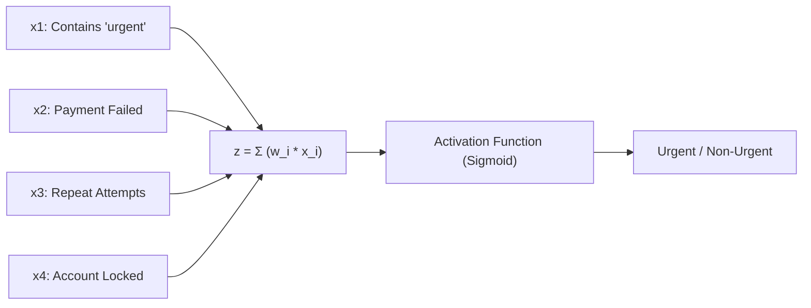

---

## 3.4 Deep Learning & Representation Learning

**Deep Learning** solved the feature engineering bottleneck by introducing multi-layered artificial neural networks capable of **Representation Learning**.

Instead of relying on human engineers to hand-craft features, Deep Learning models learn hierarchical feature representations directly from raw, unstructured data (pixels, raw text, audio waveforms).

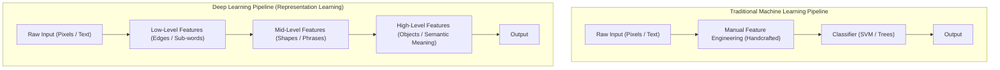

### Architectural Specialization in Deep Learning
As neural network research matured, specialized architectures emerged for different data modalities:

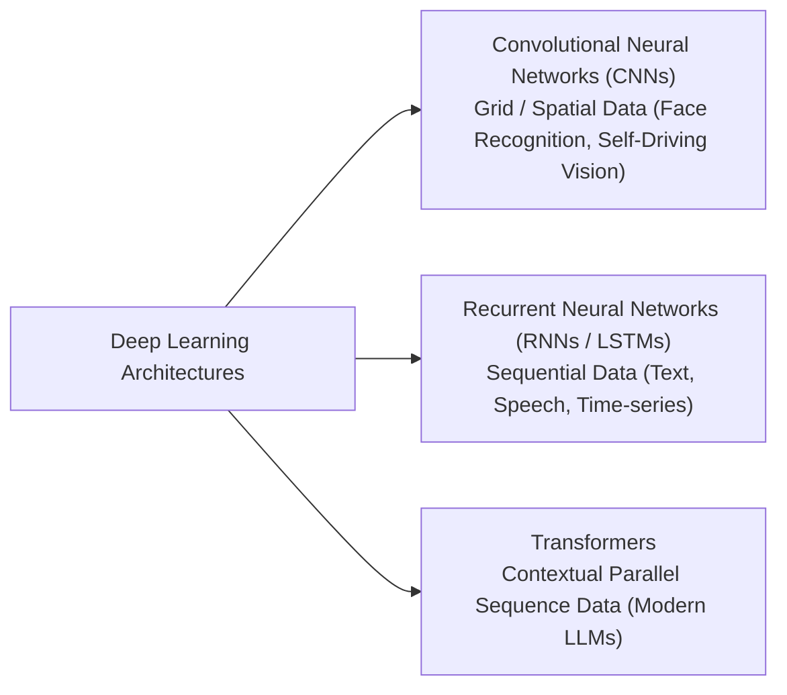

---

# Chapter 4: Language Modeling, Statistical N-Grams & Recurrent Neural Networks

## 4.1 Why Natural Language Processing (NLP) is Uniquely Hard

Computers process clear, structured numerical tables efficiently, but human natural language presents distinct linguistic hurdles that traditional software algorithms cannot handle easily.

### Key Linguistic Challenges:
1. **Context Sensitivity & Polysemy:** The identical word carries vastly different meanings based on surrounding words.
   - *"I deposited money in the **bank**."* $\rightarrow$ Financial Institution
   - *"We sat on the **bank** of the river."* $\rightarrow$ River Edge
2. **Word Order Significance:** Changing word positions alters complete semantic meaning.
   - *"The dog chased the man."* $\neq$ *"The man chased the dog."*
3. **Negations:** A single token reverses the truth condition of an entire document.
   - *"The customer **received** the refund."* vs. *"The customer **did not receive** the refund."*
4. **Pronoun Coreference Resolution:** Resolving ambiguous pronouns requires contextual world knowledge.
   - *"Aditya placed the laptop on the table because **it** was heavy."* ($\text{it} \rightarrow \text{laptop}$)
   - *"Aditya placed the laptop on the table because **it** was unstable."* ($\text{it} \rightarrow \text{table}$)
5. **Sarcasm, Pragmatics & Tone:**
   - *"Amazing service. My order is only three weeks late!"*  
     Keyword filters flag *"Amazing service"* as positive sentiment; humans recognize negative sarcasm instantly.
6. **Productive Nature of Language:** Humans constantly synthesize unique sentences never spoken before. A system cannot memorize all sentences; it must learn generative rules that generalize.

---

## 4.2 Statistical Language Models & N-Grams

A **Language Model** estimates the probability distribution over sequences of words and predicts likely upcoming tokens given preceding context:

$$P(w_1, w_2, \dots, w_m) = \prod_{i=1}^{m} P(w_i \mid w_1, w_2, \dots, w_{i-1})$$

### Frequency-Based Statistical Counting
Before neural networks, statistical language models estimated probabilities by counting word occurrences in massive text corpora.

#### Example Calculation:
Suppose our training corpus contains three sentences:
1. *"I **like machine** learning."*
2. *"I **like Java** programming."*
3. *"Students **like machine** learning."*

We observe that following the word **"like"**:
- **"machine"** appears 2 times.
- **"Java"** appears 1 time.

The maximum likelihood conditional probabilities are:

$$P(\text{machine} \mid \text{like}) = \frac{2}{3} \approx 66.7\%$$

$$P(\text{Java} \mid \text{like}) = \frac{1}{3} \approx 33.3\%$$

---

### N-Gram Models
An **N-Gram** is a continuous sequence of $N$ items (words/tokens).

- **Unigram ($N=1$):** Single tokens evaluated independently ($P(w_i)$).
- **Bigram ($N=2$):** Predicts next word using 1 previous word context ($P(w_i \mid w_{i-1})$).
- **Trigram ($N=3$):** Predicts next word using 2 previous words context ($P(w_i \mid w_{i-2}, w_{i-1})$).

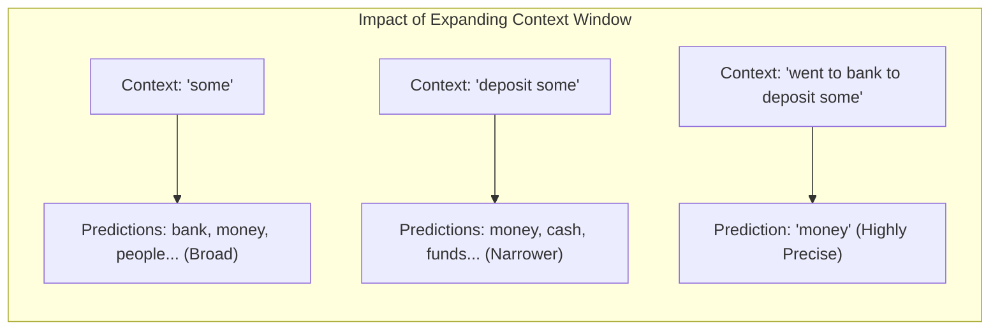

---

## 4.3 Neural Language Models & Recurrent Neural Networks (RNNs)

To overcome N-gram sparsity, neural networks were introduced to project words into continuous vector spaces (embeddings) and process sequence data dynamically.

### Sequential Processing in RNNs
A **Recurrent Neural Network (RNN)** processes language sequentially, token by token, maintaining a hidden state vector $h_t$ that acts as a recurrent memory:

$$h_t = \tanh(W_{hh} h_{t-1} + W_{xh} x_t + b_h)$$

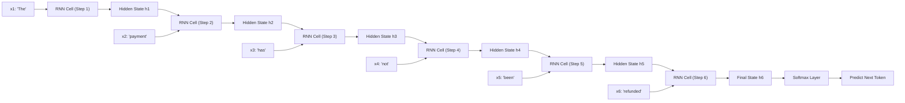

---

## 4.4 The Information Bottleneck & Long-Range Dependency Problem

While RNNs naturalized sequence processing and preserved word order, they introduced a major structural flaw when sequence lengths grew.

### The Information Bottleneck
An RNN compresses all historical context from hundreds of preceding words into a **single fixed-size hidden state vector $h_t$**.

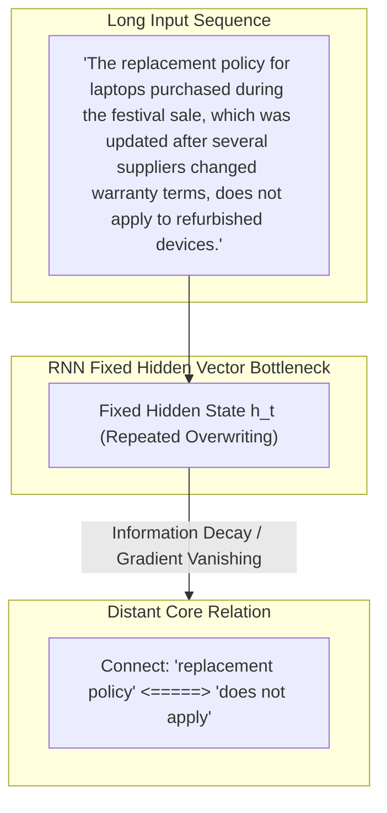

---

# Chapter 5: Attention Mechanism, Transformers & Modern LLMs

## 5.1 The Attention Breakthrough & "Attention Is All You Need"

In June 2017, Google researchers published the seminal paper [**"Attention Is All You Need"** (Vaswani et al., arXiv:1706.03762)](https://arxiv.org/pdf/1706.03762), introducing the **Transformer Architecture**. This paper triggered a massive paradigm shift in Artificial Intelligence by dispensing with recurrence (RNNs, LSTMs, GRUs) and convolutions entirely, building sequence models based **solely on attention mechanisms**.

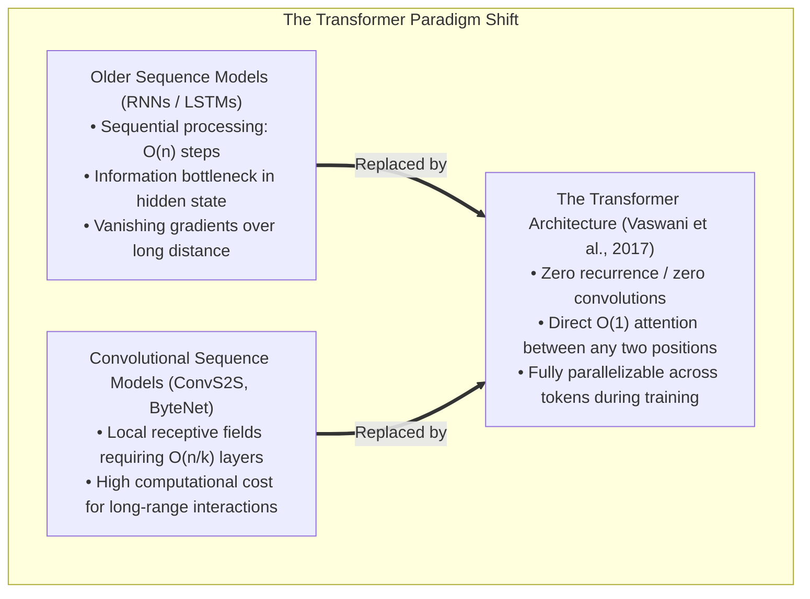

### Historical Context & Why Recurrence / Convolutions Failed
Prior to 2017, state-of-the-art sequence transduction relied on Recurrent Neural Networks (RNNs) or Convolutional Neural Networks (CNNs) structured in an Encoder-Decoder paradigm:
1. **The Recurrent Constraint ($O(n)$ Sequential Operations):**  
   Recurrent models factor computation along symbol positions, computing hidden states $h_t = f(h_{t-1}, x_t)$. This sequential dependency prevents parallelization *within* a training example. Memory constraints prevent scaling batch sizes across long sequence lengths $n$.
2. **The Convolutional Path Length Constraint ($O(n/k)$ or $O(\log_k n)$ Steps):**  
   Convolutional models (e.g., ConvS2S, ByteNet) compute representations in parallel, but the number of operations required to relate signals from two arbitrary positions grows with distance—linearly $O(n/k)$ for ConvS2S or logarithmically $O(\log_k n)$ for dilated convolutions. This makes learning long-distance dependencies difficult.
3. **The Transformer Solution ($O(1)$ Operations & Path Length):**  
   The Transformer connects all positions with a constant number of executed operations ($O(1)$ path length), eliminating sequential bottlenecks and enabling complete GPU matrix parallelization during training.

---

## 5.2 Mathematical Mechanics of Attention

Attention can be understood mathematically as a database retrieval mechanism where a set of **Queries ($Q$)**, **Keys ($K$)**, and **Values ($V$)** are mapped to an output representation vector.

```mermaid
flowchart LR
    subgraph Database_Analogy ["Query-Key-Value Information Retrieval Analogy"]
        Q["Query (Q)<br/>'What information am I searching for?'"]
        K["Keys (K)<br/>'What indexed keys exist in the context?'"]
        V["Values (V)<br/>'What is the actual content payload?'"]
        
        Q & K --> Compatibility["Dot-Product Compatibility Matching<br/>(Q · Kᵀ) / √d_k"]
        Compatibility --> SoftmaxWeighting["Softmax Normalization<br/>(Attention Weights Matrix)"]
        SoftmaxWeighting & V --> WeightedSum["Weighted Linear Combination of Values<br/>Output Vector"]
    end
```

### 1. Scaled Dot-Product Attention

Given input matrices $Q \in \mathbb{R}^{n \times d_k}$ (Query), $K \in \mathbb{R}^{m \times d_k}$ (Key), and $V \in \mathbb{R}^{m \times d_v}$ (Value), where $d_k$ is the dimensionality of the keys and queries, and $d_v$ is the dimensionality of the values:

$$\text{Attention}(Q, K, V) = \text{softmax}\left(\frac{Q K^T}{\sqrt{d_k}}\right) V$$

```mermaid
flowchart TD
    subgraph Scaled_Dot_Product ["Scaled Dot-Product Attention Pipeline"]
        Q["Query (Q) [n × d_k]"] & K["Key (K) [m × d_k]"] --> MatMul1["MatMul: Q · Kᵀ [n × m]"]
        MatMul1 --> Scale["Scale: ÷ √d_k"]
        Scale --> Mask["Optional Masking (Causal -∞ / Padding)"]
        Mask --> Softmax["Softmax Row-wise (Probabilities)"]
        Softmax & V["Value (V) [m × d_v]"] --> MatMul2["MatMul with V"]
        MatMul2 --> Output["Attention Output Vector [n × d_v]"]
    end
```

#### Detailed Mathematical Derivation: Why Scale by $\frac{1}{\sqrt{d_k}}$?

The two primary attention compatibility functions are **Additive Attention** (Bahdanau et al.) and **Dot-Product (Multiplicative) Attention**. Dot-product attention is identical to Scaled Dot-Product Attention except for the scaling factor $\frac{1}{\sqrt{d_k}}$.

* **Theoretical & Practical Performance:** While both have similar theoretical complexity, dot-product attention is significantly faster and more space-efficient in practice because it utilizes highly optimized Matrix Multiplication (BLAS / GEMM) operations on modern GPUs.
* **The Variance Problem:** For small values of $d_k$, additive and unscaled dot-product attention perform similarly. However, for large values of $d_k$, unscaled dot-product attention performs significantly worse.
* **Mathematical Proof:**  
  Assume the components of query vector $q \in \mathbb{R}^{d_k}$ and key vector $k \in \mathbb{R}^{d_k}$ are independent random variables with mean $0$ and variance $1$:
  $$\mathbb{E}[q_i] = 0, \quad \text{Var}(q_i) = 1, \quad \mathbb{E}[k_i] = 0, \quad \text{Var}(k_i) = 1$$
  
  The dot product is given by $q \cdot k = \sum_{i=1}^{d_k} q_i k_i$. The expectation of the dot product is:
  $$\mathbb{E}[q \cdot k] = \sum_{i=1}^{d_k} \mathbb{E}[q_i k_i] = \sum_{i=1}^{d_k} \mathbb{E}[q_i] \mathbb{E}[k_i] = 0$$
  
  The variance of the product of two independent variables with zero mean is $\text{Var}(q_i k_i) = \text{Var}(q_i) \text{Var}(k_i) = 1 \cdot 1 = 1$. Therefore:
  $$\text{Var}(q \cdot k) = \sum_{i=1}^{d_k} \text{Var}(q_i k_i) = \sum_{i=1}^{d_k} 1 = d_k$$
  
  Standard deviation of $q \cdot k$ is $\sqrt{d_k}$. As $d_k$ increases, the magnitude of the dot products grows to $\mathcal{O}(\sqrt{d_k})$.
* **Consequence on Softmax & Gradients:**  
  When inputs to the $\text{softmax}(z_i) = \frac{e^{z_i}}{\sum_j e^{z_j}}$ function become large, the softmax function saturates and assigns probability near $1.0$ to the maximum element and near $0.0$ to all others. In these regions, the softmax gradient $\frac{\partial \text{softmax}}{\partial z}$ becomes **vanishingly small**, impeding gradient propagation during backpropagation.
* **The Solution:**  
  Dividing by $\sqrt{d_k}$ rescales the variance of the dot products back to $1.0$:
  $$\text{Var}\left(\frac{q \cdot k}{\sqrt{d_k}}\right) = \frac{1}{d_k} \text{Var}(q \cdot k) = \frac{d_k}{d_k} = 1$$
  This stabilizes softmax outputs, preventing gradient vanishing and ensuring smooth model convergence.

---

### 2. Multi-Head Attention (MHA)

Instead of performing a single attention function over $d_{\text{model}}$-dimensional queries, keys, and values, Vaswani et al. found it beneficial to linearly project $Q$, $K$, and $V$ $h$ times with different learned linear projections to $d_k$, $d_k$, and $d_v$ dimensions, respectively.

$$\text{MultiHead}(Q, K, V) = \text{Concat}(\text{head}_1, \text{head}_2, \dots, \text{head}_h) W^O$$

$$\text{where } \text{head}_i = \text{Attention}(Q W_i^Q, K W_i^K, V W_i^V)$$

#### Learned Projection Parameter Matrices:
- $W_i^Q \in \mathbb{R}^{d_{\text{model}} \times d_k}$
- $W_i^K \in \mathbb{R}^{d_{\text{model}} \times d_k}$
- $W_i^V \in \mathbb{R}^{d_{\text{model}} \times d_v}$
- $W^O \in \mathbb{R}^{h d_v \times d_{\text{model}}}$

In the paper's base model:
- $h = 8$ parallel attention heads
- $d_{\text{model}} = 512$
- $d_k = d_v = d_{\text{model}} / h = 512 / 8 = 64$

```mermaid
flowchart TD
    subgraph Multi_Head ["Multi-Head Attention (h Parallel Heads)"]
        InQ["Input Query (Q)"] & InK["Input Key (K)"] & InV["Input Value (V)"]
        
        InQ --> LinearQ1["Linear W1^Q"] & LinearQ2["Linear W2^Q"] & LinearQh["Linear Wh^Q"]
        InK --> LinearK1["Linear W1^K"] & LinearK2["Linear W2^K"] & LinearKh["Linear Wh^K"]
        InV --> LinearV1["Linear W1^V"] & LinearV2["Linear W2^V"] & LinearVh["Linear Wh^V"]

        LinearQ1 & LinearK1 & LinearV1 --> Head1["Head 1: Scaled Dot-Product"]
        LinearQ2 & LinearK2 & LinearV2 --> Head2["Head 2: Scaled Dot-Product"]
        LinearQh & LinearKh & LinearVh --> Headh["Head h: Scaled Dot-Product"]

        Head1 & Head2 & Headh --> Concat["Concat All Heads [n × h·d_v]"] --> LinearO["Linear Projection W^O [h·d_v × d_model]"] --> Out["Multi-Head Output [n × d_model]"]
    end
```

#### Computational Efficiency & Subspace Representation
- **Cost Efficiency:** Because each head operates on a reduced dimension $d_k = d_{\text{model}} / h$, the total computational cost of Multi-Head Attention is identical to that of single-head attention with full $d_{\text{model}}$ dimensionality.
- **Why Multi-Head Attention?**  
  With a single attention head, averaging attention weights over all positions inhibits the model from simultaneously attending to information from different representation subspaces. Multi-Head Attention allows the model to jointly attend to information from different representation subspaces at different positions:
  - **Head 1:** Focuses on syntactic coreference (e.g. connecting *"he"* $\rightarrow$ *"Aditya"*).
  - **Head 2:** Focuses on semantic verb-object relationships (e.g. connecting *"needed"* $\rightarrow$ *"laptop"*).
  - **Head 3:** Focuses on temporal sequence markers or positional offsets.

---

## 5.3 The Full Transformer Architecture (Encoder-Decoder)

The original Transformer proposed in Vaswani et al. (2017) uses an **Encoder-Decoder** architecture designed for sequence-to-sequence translation tasks (such as WMT English-to-German and English-to-French).

```mermaid
flowchart TD
    subgraph Transformer_Full_Architecture ["Original Transformer Architecture (Vaswani et al., 2017)"]
        
        subgraph Encoder_Stack ["Encoder Stack (N = 6 Layers)"]
            InEmb["Input Token Embeddings"] --> MultSqrtE["Multiply by √d_model"]
            MultSqrtE + PosEnc1["Sinusoidal Positional Encodings"] --> EncLayer["Encoder Layer N (N=6)"]
            
            subgraph Enc_Sublayer ["Encoder Block"]
                MHA_Enc["Multi-Head Self-Attention"] --> AddNorm1["Add & LayerNorm"]
                AddNorm1 --> FFN_Enc["Position-wise FFN (d_ff = 2048)"] --> AddNorm2["Add & LayerNorm"]
            end
            
            EncLayer --> EncOut["Encoder Output Representations (K, V)"]
        end

        subgraph Decoder_Stack ["Decoder Stack (N = 6 Layers)"]
            OutEmb["Output Token Embeddings (Shifted Right)"] --> MultSqrtD["Multiply by √d_model"]
            MultSqrtD + PosEnc2["Sinusoidal Positional Encodings"] --> DecLayer["Decoder Layer N (N=6)"]
            
            subgraph Dec_Sublayer ["Decoder Block"]
                MaskedMHA["Masked Multi-Head Self-Attention (Causal)"] --> AddNormDec1["Add & LayerNorm"]
                AddNormDec1 & EncOut --> CrossMHA["Multi-Head Cross-Attention (Q:Dec, K/V:Enc)"] --> AddNormDec2["Add & LayerNorm"]
                AddNormDec2 --> FFN_Dec["Position-wise FFN (d_ff = 2048)"] --> AddNormDec3["Add & LayerNorm"]
            end
            
            DecLayer --> LinearLogits["Linear Projection (Weight Tied)"] --> SoftmaxOut["Softmax Output Probabilities"]
        end
    end
```

### Complete Architectural Breakdown:

#### 1. Encoder Stack ($N = 6$ Layers)
- Composed of $N = 6$ identical stacked layers.
- Each layer contains two sub-layers:
  1. **Multi-Head Self-Attention:** $Q, K, V$ are derived from the output of the previous layer.
  2. **Position-wise Feed-Forward Network (FFN).**
- Residual connections are applied around each sub-layer, followed by Layer Normalization:
  $$\text{Output} = \text{LayerNorm}(x + \text{SubLayer}(x))$$
- All sub-layers and embedding layers produce outputs of dimension $d_{\text{model}} = 512$ to facilitate residual connections.

#### 2. Decoder Stack ($N = 6$ Layers)
- Composed of $N = 6$ identical stacked layers.
- In addition to the two sub-layers in each encoder layer, the decoder inserts a **third sub-layer**:
  1. **Masked Multi-Head Self-Attention:** Prevents positions from attending to subsequent future positions (causal masking).
  2. **Multi-Head Cross-Attention (Encoder-Decoder Attention):** Queries ($Q$) come from the previous decoder layer, while Keys ($K$) and Values ($V$) come from the output of the Encoder stack.
  3. **Position-wise Feed-Forward Network (FFN).**

#### 3. Three Distinct Applications of Multi-Head Attention in the Transformer:
1. **Encoder Self-Attention:** $Q, K, V$ come from the same place (output of previous encoder layer). Each position in the encoder can attend to all positions in the previous encoder layer.
2. **Decoder Causal Self-Attention:** Each position in the decoder can attend to all positions up to and including that position. Unattended future positions are masked by setting their pre-softmax input values to $-\infty$.
3. **Encoder-Decoder Cross-Attention:** Queries come from the previous decoder layer, and Keys/Values come from the encoder output. This allows every decoder token to attend over all input tokens in the source sequence.

#### 4. Position-wise Feed-Forward Networks (FFN)
Applied to each position separately and identically across all tokens:
$$\text{FFN}(x) = \max(0, x W_1 + b_1) W_2 + b_2$$

- Dimensionality: Input and output dimension $d_{\text{model}} = 512$, inner-layer hidden dimension $d_{ff} = 2048$ (**4x expansion ratio**).
- Alternatively described as two convolutions with kernel size $1$ and stride $1$. While parameters are identical across positions, parameters differ from layer to layer.

#### 5. Embeddings, Scaling & Weight Sharing
- Learned embeddings convert input and target tokens into vectors of dimension $d_{\text{model}} = 512$.
- In the embedding layers, weights are multiplied by $\sqrt{d_{\text{model}}}$ ($\approx 22.62$) before adding positional encodings.
- **Three-Way Weight Sharing (Tied Weights):** The Transformer shares the exact same weight matrix between the source embedding layer, target embedding layer, and pre-softmax linear projection layer, significantly reducing overall trainable parameters.

---

## 5.4 Positional Encodings & Linear Offset Property

Because the Transformer contains no recurrence or convolutions, it inherently lacks any built-in notion of token order or position. To provide sequence order awareness, Vaswani et al. add **Positional Encodings** directly to input embeddings at the bottom of the encoder and decoder stacks.

```mermaid
flowchart LR
    subgraph Positional_Encoding_Addition ["Embedding & Positional Encoding Combination"]
        TokenEmb["Token Embedding (d_model = 512)"] --> ScaleEmb["Multiply by √d_model"]
        PosEnc["Sinusoidal Positional Encoding (d_model = 512)"]
        ScaleEmb & PosEnc --> ElementwiseAdd["Element-wise Addition (+)"] --> TransformerInput["Input to Transformer Layer 1"]
    end
```

### Sinusoidal Positional Encoding Formulation
Using sine and cosine functions of different frequencies across dimensions $2i$ and $2i+1$:

$$PE_{(pos, 2i)} = \sin\left(\frac{pos}{10000^{2i/d_{\text{model}}}}\right)$$

$$PE_{(pos, 2i+1)} = \cos\left(\frac{pos}{10000^{2i/d_{\text{model}}}}\right)$$

Where $pos$ is token sequence position, $i$ is vector dimension index ($0 \le i < d_{\text{model}}/2$). Wavelengths form a geometric progression from $2\pi$ to $10000 \cdot 2\pi$.

### The Linear Offset Property (Relative Position Representation)
Vaswani et al. chose sinusoidal encodings because for any fixed position offset $k$, $PE_{pos+k}$ can be represented as a **linear function of $PE_{pos}$**.

#### Mathematical Proof:
Using trigonometric addition formulas:
$$\sin(\alpha + \beta) = \sin(\alpha)\cos(\beta) + \cos(\alpha)\sin(\beta)$$
$$\cos(\alpha + \beta) = \cos(\alpha)\cos(\beta) - \sin(\alpha)\sin(\beta)$$

Let $\omega_i = \frac{1}{10000^{2i/d_{\text{model}}}}$. For position $pos + k$:
$$PE_{(pos+k, 2i)} = \sin(\omega_i (pos + k)) = \sin(\omega_i pos)\cos(\omega_i k) + \cos(\omega_i pos)\sin(\omega_i k)$$
$$PE_{(pos+k, 2i+1)} = \cos(\omega_i (pos + k)) = \cos(\omega_i pos)\cos(\omega_i k) - \sin(\omega_i pos)\sin(\omega_i k)$$

Expressed as a linear matrix transformation (2D Rotation Matrix):
$$\begin{pmatrix} PE_{(pos+k, 2i)} \\ PE_{(pos+k, 2i+1)} \end{pmatrix} = \begin{pmatrix} \cos(\omega_i k) & \sin(\omega_i k) \\ -\sin(\omega_i k) & \cos(\omega_i k) \end{pmatrix} \begin{pmatrix} PE_{(pos, 2i)} \\ PE_{(pos, 2i+1)} \end{pmatrix}$$

This property allows linear attention mechanisms to easily learn to attend to **relative positions**, because inner products between positional encodings depend purely on relative distance $k$.

### Sinusoidal vs. Learned Positional Embeddings
Vaswani et al. evaluated learned positional embeddings (Gehring et al., 2017) against sinusoidal encodings (Table 3, row E):
- **Results:** Both produced nearly identical BLEU scores ($25.8$ BLEU on EN-DE dev).
- **Decision:** Sinusoidal encodings were selected because they allow the model to **extrapolate to sequence lengths longer than those encountered during training**.

---

## 5.5 Self-Attention vs. Recurrent vs. Convolutional Layers

Vaswani et al. explicitly compared Self-Attention layers against Recurrent and Convolutional layers across three key criteria:
1. Total computational complexity per layer.
2. Parallelizable computation (minimum sequential operations).
3. Maximum path length between long-range dependencies in the network.

| Layer Type | Computational Complexity per Layer | Sequential Operations | Maximum Path Length |
| :--- | :--- | :--- | :--- |
| **Self-Attention** | $O(n^2 \cdot d)$ | $O(1)$ | $O(1)$ |
| **Recurrent (RNN / LSTM)** | $O(n \cdot d^2)$ | $O(n)$ | $O(n)$ |
| **Convolutional** | $O(k \cdot n \cdot d^2)$ | $O(1)$ | $O(\log_k(n))$ |
| **Restricted Self-Attention** | $O(r \cdot n \cdot d)$ | $O(1)$ | $O(n/r)$ |

- **$n$**: Sequence length.
- **$d$**: Representation dimension ($d_{\text{model}}$).
- **$k$**: Convolutional kernel size.
- **$r$**: Restricted neighborhood window size.

### Detailed Insights & Paper Conclusions:
1. **$O(1)$ Path Length:** Shorter paths between distant tokens make learning long-range dependencies easier. Self-attention provides a direct $O(1)$ path between any two tokens in a sequence.
2. **$O(1)$ Sequential Operations:** Self-attention executes in a single matrix operation, enabling maximum GPU parallelization, whereas recurrent layers require $O(n)$ sequential forward steps.
3. **When Self-Attention is Cheaper ($n < d$):**  
   Self-attention complexity $O(n^2 \cdot d)$ is lower than recurrent complexity $O(n \cdot d^2)$ whenever sequence length $n$ is smaller than representation dimension $d$. In standard modern NLP representations (e.g. WordPiece / BPE tokens where sequence length $n = 512$ and model dimension $d = 512$ or $1024$), self-attention layers are faster.
4. **Restricted Self-Attention:** For extremely long sequences ($n > d$), self-attention can be restricted to consider only a neighborhood of size $r$ centered around each position, reducing complexity to $O(r \cdot n \cdot d)$ (the foundational concept behind modern Sparse and Sliding-Window Attention).

---

## 5.6 Paper Training Methodology, Regularization & Empirical Benchmarks

### 1. Datasets & Preprocessing
- **WMT 2014 English-German:** ~4.5 million sentence pairs. Source-target shared vocabulary of ~37,000 Byte-Pair Encoding (BPE) tokens.
- **WMT 2014 English-French:** ~36 million sentence pairs. Split tokens into a 32,000 WordPiece vocabulary.
- **Batching:** Batched by approximate sequence length, containing ~25,000 source tokens and ~25,000 target tokens per batch.

### 2. Hardware & Schedule
- **Hardware:** Single machine with **8 NVIDIA P100 GPUs**.
- **Base Model ($N=6, d_{\text{model}}=512, d_{ff}=2048, h=8$):** Trained for 100,000 steps ($\approx 12$ hours), $0.4$ seconds per step. Total parameters: ~65 Million.
- **Big Model ($N=6, d_{\text{model}}=1024, d_{ff}=4096, h=16$):** Trained for 300,000 steps ($\approx 3.5$ days), $1.0$ seconds per step. Total parameters: ~213 Million.

### 3. Optimizer & Learning Rate Schedule
Used the **Adam Optimizer** with hyperparameters: $\beta_1 = 0.9$, $\beta_2 = 0.98$, $\epsilon = 10^{-9}$.

The learning rate was varied according to an inverse square root decay schedule with linear warmup:

$$\text{lrate} = d_{\text{model}}^{-0.5} \cdot \min\left(\text{step\_num}^{-0.5}, \text{step\_num} \cdot \text{warmup\_steps}^{-1.5}\right)$$

Where $\text{warmup\_steps} = 4000$.

```mermaid
flowchart LR
    subgraph LR_Schedule ["Learning Rate Warmup & Decay Curve"]
        Step0["Step 0 (lrate = 0)"] -->|Linear Warmup (0 to 4000 steps)| Peak["Step 4000 (Peak lrate)"]
        Peak -->|Inverse Square Root Decay (1/√step)| Tail["Step 300,000 (Decayed lrate)"]
    end
```

### 4. Regularization Techniques
- **Residual Dropout:** Applied dropout ($P_{\text{drop}} = 0.1$) to the output of each sub-layer before addition and normalization, as well as to sums of embeddings and positional encodings. (Increased to $P_{\text{drop}} = 0.3$ for Big EN-DE model).
- **Label Smoothing:** Applied label smoothing value $\epsilon_{ls} = 0.1$ (Szegedy et al.). While label smoothing hurts perplexity because the model learns to be more uncertain, it **improves BLEU score and overall translation accuracy**.

### 5. Translation State-of-the-Art Results (Table 2)

| Model Architecture | EN-DE BLEU | EN-FR BLEU | Training Cost (FLOPs) EN-DE | Training Cost (FLOPs) EN-FR |
| :--- | :--- | :--- | :--- | :--- |
| ByteNet | 23.75 | 39.2 | — | — |
| GNMT + RL | 24.60 | 39.92 | $2.3 \times 10^{19}$ | $1.4 \times 10^{20}$ |
| ConvS2S | 25.16 | 40.46 | $9.6 \times 10^{18}$ | $1.5 \times 10^{20}$ |
| GNMT + RL Ensemble | 26.30 | 41.16 | $1.8 \times 10^{20}$ | $1.1 \times 10^{21}$ |
| ConvS2S Ensemble | 26.36 | 41.29 | $7.7 \times 10^{19}$ | $1.2 \times 10^{21}$ |
| **Transformer (base model)** | **27.3** | **38.1** | $\mathbf{3.3 \times 10^{18}}$ | $\mathbf{3.3 \times 10^{18}}$ |
| **Transformer (big)** | **28.4** | **41.8** | $\mathbf{2.3 \times 10^{19}}$ | $\mathbf{2.3 \times 10^{19}}$ |

- **Key Result:** The Transformer (big) established a new state-of-the-art BLEU score of **28.4** on EN-DE (outperforming all previous models and ensembles by over 2.0 BLEU) and **41.8** on EN-FR, at less than $\frac{1}{4}$ the training cost of previous models.

### 6. Critical Model Variations & Ablation Findings (Table 3)
- **Varying Attention Heads (Row A):** Single-head attention ($h=1, d_k=512$) drops performance by **0.9 BLEU** compared to 8 heads ($24.9$ vs $25.8$). However, having too many heads ($h=32, d_k=16$) also degrades quality.
- **Reducing Key Size $d_k$ (Row B):** Reducing key size $d_k$ hurts model quality ($25.1$ BLEU), demonstrating that dot-product compatibility matching requires sufficient vector capacity.
- **Model Scaling & Dropout (Rows C & D):** Bigger models ($d_{\text{model}}=1024$) significantly improve performance, and dropout is essential to prevent severe overfitting.

### 7. English Constituency Parsing Generalization (Table 4)
To test task generalization, Vaswani et al. evaluated a 4-layer Transformer on English constituency parsing on the Penn Treebank (WSJ dataset):
- On WSJ-only training (40k sentences), the Transformer achieved **91.3 F1**, outperforming previous sequence-to-sequence RNN models and the BerkeleyParser.
- In semi-supervised training (17M sentences), it achieved **92.7 F1**, demonstrating strong structural generalization without task-specific tuning.

---

## 5.7 Pronoun Coreference & Disambiguation Examples

### Pronoun Coreference Resolution via Attention
Consider:
> **"Aditya gave Rohit the laptop because he needed it for work."**

Self-attention dynamically resolves ambiguous pronouns:
- When processing the token **"he"**, attention assigns highest weights to **"Aditya"** and **"Rohit"**.
- When processing the token **"it"**, attention assigns highest weight to **"laptop"**.

```mermaid
flowchart LR
    subgraph Coreference_Graph ["Attention Weights Graph"]
        TokenHe["Token: 'he'"] ==>|High Weight: 0.42| RefA["Aditya"]
        TokenHe ==>|High Weight: 0.38| RefR["Rohit"]
        TokenIt["Token: 'it'"] ==>|High Weight: 0.85| RefL["laptop"]
    end
```

### Context-Dependent Polysemy Disambiguation
- **Sentence A:** *"I **deposited money** in the **bank**."*  
  Token `"bank"` attends to `"deposited"` and `"money"` $\rightarrow$ Activated representation: **Financial Institution**.
- **Sentence B:** *"We **sat** on the **bank** of the **river**."*  
  Token `"bank"` attends to `"sat"` and `"river"` $\rightarrow$ Activated representation: **Geographic Shore**.

---

## 5.8 Attention Is Not Intelligence by Itself

While Attention provides a mathematical mechanism for weighting contextual relevance, **it does not constitute complete intelligence or factual verification by itself.**

> **Critical Distinction for FDEs:**  
> An attention mechanism **does not guarantee** that a model:
> 1. Verifies if a generated claim is factually true.
> 2. Accesses live internet or private enterprise database records.
> 3. Can safely execute write/delete database operations.
> 4. Will not hallucinate confident false statements.

---

## 5.9 Modern LLMs & Anatomy of GPT (Decoder-Only Architecture)

Modern LLMs evolved from the original Encoder-Decoder Transformer into **Decoder-Only Architectures** (such as OpenAI's GPT series, Meta's Llama, and Google's Gemini decoder variants). In **December 2022**, OpenAI released **ChatGPT**, demonstrating the power of decoder-only LLMs at global scale.

### Deconstructing GPT: **G — P — T**

```mermaid
flowchart TD
    GPT["GPT Architecture Breakdown"]
    
    G["G — Generative<br/>Autoregressive Next-Token Prediction Loop"]
    P["P — Pre-trained<br/>Unsupervised Pretraining on Trillions of Tokens"]
    T["T — Transformer<br/>Decoder-Only Causal Self-Attention Architecture"]

    GPT --> G
    GPT --> P
    GPT --> T
```

### 1. **G — Generative**
Generates text autoregressively through **repeated next-token prediction**:

$$x_{t+1} \sim P(x \mid x_1, x_2, \dots, x_t)$$

```mermaid
flowchart LR
    Prompt["Prompt: 'Artificial intelligence helps developers'"] --> Model["Decoder Model"] --> Token1["'build'"]
    Prompt & Token1 --> Model2["Decoder Model"] --> Token2["'applications'"]
```

### 2. **P — Pre-Trained**
Pre-trained on massive datasets $\rightarrow$ creates a general-purpose foundation model adaptable across support, coding, search, and document analysis.

### 3. **T — Transformer (Decoder-Only)**
GPT models specifically utilize a **Decoder-Only Transformer**. The Decoder uses a **Causal Mask** in its self-attention layer, enforcing that position $t$ can only attend to previous tokens $<t$, ensuring the model cannot "look into the future" during next-token generation.

### 4. Modern Attention Variants in Enterprise Production Systems:
- **KV-Caching:** Stores computed key ($K$) and value ($V$) projections of past tokens in GPU VRAM during autoregressive decoding, turning inference generation from $\mathcal{O}(n^2)$ recomputation into $\mathcal{O}(1)$ step efficiency per generated token.
- **Grouped-Query Attention (GQA) & Multi-Query Attention (MQA):** Reduces the number of key/value heads relative to query heads (e.g., Llama 3 uses GQA with 8 KV heads for 32 Q heads), shrinking KV cache memory footprint by **$4\times - 8\times$** and enabling larger context windows.
- **FlashAttention (Dao et al.):** An IO-aware exact attention algorithm that reorders GPU SRAM memory accesses using tiling and online softmax, reducing GPU memory reads/writes from $\mathcal{O}(n^2)$ to $\mathcal{O}(n)$ and accelerating training/inference by $2\times - 4\times$.
- **Rotary Position Embeddings (RoPE):** Applies a rotational transformation matrix to Query and Key vectors directly in complex space, replacing absolute sinusoidal encodings and enabling seamless context window extension.


---

# Chapter 6: Production Systems Architecture & Key Takeaways

## 6.1 The Evolutionary Journey of AI Technology

Generative AI and Large Language Models did not appear overnight. Every technological shift in AI history emerged directly to resolve specific engineering bottlenecks of the preceding approach:

```mermaid
flowchart TD
    Tech1["Traditional Programming (Explicit Rules)"] -->|Bottleneck: Cannot handle language variations| Tech2["Machine Learning (Learned Patterns)"]
    Tech2 -->|Bottleneck: Manual Feature Engineering| Tech3["Deep Learning (Representation Learning)"]
    Tech3 -->|Bottleneck: High Sparsity & Limited Context| Tech4["Statistical Language Models (N-Grams)"]
    Tech4 -->|Bottleneck: Out of Vocabulary & Zero Semantics| Tech5["Neural Language Models (RNNs / LSTMs)"]
    Tech5 -->|Bottleneck: Information Decay & Vanishing Gradients| Tech6["Transformers & Self-Attention"]
    Tech6 -->|Result: Scalable Next-Token Generation| Tech7["Modern Large Language Models (GPT / Gemini)"]
```

### Evolutionary Summary Matrix

| Generation / Era | Core Approach | Key Breakthrough | Primary Limitation / Bottleneck |
| :--- | :--- | :--- | :--- |
| **Rule-Based Systems** | Handwritten `IF-THEN` rules & Facts | Clear logic, deterministic | Impossible to maintain for natural language; brittle rules. |
| **Machine Learning** | Statistical pattern learning from data | Eliminated manual rule creation | Required manual **Feature Engineering** per domain. |
| **Deep Learning** | Multi-layer artificial neural networks | **Representation Learning** (auto feature extraction) | Sequential architectures (RNNs) hit context bottlenecks. |
| **Statistical Models (N-Grams)**| Word co-occurrence counting | Probability estimates of text continuations | Sparsity problem; context window restricted to $N \le 3$. |
| **RNNs / LSTMs** | Sequential hidden state updating | Preserved word order across variable lengths | **Information Bottleneck**; early context decay. |
| **Transformers & LLMs** | Self-Attention mechanisms | $O(1)$ direct context links; GPU parallel computation | Requires enterprise system scaffolding for grounding & safety. |

---

## 6.2 Connection Back to Forward Deployed Engineering

A Forward Deployed Engineer does not view Large Language Models as mystical or magical black boxes. An LLM is simply a powerful **probabilistic reasoning engine** within a larger software stack.

Building an enterprise-ready AI system requires placing production engineering scaffolding around the LLM:

```mermaid
flowchart TD
    subgraph Enterprise_Production_Stack ["Production AI System Topology"]
        Customer["Customer / User Interface"]
        App["Application Layer (FDE Orchestrator)"]
        
        subgraph Core_LLM ["Cognitive Engine"]
            LLM["Large Language Model (GPT / Gemini)"]
        end

        subgraph Grounding_Integrations ["Enterprise Systems & Guardrails"]
            RAG["Company Knowledge Base (RAG)"]
            DB["Customer & Order DB"]
            APIs["Transactional Business APIs"]
            Rules["Validation & Authorization Guardrails"]
            Sec["Security & Audit Logging"]
            Human["Human Oversight & Fallback"]
        end
        
        Customer <--> App
        App <--> Core_LLM
        App <--> Grounding_Integrations
    end
```

---

## 6.3 The 20 Fundamental Key Takeaways

1. **Request vs. Requirement:** A customer’s proposed technical solution (e.g. *"Build a chatbot"*) is rarely the actual business requirement.
2. **The FDE Role:** Forward Deployed Engineers work embedded near real customer problems, translating business needs into production-ready software architectures.
3. **AI Taxonomy:** Artificial Intelligence is a much broader field than Generative AI or LLMs.
4. **Symbolic Logic:** Rule-based systems depend on humans explicitly defining domain knowledge and logic.
5. **Linguistic Complexity:** Human language contains too many contextual variations, idioms, and nuances to handle completely through handwritten rules.
6. **Machine Learning Shift:** Machine learning allows software systems to learn useful predictive patterns directly from data examples.
7. **Model Abstraction:** A model is fundamentally a computational function mapping inputs to outputs using learned numerical parameters.
8. **Training vs. Inference:** Training updates model parameter weights; normal inference executes predictions using frozen, already-trained weights.
9. **Representation Learning:** Deep learning enables models to automatically discover hierarchical internal feature representations directly from raw data.
10. **Context Superiority:** Natural language is uniquely difficult because token meaning depends heavily on surrounding context.
11. **Statistical Foundations:** Statistical language models introduced the core concept of predicting likely text continuations.
12. **The RNN Bottleneck:** Recurrent Neural Networks (RNNs) processed language sequentially but suffered severe context decay over long-range dependencies.
13. **The Role of Attention:** Attention allows different token positions in a sequence to dynamically examine and weight information from other relevant positions.
14. **The Transformer Impact:** Transformers made self-attention central to sequence modeling, enabling massive GPU parallelization and forming the basis of modern LLMs.
15. **Decoding GPT:** GPT stands for **G**enerative **P**re-trained **T**ransformer.
16. **Autoregressive Generation:** GPT-style models generate text through repeated, autoregressive next-token prediction.
17. **Fluency vs. Factuality:** Syntactic language fluency does not guarantee factual correctness or truth verification.
18. **Application Scaffolding:** An LLM alone is not a complete, production-ready enterprise application.
19. **Production Requirements:** Real AI systems require RAG knowledge integration, APIs, business logic, security guardrails, evaluation suites, and human oversight.
20. **Engineering Mindset:** Bridging the gap between a raw probabilistic AI model and a secure, reliable production platform is where the mindset of a Forward Deployed Engineer becomes essential.
