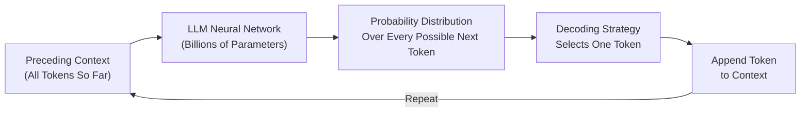
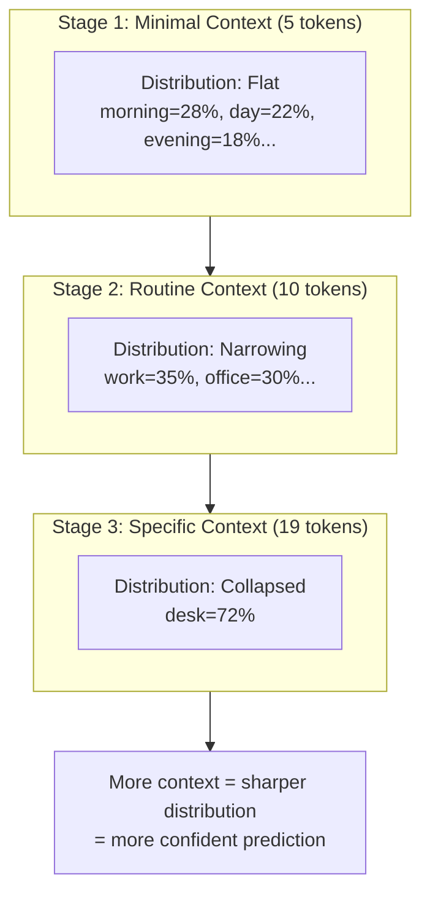
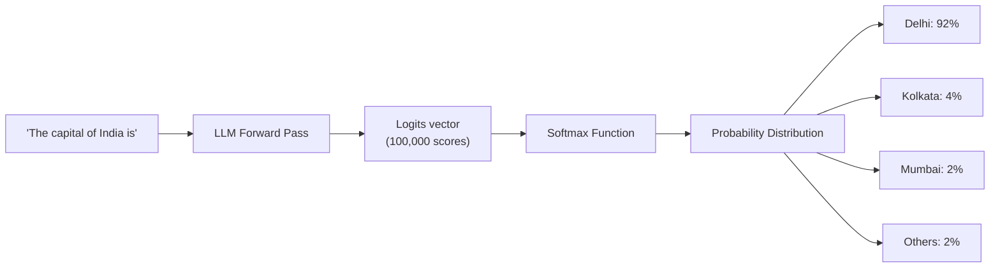
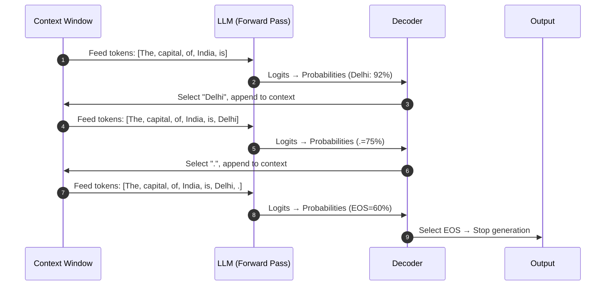
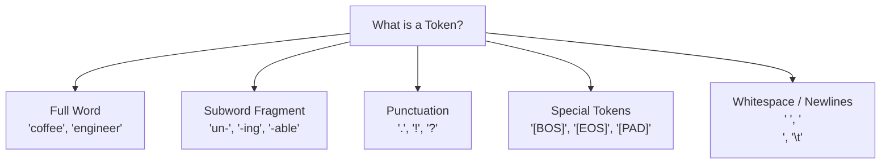

# Chapter 1: Foundations of Large Language Models & Next-Token Prediction

> **Chapter Goal:** Understand the single unifying idea behind every LLM — next-token prediction — and how a surprisingly simple mechanism gives rise to the complex behaviors we observe in systems like ChatGPT, Claude, and Gemini.

---

## 1.1 The One Core Task

At the most fundamental level, a **Large Language Model (LLM)** does not:
- Execute rule trees or `if-else` logic chains
- Query relational databases or knowledge graphs
- "Think" in the human sense of the word

Instead, every LLM is trained to do **exactly one thing**:

> **Given all preceding tokens in the context, predict a probability distribution over what single token should come next.**

This is called **next-token prediction** or **autoregressive language modeling**.

The remarkable insight of modern LLMs is that this deceptively simple task — when applied at massive scale across trillions of training tokens — gives rise to emergent capabilities: reasoning, summarization, translation, code generation, question answering, and more.



> [!NOTE]
> **Why does this work?** To predict the next word in "The capital of France is ___", a model must implicitly "know" geography. To predict the next token in a Python function signature, it must implicitly "know" programming syntax. All knowledge is captured as statistical patterns learned from the training corpus — not as explicit symbolic rules.

---

## 1.2 Context Is Everything: The Prompt Evolution Experiment

An LLM's prediction is never isolated. Every token probability is conditioned on the **entire preceding context**. As context grows more specific, the probability distribution narrows dramatically.

Consider the following staged prompt experiment drawn from the lecture:

### Stage 1 — Minimal Context
```
"I drink coffee every ___"
```
With only 5 tokens of context, the distribution is flat:

| Candidate | Probability |
|-----------|-------------|
| morning | 28% |
| day | 22% |
| evening | 18% |
| night | 15% |
| hour | 10% |
| others | 7% |

### Stage 2 — Expanded Context
```
"I drink coffee every morning before going to ___"
```
Adding a time constraint ("morning") and a spatial action ("going to") dramatically shifts the distribution:

| Candidate | Probability |
|-----------|-------------|
| work | 35% |
| office | 30% |
| college | 15% |
| gym | 10% |
| school | 6% |
| others | 4% |

### Stage 3 — Highly Specific Context
```
"I work remotely as a software engineer. Every morning I drink coffee before going to my ___"
```
The word "remotely" eliminates commuting destinations. "My" signals personal space. The distribution collapses:

| Candidate | Probability |
|-----------|-------------|
| **desk** | **72%** |
| workstation | 12% |
| computer | 8% |
| home office | 5% |
| others | 3% |



> [!IMPORTANT]
> **Engineering Takeaway:** This is why **prompt engineering works**. The more specific and targeted your prompt context, the more constrained the model's probability distribution becomes, and the more useful and accurate the output.

---

## 1.3 Next-Token Probability Distribution: A Worked Example

When the model receives:
```
"The capital of India is"
```

Internally, the model does **not** look up "India → capital → Delhi" in a dictionary. Instead, during training, it learned that the token sequence `["The", "capital", "of", "India", "is"]` is statistically followed by `"Delhi"` the vast majority of the time in its training corpus.

This knowledge manifests as a probability distribution at inference time:

| Token Candidate | Raw Logit Score | Softmax Probability | Interpretation |
|-----------------|----------------|---------------------|----------------|
| **Delhi** | +12.8 | **92%** | Strong pattern match from training |
| Kolkata | +7.1 | 4% | Major city, once a capital |
| Mumbai | +5.4 | 2% | Major city, frequently mentioned |
| Bangalore | +4.2 | 1% | Major tech hub |
| Others (entire vocab) | varies | 1% | Distributed across ~100k tokens |



> [!NOTE]
> The model produces one probability score for **every single token in its vocabulary** — not just the plausible ones. A token like `"banana"` might receive a logit of `-8.4` and a probability of `0.00003%`. The Softmax function ensures all probabilities across the entire vocabulary sum to exactly `1.0 (100%)`.

---

## 1.4 The Autoregressive Generation Loop

The term **autoregressive** means: *a model that uses its own previous outputs as inputs to produce its next output*.

**Auto** = self  
**Regressive** = future predictions depend on preceding values

### Step-by-Step Trace: "The capital of India is"

**Iteration 1:**
- Context: `"The capital of India is"`
- Model output distribution: Delhi=92%, Kolkata=4%, others=4%
- Selected token: `"Delhi"` (highest probability)
- New context: `"The capital of India is Delhi"`

**Iteration 2:**
- Context: `"The capital of India is Delhi"`
- Model output distribution: `.`=75%, `,`=8%, `and`=5%, `which`=4%...
- Selected token: `"."`
- New context: `"The capital of India is Delhi."`

**Iteration 3:**
- Context: `"The capital of India is Delhi."`
- Model output distribution: `<EOS>`=60%, `It`=15%, `The`=10%...
- Selected token: `<EOS>` (End of Sequence token)
- **Generation stops.**



> [!IMPORTANT]
> **Critical Mental Model:** An LLM never generates a full response in one shot. It generates **one token at a time**, running a complete forward pass through its billions of parameters for each individual token. A 500-word response might require 700+ forward passes.

---

## 1.5 The First Correction: Words vs. Tokens

Beginners often describe LLMs as systems that "predict the next word." This is close, but **technically incorrect** and matters for engineering.

**LLMs predict the next *token*, not the next *word*.**

A token is **not necessarily a word**. It is the fundamental atomic unit of text that the model's tokenizer treats as a single discrete unit. Tokens can be:

- A full common word: `"cat"`, `"coffee"`, `"the"`
- A subword fragment: `"un"`, `"believ"`, `"able"` (from "unbelievable")
- A single character (in some tokenizers)
- Punctuation: `"."`, `"?"`, `"!"`
- Whitespace or newline characters
- Special system tokens: `"<|endoftext|>"`, `"[CLS]"`, `"<EOS>"`



> [!TIP]
> **Practical Impact:** This is why AI API providers charge by **token count** not word count. A seemingly short sentence with technical jargon (like `"ChatGPT's tokenizer decomposes unbelievable into sub-units"`) uses far more tokens than a simple sentence of the same word count. Always estimate tokens, not words.

---

## 1.6 Why Emergent Complexity from Simple Prediction?

Students often wonder: *if all the model does is predict the next token, how does it write essays, debug code, and solve math problems?*

The answer lies in **what must be true for next-token prediction to work well**.

To predict the next token in:
```
"The bug in line 47 occurs because Python's integer division with '//' truncates towards ___"
```

The model must implicitly understand:
- What Python is
- What `//` means in Python
- What "truncates towards" means in arithmetic
- That the answer should be `"negative infinity"` (floor division behavior)

To generalize across billions of such patterns, the model must build internal representations of syntax, semantics, facts, reasoning chains, and world knowledge — all as a side-effect of learning to predict tokens well.

> [!NOTE]
> **This is the insight:** Prediction is not the goal — prediction is the *training signal*. The rich internal representations learned to minimize prediction error are the actual source of the model's capabilities.

---

## 1.7 Summary

| Concept | Key Insight |
|---------|-------------|
| **Core Task** | Next-token prediction conditioned on full context |
| **Context Sensitivity** | More context = narrower distribution = better predictions |
| **Probability Distribution** | Assigned to every token in vocabulary at each step |
| **Autoregressive Loop** | Model uses own output as input; generates one token per pass |
| **Token ≠ Word** | Tokens are atomic text units; may be subwords, punctuation, or special markers |
| **Emergent Capabilities** | Complex behaviors emerge as side-effects of learning to predict well at scale |
