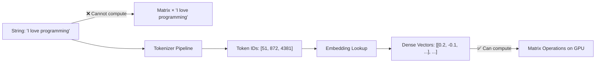
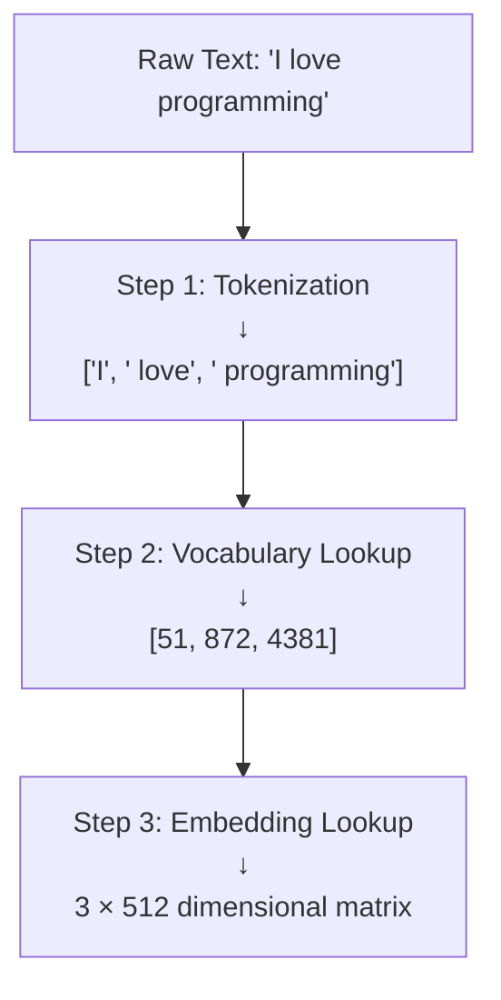
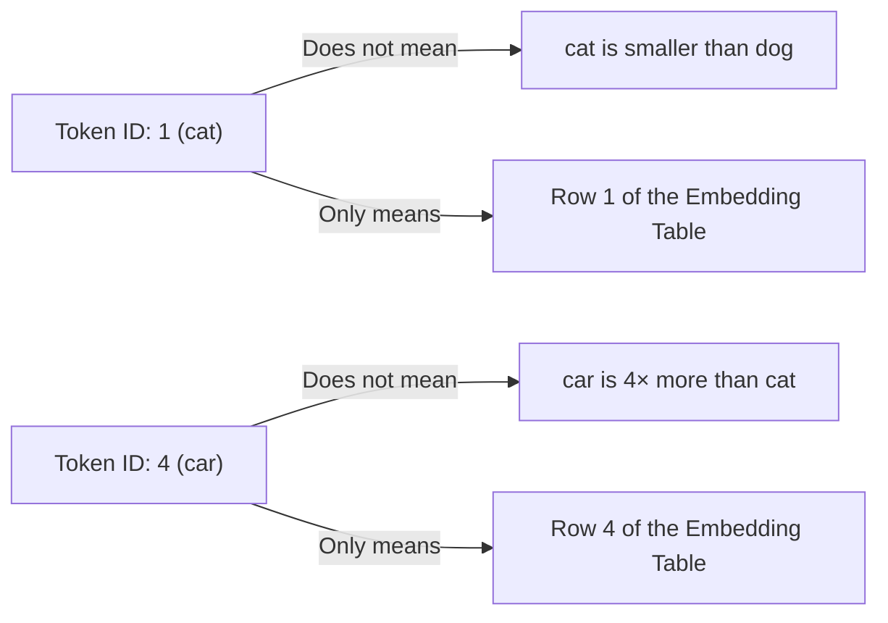
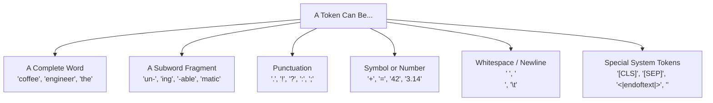
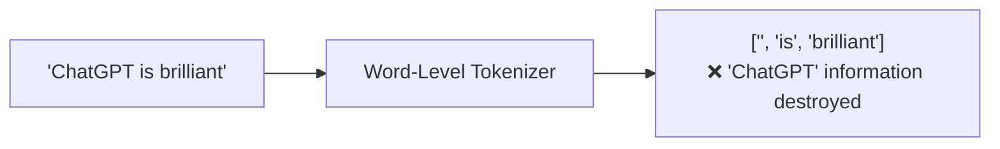
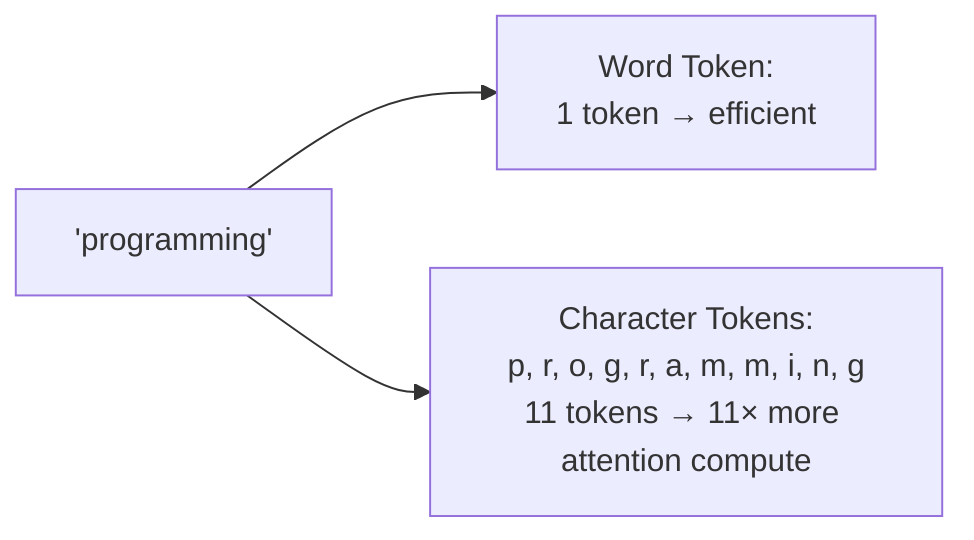
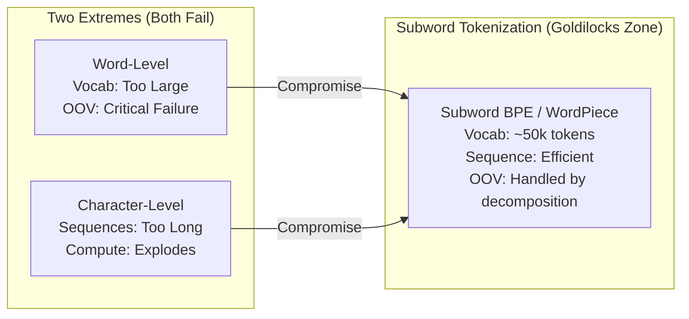
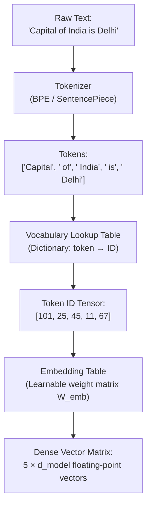

# Chapter 2: Tokenization — From Raw Text to Numbers

> **Chapter Goal:** Understand *exactly* how raw human text becomes the numerical input that a neural network can process. Master the trade-offs between different tokenization strategies and understand why subword tokenization became the industry standard.

---

## 2.1 Why Text Must First Become Numbers

A neural network is, at its core, a series of mathematical operations: matrix multiplications, dot products, element-wise additions, and non-linear activation functions. Every single operation inside a Transformer requires **numerical tensors** as input.

Raw text — the string `"Hello, world!"` — cannot be directly fed into these operations. There is no meaningful way to multiply the letter `H` by a weight matrix.



The solution is a two-stage process:
1. **Tokenization:** Split text into discrete units (tokens) and assign each a unique integer ID
2. **Embedding:** Map each integer ID to a dense, learned vector of floating-point numbers

This chapter covers Stage 1. Chapter 3 covers Stage 2.

---

## 2.2 The Three Things That Are Different

Before going further, it is critical to distinguish between three related but distinct objects:

| Object | Example | Description |
|--------|---------|-------------|
| **Original Text** | `"I love programming"` | The raw string as typed by the user |
| **Tokens** | `["I", " love", " programming"]` | Text segments the tokenizer identifies as atomic units |
| **Token IDs** | `[51, 872, 4381]` | Integer indices assigned to each token in the vocabulary lookup table |



During generation, this pipeline runs in reverse: the model outputs a predicted token ID (e.g., `4381`), which is decoded back to its text representation (`" programming"`).

---

## 2.3 Token IDs Are Labels, Not Measurements

A critical misconception must be addressed immediately:

**A larger token ID does NOT mean a more important, frequent, or semantically heavier token.**

Token IDs are purely **arbitrary lookup indices** — like student roll numbers or product SKUs. They carry no intrinsic numerical meaning.

### The Roll Number Analogy (from Lecture)

In a university classroom:
- **Rohit** → Roll Number `104`
- **Aditya** → Roll Number `237`

The fact that $237 > 104$ tells us **nothing** about Aditya relative to Rohit — not intelligence, not age, not academic performance. These are just arbitrary identifiers assigned during enrollment.

The same is true for tokens:

| Token | Assigned ID | Does ID convey meaning? |
|-------|-------------|-------------------------|
| `cat` | `1` | No — just an index |
| `dog` | `2` | No — just an index |
| `apple` | `3` | No — just an index |
| `car` | `4` | No — `car ≠ 4 × cat` |
| `Rohit` | `104` | No — arbitrary assignment |
| `Aditya` | `237` | No — arbitrary assignment |



> [!IMPORTANT]
> **Key Principle:** $\text{Token ID} \neq \text{Semantic Meaning}$. Token IDs are scalar integer *lookup keys*, nothing more. The semantic meaning is stored in the **embedding vectors** they index — not in the IDs themselves.

---

## 2.4 What Exactly Is a Token?

A **token** is whatever unit of text the tokenizer treats as the smallest atomic building block.

### Common Myths Debunked

**Myth 1: "One word = one token"**

This is approximately true for simple, common English words, but breaks down often:
- The word `unbelievable` → might become 3 tokens: `["un", "believ", "able"]`
- A proper noun like `Anthropic` → might become 2 tokens: `["Anthr", "opic"]`
- Code like `print(x)` → might become 4+ tokens: `["print", "(", "x", ")"]`

**Myth 2: "1 token = 4 characters"**

The rule `1 token ≈ 4 characters` is a **rough empirical estimate** for standard English prose — useful for API cost estimation, but it is not a structural definition:
- A single character `é` in French text might be 2 tokens (due to UTF-8 byte encoding)
- A full common word like `"the"` = 1 token = 3 characters
- A rare technical term like `"glucocorticosteroid"` = many tokens

### What Tokens Can Be



---

## 2.5 Why Not Simply Use Whole Words? (Word-Level Tokenization)

The simplest approach: assign every unique word in the language its own token.

```
cat → 1,   dog → 2,   computer → 3,   programming → 4,   automatically → 5 ...
```

### The Fatal Problems

**Problem 1: Vocabulary Explosion**

Languages are morphologically rich. A single root word generates dozens of surface forms, each needing its own entry:

| Root Word | Surface Forms Requiring Separate Entries |
|-----------|------------------------------------------|
| `automate` | `automate`, `automates`, `automated`, `automating`, `automation`, `automatic`, `automatically`, `automatons`... |
| `program` | `program`, `programs`, `programmed`, `programming`, `programmer`, `programmers`, `programmatic`... |

A vocabulary covering English with all morphological variants, technical jargon, proper nouns, code identifiers, and typos could easily exceed **1 million entries**. This makes the embedding matrix enormous.

**Problem 2: Out-of-Vocabulary (OOV) Failure**

New words appear constantly: brand names (`ChatGPT`, `TikTok`), technical terms (`tokenizer`, `embeddings`), slang, and domain-specific jargon. A fixed word vocabulary returns `<UNK>` (unknown) for these, completely losing their meaning.



---

## 2.6 Why Not Use Individual Characters? (Character-Level Tokenization)

The opposite extreme: every character (`a`, `b`, `c`, `1`, `!`, space) is its own token.

### The Fatal Problem: Sequence Length Explosion

The word `"programming"` becomes 11 separate tokens: `p r o g r a m m i n g`

Self-attention in Transformers scales quadratically with sequence length: $O(N^2)$. If character tokenization expands a typical 100-word prompt into ~600 character tokens, the attention computation cost increases by $36×$.

This makes character-level models impractical for handling long documents, code files, or multi-turn conversations.



---

## 2.7 Subword Tokenization: The Industry Standard

Modern LLMs use **Subword Tokenization** — a middle ground that combines the benefits of both extremes.

**Core Principle:** Frequent words remain as single tokens. Rare or complex words are split into frequent subword chunks that already exist in the vocabulary.

### How It Works (BPE Example)

**Byte-Pair Encoding (BPE)** starts with individual characters and iteratively merges the most frequent adjacent pairs into new tokens:

```
Step 0: v-o-c-a-b-u-l-a-r-y  (character-level start)
Step 1: vo-ca-bu-la-ry        (merge most frequent pairs)
Step 2: vocab-ulary            (continue merging)
Step 3: vocabulary             (common enough → single token)
```

For a rare word like `"unbelievable"`:
```
un + believ + able → 3 tokens (all are frequent subwords)
```

For a common word like `"the"`:
```
the → 1 token (appears so frequently it stays whole)
```

### Tokenization Examples Across Models

```
"Automatically"
├── GPT-4 (cl100k):   ["Automatically"]          → 1 token
├── LLaMA-3 (Tiktoken):["Auto", "matically"]     → 2 tokens  
└── GPT-2 (original): ["Auto", "mat", "ically"]  → 3 tokens
```

Different tokenizers produce **different token splits** for the same text. This is a key engineering consideration when switching models.

### The Trade-Off Comparison Matrix

| Dimension | Word-Level | Character-Level | Subword (BPE/WordPiece) |
|-----------|-----------|-----------------|-------------------------|
| **Vocabulary Size** | Enormous (>1M) | Tiny (100–256) | Balanced (32k–100k) |
| **Sequence Length** | Minimal | Massive (+10×) | Optimal |
| **OOV Handling** | Fails (`<UNK>`) | Perfect | Perfect (decomposes) |
| **Morphology** | Poor (each form separate) | N/A | Good (shares subwords) |
| **Attention Compute** | Light | Very Heavy | Moderate |
| **Embedding Matrix Size** | Enormous | Tiny | Manageable |
| **Industry Usage** | Legacy NLP only | Rare | **All Modern LLMs** |



---

## 2.8 The Complete Tokenization Pipeline

Let's trace a real example end-to-end:

**Input Prompt:** `"Capital of India is Delhi"`

```
Step 1 — Raw String Input:
"Capital of India is Delhi"

Step 2 — Subword Segmentation by Tokenizer:
["Capital", " of", " India", " is", " Delhi"]
(Note: leading spaces are part of the token in many tokenizers like BPE)

Step 3 — Vocabulary Index Lookup:
[101, 25, 45, 11, 67]

Step 4 — Embedding Matrix Row Extraction:
Row 101 → [0.41, -0.82, 1.34, ...]  (512 or 4096-dim vector for "Capital")
Row 25  → [0.12,  0.55, -0.23, ...]  (vector for " of")
Row 45  → [-0.73, 0.92, 0.44, ...]  (vector for " India")
...
```



> [!TIP]
> **API Engineering Note:** Since every LLM family (OpenAI, Meta LLaMA, Google Gemini, Anthropic Claude) uses a different tokenizer with a different vocabulary, the same sentence produces **different token counts and different token IDs** across models. When calculating costs, always use the specific model's tokenizer. OpenAI's `tiktoken` library and Hugging Face's `tokenizers` library both provide accurate counts.

---

## 2.9 Summary

| Concept | Key Insight |
|---------|-------------|
| **Why Tokenize?** | Neural networks require numerical tensors; raw text strings cannot be used in matrix math |
| **Token vs. Token ID** | Token = text unit; Token ID = integer index into vocabulary lookup table |
| **Token ID ≠ Meaning** | IDs are roll numbers — arbitrary identifiers with no intrinsic value |
| **Token ≠ Word** | Tokens can be subwords, punctuation, whitespace, or special system tokens |
| **Word-Level Fails** | Vocabulary explosion + OOV failures on new words |
| **Character-Level Fails** | Sequence length explosion → quadratic attention compute explosion |
| **Subword Is Standard** | BPE/WordPiece balances vocabulary size, sequence length, and OOV handling |
| **Model-Specific** | Different models tokenize the same text differently — never assume token counts transfer across models |
