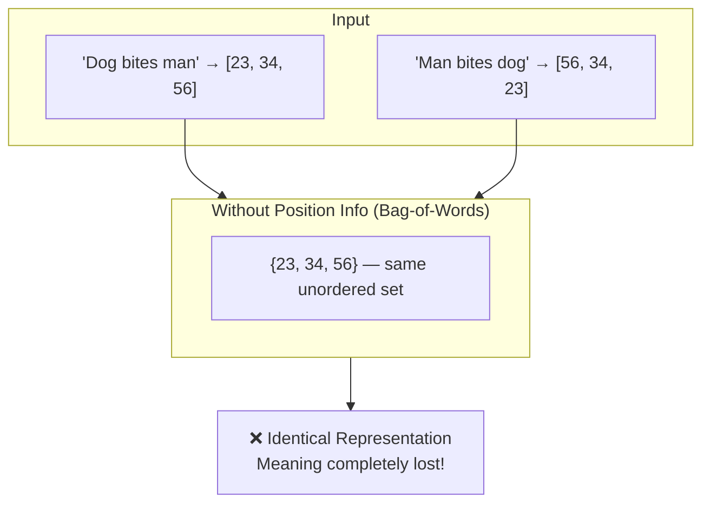
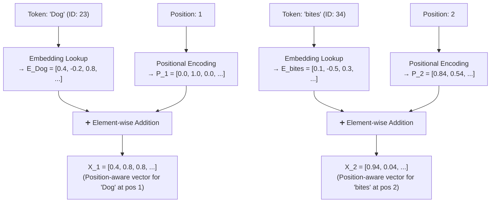
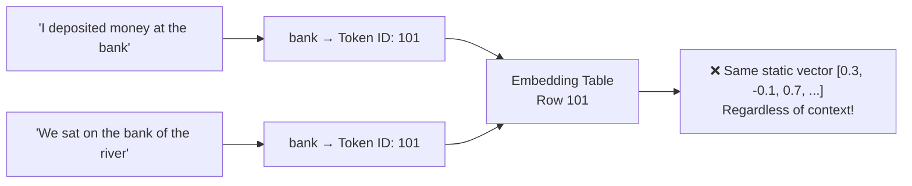
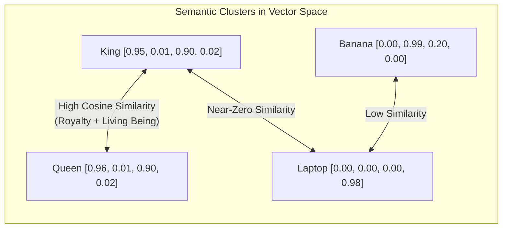
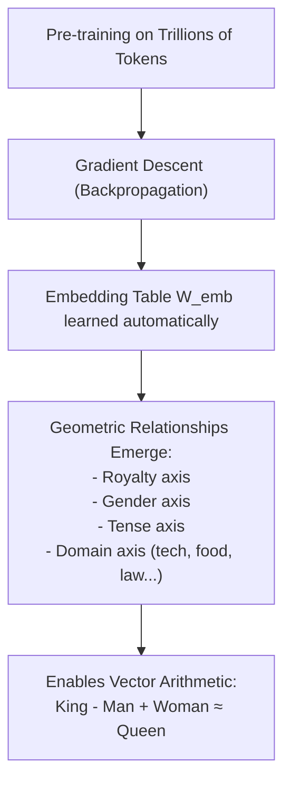
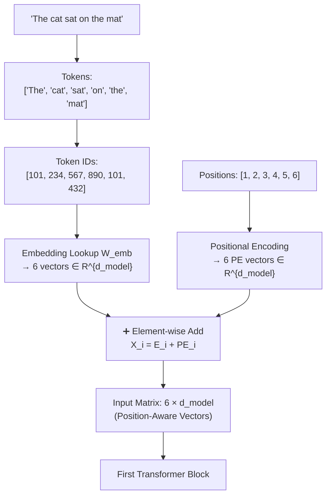

# Chapter 3: Word Order, Positional Encodings & Vector Embeddings

> **Chapter Goal:** Understand why raw token IDs are insufficient, how position is injected, and how dense vector embeddings allow tokens to carry semantic meaning in a high-dimensional mathematical space.

---

## 3.1 The Permutation Problem: Why Order Is Critical

Consider these two sentences:

- **Sentence A:** `"Dog bites man."` → Token IDs: `[23, 34, 56]`  
- **Sentence B:** `"Man bites dog."` → Token IDs: `[56, 34, 23]`

The words are identical. The meanings are opposite — one is news, the other is barely worth reporting. Yet a model that only sees the **set** of token IDs would produce the **same representation** for both.

This problem is called **permutation invariance**: if your model is blind to order, the same three tokens produce the same representation regardless of their sequence.



More examples where order is decisive:

| Sentence A | Sentence B | Same Tokens? | Same Meaning? |
|------------|------------|--------------|---------------|
| "Rohit teaches Aditya" | "Aditya teaches Rohit" | ✅ Yes | ❌ No |
| "The cat chased the dog" | "The dog chased the cat" | ✅ Yes | ❌ No |
| "I am fine, not sick" | "I am sick, not fine" | ✅ Yes | ❌ No |

**Self-attention is inherently permutation-invariant**. Without positional information, it treats every input as an unordered set. Positional encodings solve this.

---

## 3.2 Injecting Order: Positional Encodings

The solution is to **add** a positional signal to each token's representation before feeding it into the Transformer. This tells the model not just *what* each token is, but *where* it appears in the sequence.

### The Key Formula

$$\mathbf{X}_{\text{in}} = \mathbf{E}_{\text{token}} + \mathbf{P}_{\text{pos}}$$

Where:
- $\mathbf{E}_{\text{token}} \in \mathbb{R}^{d_{\text{model}}}$ = the dense semantic embedding of the token
- $\mathbf{P}_{\text{pos}} \in \mathbb{R}^{d_{\text{model}}}$ = the positional encoding for position $i$
- $\mathbf{X}_{\text{in}}$ = the position-aware input vector fed to the first Transformer block



Now the model sees different vectors for `"Dog"` at position 1 vs. `"Dog"` at position 3 — even though the embedding is identical.

### Types of Positional Encoding

| Method | Used In | How It Works |
|--------|---------|-------------|
| **Sinusoidal PE** | Original Transformer (Vaswani 2017) | Fixed mathematical functions: $\sin/\cos$ at different frequencies for each dimension |
| **Learned PE** | GPT-2, BERT | Trainable vectors per position, learned alongside model weights |
| **RoPE (Rotary)** | LLaMA, Mistral, Gemma | Encodes position as rotation in complex space; enables better length generalization |
| **ALiBi** | MPT, BLOOM | Adds learned bias to attention scores based on relative distance |

> [!NOTE]
> The original 2017 Transformer paper used sinusoidal encodings with the formula:
> $$PE_{(pos, 2i)} = \sin\left(\frac{pos}{10000^{2i/d_{\text{model}}}}\right), \quad PE_{(pos, 2i+1)} = \cos\left(\frac{pos}{10000^{2i/d_{\text{model}}}}\right)$$
> Modern models typically use **learned** or **RoPE** positional encodings for better generalization to longer sequences.

---

## 3.3 Context Changes Meaning: The Polysemy Problem

Even with position added, a raw integer token ID cannot capture **context-dependent meaning**. Consider the single word `"bank"`:

- `"I deposited money at the **bank**."` → financial institution
- `"We sat on the **bank** of the river."` → sloping riverside edge

The token `"bank"` has the same integer ID in both sentences. If we look up a fixed vector in an embedding table, we get the **exact same vector** regardless of context. This means a static embedding table lookup cannot distinguish these two meanings.



The solution is **not** to create two separate entries for financial-bank and river-bank. That approach explodes for truly ambiguous words (hundreds of word senses in a full language). 

The solution is **Self-Attention** (Chapter 4), which dynamically modifies a token's representation based on surrounding context. But first, we need to understand what these vectors actually represent.

---

## 3.4 Dense Vector Embeddings: Giving Tokens Geometric Meaning

A **token embedding** is a dense, continuous, high-dimensional vector that places the token in a geometric vector space $\mathbb{R}^{d_{\text{model}}}$, where geometrically close vectors correspond to semantically related concepts.

### Why Not Use Sparse One-Hot Vectors?

A naive approach: represent each token as a one-hot vector of length $|V|$ (vocabulary size):
```
cat  = [1, 0, 0, 0, 0, ...]  (50,000-dim vector, all zeros except position 1)
dog  = [0, 1, 0, 0, 0, ...]
```

Problems:
- **Enormous dimensionality:** 50,000+ dimensions per token
- **No geometric relationships:** `cat` and `dog` are equidistant in this space (both are distance $\sqrt{2}$ apart from each other and from everything else)
- **No generalization:** Model cannot infer that knowledge about cats might apply to dogs

### Dense Embeddings: Compact and Relational

Instead, every token is mapped to a compact dense vector (e.g., 512 or 4096 dimensions), where the **geometric relationships encode semantic relationships**:

### Conceptual Feature Dimension Illustration

Imagine (hypothetically) that word vectors had human-interpretable dimensions:

| Word | Royalty | Food | Living Being | Technology | Simplified Vector |
|------|---------|------|--------------|------------|-------------------|
| **King** | 0.95 | 0.01 | 0.90 | 0.02 | `[0.95, 0.01, 0.90, 0.02]` |
| **Queen** | 0.96 | 0.01 | 0.90 | 0.02 | `[0.96, 0.01, 0.90, 0.02]` |
| **Banana** | 0.00 | 0.99 | 0.20 | 0.00 | `[0.00, 0.99, 0.20, 0.00]` |
| **Laptop** | 0.00 | 0.00 | 0.00 | 0.98 | `[0.00, 0.00, 0.00, 0.98]` |

From this, observe:
- **King** and **Queen** → nearly identical vectors → geometrically close → semantically related ✅
- **King** and **Laptop** → very different vectors → geometrically distant → semantically unrelated ✅
- **Cosine similarity**: $\cos(\text{King}, \text{Queen}) \approx 0.99$, $\cos(\text{King}, \text{Laptop}) \approx 0.01$



### The Famous Word Arithmetic (Word2Vec Era)

Dense embeddings enable mathematical word relationships:

$$\text{vector}(\text{King}) - \text{vector}(\text{Man}) + \text{vector}(\text{Woman}) \approx \text{vector}(\text{Queen})$$

This is geometry, not lookup. The vector space has learned directional axes for concepts like gender, royalty, and so on — all without ever being explicitly told what these concepts are.

---

## 3.5 Embeddings Are Learned, Not Hand-Crafted

An important point from the lecture: **no human hand-crafts these dimension values**.

Real LLMs do not have dimensions labeled "Royalty" or "Food". Instead, the model has a weight matrix $W_{\text{emb}} \in \mathbb{R}^{|V| \times d_{\text{model}}}$ (the embedding table), and these weights are **learned entirely from data** via backpropagation during pre-training.

For a model with $d_{\text{model}} = 4096$ (e.g., LLaMA-2 7B):

$$\mathbf{E}_{\text{king}} = [0.41, -0.82, 1.34, 0.15, \ldots, -0.09] \in \mathbb{R}^{4096}$$

These 4096 numbers are not interpretable by humans. They are abstract mathematical directions in a high-dimensional space that emerge from the model learning to predict tokens well. The geometric structure that emerges — Royalty axis, Gender axis, Tense axis, etc. — is a byproduct of learning, not deliberate design.



---

## 3.6 The Complete Input Pipeline

Putting it all together, the input processing pipeline for the Transformer is:

```
Raw Text: "The cat sat on the mat"
     ↓
Tokenization: ["The", " cat", " sat", " on", " the", " mat"]
     ↓
Token IDs:    [101,   234,   567,   890,   101,   432]
     ↓
Embedding Lookup: Each ID → dense vector ∈ ℝ^{d_model}
     ↓
Positional Encoding: PE_1, PE_2, PE_3, PE_4, PE_5, PE_6
     ↓
Addition: X_i = E_token_i + PE_i
     ↓
Position-Aware Input Matrix: [X_1, X_2, X_3, X_4, X_5, X_6] ∈ ℝ^{6 × d_model}
     ↓
Input to First Transformer Block
```



> [!NOTE]
> Notice that token `"The"` appears at positions 1 and 5 in the sentence `"The cat sat on the mat"`. It has the **same token ID** (101) both times and therefore the **same base embedding**. But after adding different positional encodings ($PE_1 \neq PE_5$), the model receives distinct input vectors for each occurrence. This is how position awareness works.

---

## 3.7 Summary

| Concept | Key Insight |
|---------|-------------|
| **Permutation Problem** | Self-attention is order-blind without explicit positional signals |
| **Positional Encoding** | Position vectors added to embeddings: $\mathbf{X}_{\text{in}} = \mathbf{E} + \mathbf{P}$ |
| **Static vs. Dynamic** | Embedding table gives static lookup; Self-Attention creates dynamic, context-aware representations |
| **Polysemy** | Same word ID always fetches same static vector — context-dependent meaning requires Attention |
| **Dense Embeddings** | Compact floating-point vectors where geometric distance encodes semantic similarity |
| **Learned Dimensions** | Embedding dimensions are not human-labeled; they emerge from training |
| **Word Arithmetic** | Vector geometry enables analogical reasoning: King − Man + Woman ≈ Queen |
