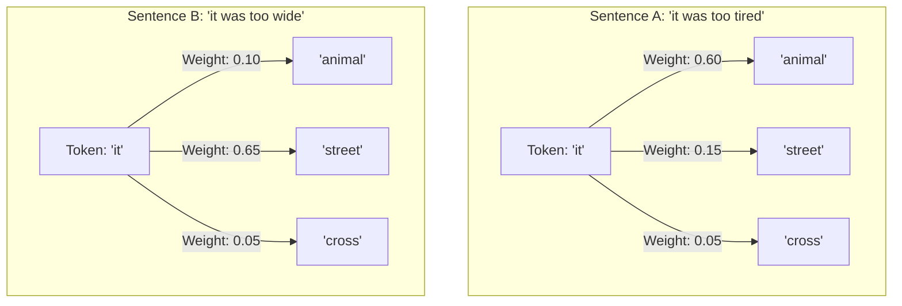
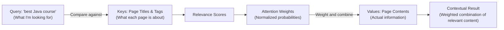
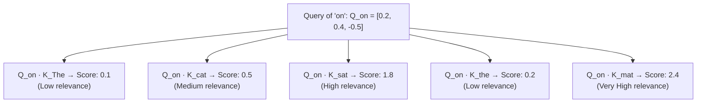
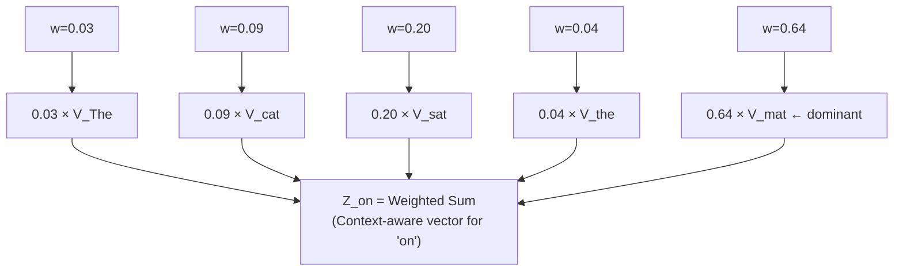
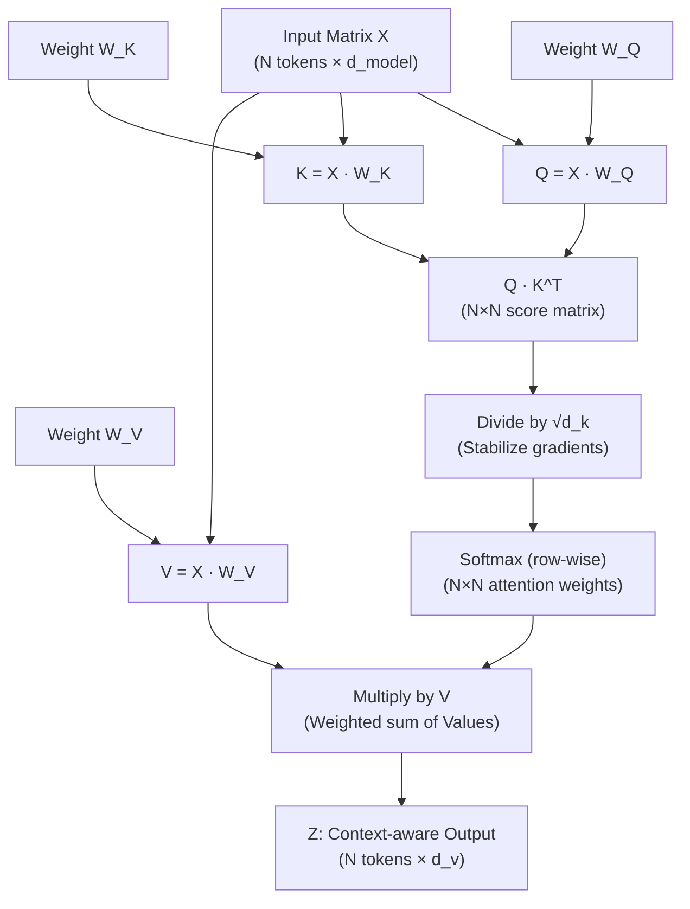
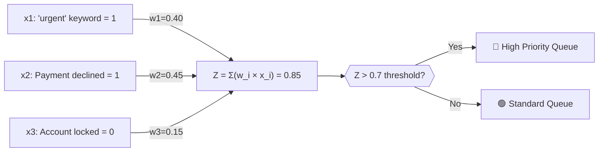

# Chapter 4: Self-Attention Mechanism & the QKV Framework

> **Chapter Goal:** Understand how Self-Attention enables every token to dynamically gather relevant information from all other tokens in the sequence — building the context-aware representations that make LLMs powerful. Master the Query, Key, Value framework and the mathematics of Scaled Dot-Product Attention.

---

## 4.1 The Problem That Attention Solves

We established in Chapter 3 that embedding table lookups are **static**: the word `"bank"` always returns the same vector regardless of whether it appears in `"deposited money at the bank"` or `"sat on the bank of the river"`.

To build contextual representations, we need a mechanism that allows each token to **look at all other tokens in the sequence** and decide:
1. Which other tokens are relevant to me?
2. How much weight should I give to each of them?
3. What information should I gather from them?

This mechanism is **Self-Attention**.

$$\underbrace{\mathbf{E}_{\text{bank}}}_{\text{static}} + \underbrace{\text{context from surrounding tokens}}_{\text{dynamic}} \longrightarrow \underbrace{\mathbf{Z}_{\text{bank}}}_{\text{context-aware}}$$

---

## 4.2 Attention Is Dynamic: Reference Resolution

The clearest illustration of why static representations fail comes from **reference resolution** — figuring out what a pronoun like "it" or "his" refers to.

### Example from Lecture

Consider: `"Rohit gave Aditya his laptop because his computer was broken."`

**Question:** Which "his" refers to whom?
- The first `"his"` → belongs to **Aditya** (Rohit gave Aditya *his own* laptop — Aditya's laptop)
- The second `"his"` → belongs to **Aditya** (Aditya's computer was broken)

To resolve `"his"`, the model must attend to `"Aditya"` more heavily than `"Rohit"`. The attention weights might look like:

| Token | Attention Weight for "his" |
|-------|---------------------------|
| Rohit | 30% |
| gave | 1% |
| **Aditya** | **60%** |
| laptop | 5% |
| because | 1% |
| computer | 3% |

### The Classic Sentence Pair (from PDF)

- **Sentence A:** `"The animal didn't cross the street because it was too **tired**."`  
  → `"it"` refers to: **the animal** (animals get tired, not streets)

- **Sentence B:** `"The animal didn't cross the street because it was too **wide**."`  
  → `"it"` refers to: **the street** (streets are wide, not animals)

Changing one word (`tired` → `wide`) completely flips the reference of `"it"`. A static lookup has no hope of capturing this. Attention weights change dynamically for every input sequence.



> [!IMPORTANT]
> **Attention is computed fresh for every new input.** The model does not hardcode rules like `"it" → animal`. It computes relevance scores on the fly based on the specific sequence at hand. This is what makes it *dynamic*.

---

## 4.3 The Query, Key, Value (QKV) Framework

Self-attention achieves this dynamic computation through three learned linear projections for every token: **Query (Q)**, **Key (K)**, and **Value (V)**.

### The Search Engine Analogy (from Lecture)

The easiest way to understand QKV is through the analogy of a **search engine**:

You search: `"best Java programming course"`

| Component | Search Engine | Self-Attention |
|-----------|---------------|----------------|
| **Query (Q)** | Your search query text | "What information am I looking for?" |
| **Key (K)** | Page titles, tags, metadata indexed by the search engine | "What kind of information do I contain?" |
| **Value (V)** | The actual web page content returned when matched | "Here is the information I can contribute" |

The search engine compares your **Query** against all **Keys**, computes relevance scores, and returns the **Values** of the most relevant results.



### The Multi-Faceted Person Analogy (from Lecture)

Consider describing a person — let's say **Aditya**. Depending on the question asked, you examine different aspects:

| Question | Relevant "Key" Aspect of Aditya |
|----------|--------------------------------|
| "Who knows Java?" | Technical skills: Java ✅, FDE ✅, CD Fundamentals ✅ |
| "Who lives closest?" | Location: India, Delhi, Remote worker |
| "Who should teach?" | Communication skills + Knowledge + Availability |

Aditya is the same person, but **you extract different information depending on the task**. Q, K, and V give each token three separate learned projections so the model can ask different questions (Q), be findable via different criteria (K), and contribute different content (V).

---

## 4.4 Every Token Produces Its Own Q, K, and V

For the sentence: `"The cat sat on the mat."`

Token IDs: `[23, 34, 45, 56, 67, 78]`

After the position-aware embeddings are computed, each token vector $\mathbf{x}_i$ is linearly projected to produce three vectors:

$$Q_i = \mathbf{x}_i W_Q, \quad K_i = \mathbf{x}_i W_K, \quad V_i = \mathbf{x}_i W_V$$

Where $W_Q, W_K, W_V \in \mathbb{R}^{d_{\text{model}} \times d_k}$ are learned weight matrices shared across all tokens.

```
Token "The":  Q_The,  K_The,  V_The
Token "cat":  Q_cat,  K_cat,  V_cat
Token "sat":  Q_sat,  K_sat,  V_sat
Token "on":   Q_on,   K_on,   V_on
Token "the":  Q_the,  K_the,  V_the
Token "mat":  Q_mat,  K_mat,  V_mat
```

From the Excalidraw notes:
```
"on" → position 56 → produces:
  Q_on = [0.2, 0.4, -0.5]
  K_on = [0.3, 0.7, 0.9]
  V_on = [-0.9, 0.99, -0.6]
```

---

## 4.5 Computing Attention Weights: A Token-Level Trace

Let's trace exactly what happens when computing the updated representation for the token `"on"` in the sentence `"The cat sat on the mat"`:

**Step 1: Compute relevance scores (dot products)**

`"on"` uses its Query $Q_{\text{on}}$ and computes a dot product with the Key of **every other token**:

```
Q_on · K_The  → Low score  → "The" is not very relevant to "on"
Q_on · K_cat  → Medium     → "cat" (the subject) has some relevance
Q_on · K_sat  → High       → "sat" is very relevant (on what? on where sat)
Q_on · K_the  → Low        → "the" is a filler
Q_on · K_mat  → Very High  → "mat" is the direct object of "on"
```



**Step 2: Scale by $\frac{1}{\sqrt{d_k}}$**

If $d_k = 3$ (our toy example), we divide all scores by $\sqrt{3} \approx 1.73$:
- $0.1 / 1.73 = 0.058$
- $0.5 / 1.73 = 0.289$
- $1.8 / 1.73 = 1.040$
- $0.2 / 1.73 = 0.116$
- $2.4 / 1.73 = 1.387$

**Step 3: Apply Softmax to get attention weights**

Softmax converts scaled scores into weights that sum to 1:

| Token | Scaled Score | Attention Weight $w_i$ |
|-------|-------------|------------------------|
| The | 0.058 | 3% |
| cat | 0.289 | 9% |
| sat | 1.040 | 20% |
| the | 0.116 | 4% |
| **mat** | **1.387** | **64%** |

**Step 4: Compute weighted sum of Values**

$$Z_{\text{on}} = 0.03 \cdot V_{\text{The}} + 0.09 \cdot V_{\text{cat}} + 0.20 \cdot V_{\text{sat}} + 0.04 \cdot V_{\text{the}} + 0.64 \cdot V_{\text{mat}}$$



The resulting vector $Z_{\text{on}}$ now carries contextual information about `"mat"` being the object of `"on"` — without any explicit programming of grammar rules.

---

## 4.6 The Full Scaled Dot-Product Attention Formula

Generalizing to all tokens simultaneously using matrix notation:

$$\text{Attention}(Q, K, V) = \text{softmax}\left(\frac{QK^T}{\sqrt{d_k}}\right) V$$

where:
- $Q \in \mathbb{R}^{N \times d_k}$ — matrix of Query vectors for all $N$ tokens
- $K \in \mathbb{R}^{N \times d_k}$ — matrix of Key vectors for all $N$ tokens
- $V \in \mathbb{R}^{N \times d_v}$ — matrix of Value vectors for all $N$ tokens
- $QK^T \in \mathbb{R}^{N \times N}$ — attention score matrix (every token vs. every token)
- $\text{softmax}(\cdot)$ applied row-wise to normalize each token's scores to sum to 1



### Why Scale by $\sqrt{d_k}$?

Without the scaling factor, the dot products $QK^T$ grow in magnitude as $d_k$ increases. Large values push Softmax into regions where gradients vanish (all probability mass concentrates on one token), making training unstable. Dividing by $\sqrt{d_k}$ keeps the variance of dot products constant regardless of dimension size.

---

## 4.7 Why "Self"-Attention?

The word **self** is crucial. In self-attention, every token attends to **tokens from the same sequence** (including itself). There is no external memory or separate encoder — the sequence attends to itself.

This distinguishes it from cross-attention, used in encoder-decoder architectures (like the original Transformer for machine translation), where the decoder attends to the encoder's output.

---

## 4.8 Grounded Industry Example: E-Commerce Urgency

The weighted sum computation in attention is the same mathematical operation as computing an urgency signal from customer support features.

Consider an e-commerce support system evaluating whether a ticket is urgent:

| Feature | Input Value | Learned Weight | Contribution |
|---------|-------------|----------------|-------------|
| $x_1$: Query contains "urgent" | 1 (true) | $w_1 = 0.40$ | 0.40 |
| $x_2$: Payment was declined | 1 (true) | $w_2 = 0.45$ | 0.45 |
| $x_3$: Account is locked | 0 (false) | $w_3 = 0.15$ | 0.00 |

$$Z = w_1 x_1 + w_2 x_2 + w_3 x_3 = 0.40 + 0.45 + 0.00 = 0.85 \text{ (High urgency)}$$



In self-attention, **every token** performs exactly this computation — but instead of 3 features with fixed weights, each token attends to up to $N$ other tokens with **learned dynamic weights** that change for every input sequence.

---

## 4.9 Summary

| Concept | Key Insight |
|---------|-------------|
| **Why Attention?** | Static embeddings cannot represent context-dependent meaning; attention provides dynamic context fusion |
| **Dynamic, Not Static** | Attention weights are computed fresh for every input — the model learns no fixed rules |
| **Query (Q)** | "What information am I searching for?" |
| **Key (K)** | "What type of information do I index/provide?" |
| **Value (V)** | "What actual content do I contribute when selected?" |
| **Attention Formula** | $\text{softmax}\left(\frac{QK^T}{\sqrt{d_k}}\right)V$ |
| **Scaling Factor** | $\frac{1}{\sqrt{d_k}}$ prevents gradient vanishing in softmax from large dot products |
| **Self-Attention** | Tokens attend to other tokens in the **same** sequence |
| **Output** | Each token gets a new context-aware vector $Z_i = \sum_j w_{ij} V_j$ |
