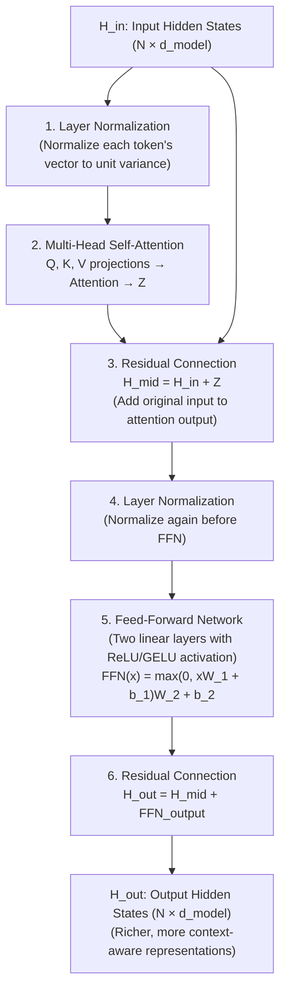
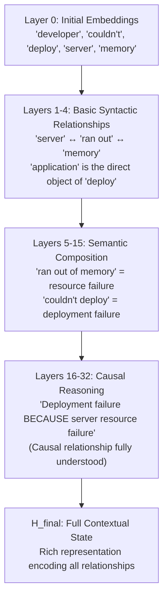
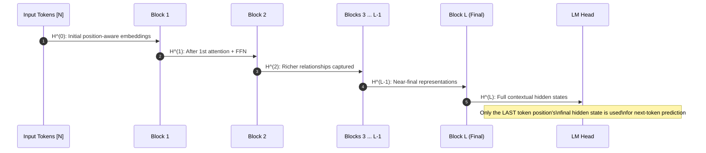
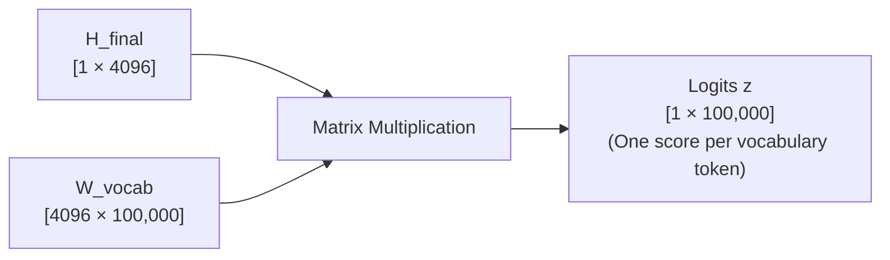
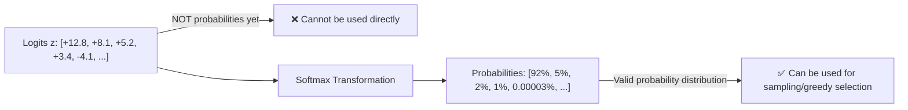

# Chapter 5: Transformer Architecture — Blocks, Depth & Vocabulary Projection

> **Chapter Goal:** Understand the complete internal anatomy of a Transformer block (not just self-attention), why depth is necessary for abstract reasoning, how representations evolve through stacked layers, and how the final hidden state is converted into vocabulary scores called logits.

---

## 5.1 Correcting a Common Misconception

One of the most persistent mistakes in AI discourse is equating:

$$\text{Transformer} \equiv \text{Self-Attention}$$

**This is wrong.** Self-Attention is one important component *inside* a Transformer block — but a Transformer block contains several more operations that are equally essential.

| Component | Common Misconception | Reality |
|-----------|---------------------|---------|
| Self-Attention | "This is the Transformer" | One sub-layer of one block |
| FFN | Often completely forgotten | Applies non-linear transformation to each token independently |
| Layer Norm | Usually ignored | Critical for training stability |
| Residual Connection | Rarely mentioned | Essential for gradient flow in deep networks |

---

## 5.2 Anatomy of a Single Transformer Block

Each Transformer block (also called a "layer" or "decoder block" in GPT-style models) contains four operations applied sequentially:



### Understanding Each Component

#### ① Layer Normalization
Normalizes the values within each token vector to have zero mean and unit variance. Without this, gradients can explode or vanish during training of deep networks.

$$\text{LayerNorm}(\mathbf{x}) = \gamma \cdot \frac{\mathbf{x} - \mu}{\sigma + \epsilon} + \beta$$

#### ② Multi-Head Self-Attention
The attention mechanism from Chapter 4, but run in parallel across $h$ independent "heads". Each head learns to attend to different types of relationships simultaneously.

**Multi-Head Attention:**
$$\text{MultiHead}(Q, K, V) = \text{Concat}(\text{head}_1, \ldots, \text{head}_h) W^O$$
$$\text{head}_i = \text{Attention}(Q W_i^Q, K W_i^K, V W_i^V)$$

Why multiple heads? 
- Head 1 might focus on **syntactic relationships** (subject-verb agreement)
- Head 2 might focus on **coreference** (pronoun resolution)
- Head 3 might focus on **positional proximity** (nearby token relationships)
- Head 4 might focus on **semantic role** (agent-patient relationships)

Having multiple heads allows the model to simultaneously track multiple types of linguistic relationships.

#### ③ Residual (Skip) Connection
The input to the attention layer is **added back** to the attention output:
$$H_{\text{mid}} = H_{\text{in}} + Z_{\text{attention}}$$

This allows information to **bypass** the attention computation. Without residual connections, deep networks suffer from the degradation problem — very deep networks perform worse than shallower ones because gradient signals become negligible by the time they reach early layers.

> [!NOTE]
> Residual connections are what make training 96-layer networks (GPT-3) or 200+ layer networks possible. The gradient flows directly through the addition operation to all earlier layers.

#### ④ Feed-Forward Network (FFN)
After attention allows tokens to exchange information, the FFN applies a **non-linear transformation independently to each token**. It expands the representation to a much higher dimension (typically $4 \times d_{\text{model}}$) and then contracts back:

$$\text{FFN}(\mathbf{x}) = \text{GELU}(\mathbf{x} W_1 + b_1) W_2 + b_2$$

The FFN does **not** mix information across tokens (attention already handled that). It applies token-level feature transformations — effectively processing the enriched contextual representation from attention and extracting higher-level features.

> [!TIP]
> The FFN contains about **2/3 of a Transformer model's total parameters**. In GPT-style models, FFN expansion ratio is typically 4×: if $d_{\text{model}} = 4096$, the FFN inner dimension is $16384$.

---

## 5.3 Why Many Layers? The Abstraction Hierarchy

A single Transformer block applies one round of attention and one FFN transformation. But complex language understanding requires building up **hierarchical abstractions** over multiple steps.

### The Development Example (from Lecture)

Consider: `"The developer couldn't deploy the application because the server ran out of memory."`

| Processing Stage | What the Model Understands |
|-----------------|---------------------------|
| Early layers (1-4) | "server" and "memory" are co-occurring technical terms |
| Middle layers (5-15) | "server ran out of memory" is a resource failure event |
| Deep layers (16-32) | The entire sentence describes a deployment failure *caused by* resource exhaustion |



### The Photo Editing Analogy (from Lecture)

Think of processing an image with professional photo editing software — not one big operation, but a sequential pipeline of refinements:

```
Raw Camera Sensor Data
    ↓ Exposure Correction
    ↓ Shadow/Highlight Recovery
    ↓ Contrast Adjustment
    ↓ Color Calibration
    ↓ Noise Reduction
    ↓ Sharpening & Detail
Final Polished Image
```

Similarly, each Transformer block is one refinement step:
```
Raw Token Embeddings
    ↓ Block 1: Identify adjacent word relationships
    ↓ Block 2: Identify phrase-level structure
    ↓ Block 3: Identify clause boundaries
    ↓ Block N-1: Identify semantic roles
    ↓ Block N: Assemble full contextual meaning
Final Hidden State H_final
```

---

## 5.4 Tracking Token States Through the Stack

At every layer $l$, every token $i$ has its own hidden state vector $\mathbf{h}_i^{(l)} \in \mathbb{R}^{d_{\text{model}}}$.

These hidden states evolve as they pass through each block:



> [!IMPORTANT]
> In a **decoder-only** GPT-style model (which generates text left-to-right), each token can only attend to tokens that come **before it** in the sequence. This is enforced with a **causal mask** — a triangular mask applied to the attention score matrix that sets future positions to $-\infty$ before Softmax (so they receive 0 attention weight). This prevents the model from "cheating" by looking at future tokens during both training and inference.

**Scale of Modern Models:**

| Model | Layers | d_model | FFN Dim | Attention Heads |
|-------|--------|---------|---------|-----------------|
| GPT-2 (small) | 12 | 768 | 3,072 | 12 |
| GPT-3 | 96 | 12,288 | 49,152 | 96 |
| LLaMA-3 8B | 32 | 4,096 | 14,336 | 32 |
| LLaMA-3 70B | 80 | 8,192 | 28,672 | 64 |

---

## 5.5 From Hidden State to Vocabulary Scores

After all $L$ Transformer blocks have been applied, each token has a final hidden state vector. For **next-token prediction**, we use the hidden state of the **last token position** in the sequence.

For the prompt `"The capital of India is"`, after all layers, the vector at the final position (after `"is"`) is:

$$\mathbf{h}_{\text{final}} = [0.4, -1.2, 0.8, \ldots, 0.15] \in \mathbb{R}^{d_{\text{model}}}$$

This vector needs to be converted into a score for every candidate in the vocabulary (e.g., 100,000 tokens). This is done with a final **linear projection** called the **Language Model (LM) Head**:

$$\mathbf{z} = \mathbf{h}_{\text{final}} W_{\text{vocab}} + \mathbf{b}$$

Where $W_{\text{vocab}} \in \mathbb{R}^{d_{\text{model}} \times |V|}$ maps the $d_{\text{model}}$-dimensional hidden state to a $|V|$-dimensional score vector.



---

## 5.6 Understanding Logits

The output vector $\mathbf{z}$ is called **logits** (from logistic regression terminology, where "logit" refers to the log-odds before applying sigmoid/softmax).

Each entry $z_i$ is an unnormalized raw score indicating how compatible token $i$ is with being the next token after the current context.

For the prompt `"The capital of India is"`:

| Vocabulary Token | Raw Logit $z_i$ | Meaning |
|-----------------|----------------|---------|
| **Delhi** | **+12.8** | Extremely high compatibility |
| Mumbai | +8.1 | Moderate compatibility |
| Kolkata | +5.2 | Some compatibility |
| Punjab | +3.4 | Low compatibility |
| banana | -4.1 | Very incompatible |
| `<EOS>` | -8.3 | Should not end here |

**Critical properties of logits:**
- They can be **any real number** — negative, zero, positive
- They do **not** sum to 1.0
- They are **not** probabilities
- Larger values indicate stronger preference for that token
- Converting to probabilities requires Softmax (covered in Chapter 6)



> [!IMPORTANT]
> **The LM Head weight matrix is often tied to the Embedding Matrix.** In many LLM implementations, $W_{\text{vocab}} = W_{\text{emb}}^T$ (the transpose of the embedding table). This is called **weight tying** and reduces parameter count while also ensuring that the model's final projection is geometrically consistent with its input embedding space.

---

## 5.7 Summary

| Concept | Key Insight |
|---------|-------------|
| **Transformer Block Components** | Layer Norm → Multi-Head Attention → Residual → Layer Norm → FFN → Residual |
| **Multi-Head Attention** | Multiple attention heads capture different relationship types simultaneously |
| **FFN** | Non-linear per-token transformation; contains ~2/3 of model parameters |
| **Residual Connections** | Enable gradient flow through 100+ layers; essential for deep training |
| **Layer Normalization** | Stabilizes training by keeping activations in a reasonable range |
| **Why Many Layers?** | Each layer adds one refinement step; deep stacks build hierarchical abstractions |
| **Causal Masking** | Prevents tokens from attending to future positions during autoregressive generation |
| **LM Head** | Linear projection from $d_{\text{model}}$ → $|V|$; produces one score per vocabulary token |
| **Logits** | Raw unnormalized scores; not probabilities; can be negative; don't sum to 1 |
