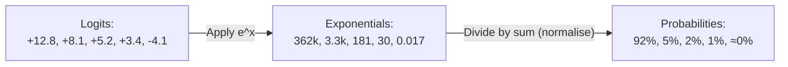
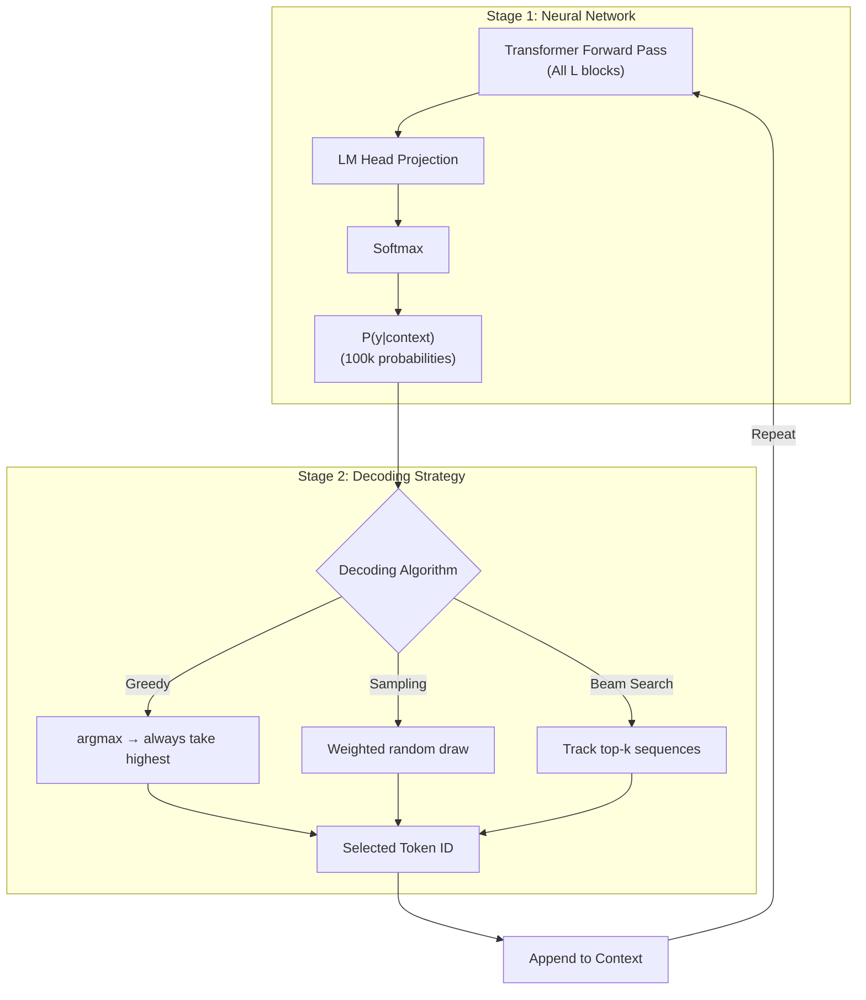
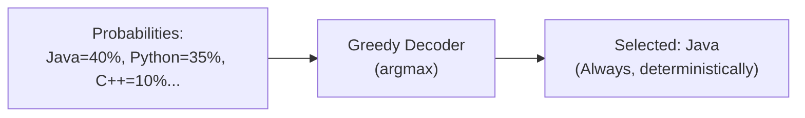
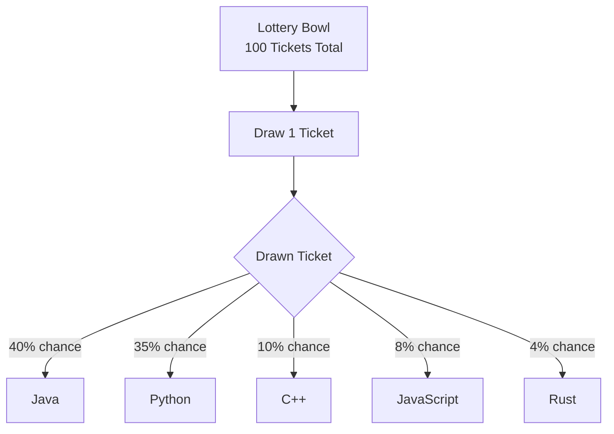
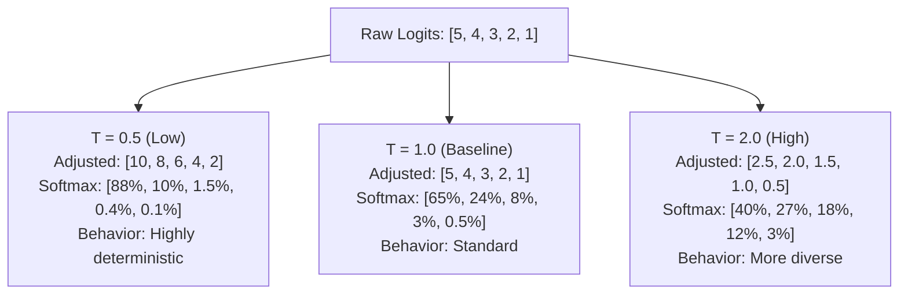
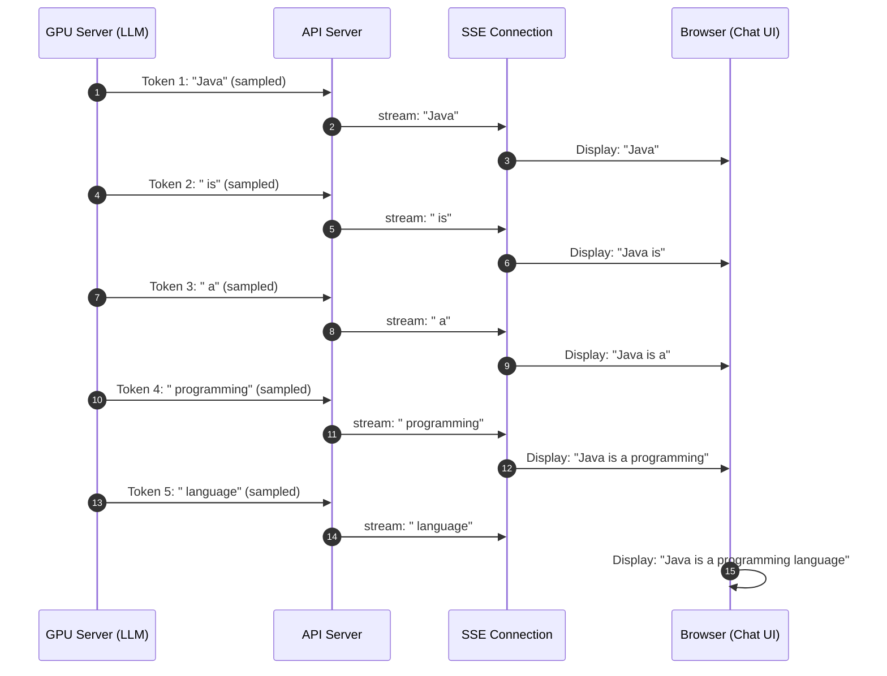

# Chapter 6: Softmax, Decoding Strategies & Temperature

> **Chapter Goal:** Understand how raw logit scores are converted to probability distributions (Softmax), how a token is actually selected (decoding strategies), and how Temperature controls the trade-off between determinism and diversity. Then see why all of this enables ChatGPT-style streaming.

---

## 6.1 From Logits to Probabilities: The Softmax Function

In Chapter 5, we computed a vector of raw unnormalized scores $\mathbf{z}$ (logits) — one per vocabulary token. These numbers are not usable as-is because they are not probabilities (they can be negative, don't sum to 1, and have no bounded range).

The **Softmax function** converts this raw score vector into a valid probability distribution:

$$P(y_i \mid \text{context}) = \frac{e^{z_i}}{\displaystyle\sum_{j=1}^{|V|} e^{z_j}}$$

### Why Exponentiation?

The exponential function $e^x$ serves three purposes:
1. **Positivity:** Makes all values positive regardless of sign ($e^{-4.1} > 0$)
2. **Amplification:** Disproportionately amplifies larger values, increasing contrast
3. **Monotonicity:** Preserves ranking (if $z_i > z_j$ then $e^{z_i} > e^{z_j}$)

### Worked Computation Example

For the prompt `"The capital of India is"` with logits:

| Token | Logit $z_i$ | $e^{z_i}$ | Probability $P(y_i)$ |
|-------|-------------|-----------|----------------------|
| **Delhi** | +12.8 | 361,999 | **92.0%** |
| Mumbai | +8.1 | 3,294 | 5.0% (drops exponentially) |
| Kolkata | +5.2 | 181 | 2.0% |
| Punjab | +3.4 | 30 | 1.0% |
| banana | -4.1 | 0.017 | ≈ 0.000004% |
| **Total** | — | ~365,504 | **100.0%** |



**Key property:** The probabilities across all $|V|$ vocabulary tokens sum exactly to $1.0$ (100%).

> [!NOTE]
> Even a token like `"banana"` (logit = -4.1) still receives a tiny but non-zero probability. This means: in theory, the model could output `"banana"` as the next token after `"The capital of India is"`. In practice, this happens with probability of 0.000004% — which is why responses are almost always sensible, but never guaranteed to be perfect.

---

## 6.2 Two Separate Stages: Model vs. Decoder

A critical architectural separation is often missed:

**Stage 1 — The Neural Network (Model):**
- Runs the forward pass through all $L$ Transformer blocks
- Projects the final hidden state through the LM Head
- Applies Softmax to produce probabilities
- **Output:** Probability distribution $P(y \mid \text{context})$ over all $|V|$ vocabulary tokens

**Stage 2 — The Decoding Strategy:**
- Receives the probability distribution
- Applies an algorithm to **select one token**
- Has no access to model internals — only sees the probability vector
- **Output:** One selected token ID



> [!IMPORTANT]
> The model **never** selects a token. The model **only** provides a probability distribution. The decoding algorithm, running on the application layer (outside the model), makes the actual token selection. This separation is architecturally important because it means you can swap decoding strategies without modifying the model.

---

## 6.3 Greedy Decoding

The simplest possible decoding strategy: **always select the token with the highest probability**.

$$\hat{y} = \arg\max_{i} P(y_i \mid \text{context})$$

For the distribution:
```
Java: 40%,  Python: 35%,  C++: 10%,  JavaScript: 8%,  Rust: 4%,  Other: 3%
```

Greedy always picks: **Java (40%)** — without exception.



### Advantages
- ✅ Fast and simple
- ✅ Deterministic — same input always produces same output
- ✅ Never selects obviously wrong tokens

### Disadvantages
- ❌ **Repetition loops:** Greedy can get stuck repeating the same phrase indefinitely because each highest-probability token feeds back into making the same token likely again
- ❌ **Lacks diversity:** All generations from the same prompt are identical
- ❌ **Locally optimal, globally suboptimal:** The token with highest probability at step $t$ might lead to a worse overall sequence than a slightly lower-probability choice would have

> [!TIP]
> Greedy decoding is appropriate when you want **deterministic, reproducible outputs** — e.g., code generation where correctness matters more than variety, or factual extraction tasks.

---

## 6.4 Sampling (Stochastic Decoding)

Instead of always taking the maximum, sampling treats probabilities as a **weighted lottery**. Each token gets lottery tickets proportional to its probability:

```
Java:       40 tickets
Python:     35 tickets  
C++:        10 tickets
JavaScript:  8 tickets
Rust:        4 tickets
Other:       3 tickets
─────────────────────
Total:      100 tickets
```

**One ticket is drawn at random.**

Java is most likely to be drawn (40% chance), but Python (35%), C++ (10%), or even Rust (4%) can be selected.



### Why This Explains Non-Deterministic LLM Responses

**This is the root cause of why asking an LLM the same question twice can give different answers.**

When sampling is enabled (as it is by default in ChatGPT, Claude, and most production LLMs):
- The same probability distribution is generated each time
- But the random lottery draw selects a different token each run
- This small difference at each step compounds: different token → different next distribution → different next token → exponentially diverging responses

> [!NOTE]
> Sampling with the full distribution including very low probability tokens can occasionally produce surprising or wrong outputs. Advanced sampling techniques like **Top-K Sampling** (only sample from top $K$ tokens by probability) and **Top-P / Nucleus Sampling** (only sample from the top tokens whose cumulative probability exceeds $P$) restrict the lottery pool to reduce but not eliminate variance.

---

## 6.5 Temperature: Shaping the Probability Distribution

**Temperature ($T$)** is a hyperparameter that reshapes the probability distribution *before* Softmax is applied, controlling the trade-off between confidence and creativity.

### The Formula

Every logit $z_i$ is divided by Temperature $T$ before Softmax:

$$P(y_i \mid \text{context}) = \frac{e^{z_i / T}}{\displaystyle\sum_{j=1}^{|V|} e^{z_j / T}}$$

$$\text{Adjusted Logit: } z_i' = \frac{z_i}{T}$$

### Working Through the Three Cases

Starting logits:
```
Python: 5,   Java: 4,   JavaScript: 3,   C++: 2,   Rust: 1
```

#### Case 1: T = 1.0 (Baseline — No Change)

$$\frac{5}{1}=5, \quad \frac{4}{1}=4, \quad \frac{3}{1}=3, \quad \frac{2}{1}=2, \quad \frac{1}{1}=1$$

Logits unchanged. Distribution reflects the model's raw learned preferences.

#### Case 2: T = 0.5 (Low Temperature — Sharpen)

$$\frac{5}{0.5}=10, \quad \frac{4}{0.5}=8, \quad \frac{3}{0.5}=6, \quad \frac{2}{0.5}=4, \quad \frac{1}{0.5}=2$$

Notice: gaps between logits **doubled** ($5-4=1 \rightarrow 10-8=2$). After Softmax, the top token becomes dramatically more dominant.

#### Case 3: T = 2.0 (High Temperature — Flatten)

$$\frac{5}{2}=2.5, \quad \frac{4}{2}=2.0, \quad \frac{3}{2}=1.5, \quad \frac{2}{2}=1.0, \quad \frac{1}{2}=0.5$$

Notice: gaps between logits **halved** ($5-4=1 \rightarrow 2.5-2.0=0.5$). After Softmax, lower-ranked tokens receive relatively more probability mass.

### Side-by-Side Probability Comparison

| Token | T = 0.5 (Sharp) | T = 1.0 (Baseline) | T = 2.0 (Flat) |
|-------|----------------|--------------------|-----------------| 
| **Python** | **88%** | **65%** | **40%** |
| Java | 10% | 24% | 27% |
| JavaScript | 1.5% | 8% | 18% |
| C++ | 0.4% | 3% | 12% |
| Rust | 0.1% | 0.5% | 3% |



### When to Use Each Temperature Setting

| Temperature Range | Distribution Shape | Best Used For | Risks |
|------------------|--------------------|---------------|-------|
| **T = 0 → 0.3** | Nearly deterministic | Code generation, math, factual Q&A | Repetitive, robotic |
| **T = 0.5 → 0.8** | Sharp but varied | Technical writing, summaries | Some variance |
| **T = 1.0** | Model's natural distribution | Baseline, chat | Balanced |
| **T = 1.2 → 1.5** | Flat, creative | Creative writing, brainstorming | Some nonsense |
| **T > 2.0** | Near-uniform | Experimental, research | High hallucination rate |

> [!CAUTION]
> **Temperature = 0** is equivalent to Greedy Decoding (Softmax approaches a one-hot distribution). **Temperature → ∞** approaches a completely uniform distribution where every token is equally likely — fully random noise output.

---

## 6.6 Why ChatGPT Streams Text

You have likely noticed that ChatGPT, Claude, and Gemini display responses word-by-word as they are generated, rather than all at once. This is called **token streaming**.

Token streaming is **not** a special architectural feature — it is a natural consequence of **autoregressive generation**:

Because the model generates **one token at a time**, each token becomes available immediately after it is sampled. The application server can emit each generated token to the frontend via a streaming connection (Server-Sent Events or WebSockets) as soon as it is selected — without waiting for the full response to complete.



### Two Key Concepts to Keep Separate

| Concept | What It Is | Who Controls It |
|---------|-----------|-----------------|
| **Autoregressive Generation** | Token-by-token forward passes through the model | Model architecture |
| **UI Streaming** | Network protocol delivering tokens to frontend incrementally | Application server + client |

You can have autoregressive generation **without** streaming (waiting for the full response before displaying), and you could theoretically stream any pre-generated response too. They are independent concerns.

---

## 6.7 Summary

| Concept | Key Insight |
|---------|-------------|
| **Softmax** | Converts logits to probabilities via $P(y_i) = e^{z_i} / \sum e^{z_j}$ |
| **Model vs. Decoder** | Model produces probabilities; decoding algorithm selects the actual token |
| **Greedy Decoding** | Always select $\arg\max$ — deterministic, no diversity, risk of loops |
| **Sampling** | Weighted lottery — probabilistic, naturally diverse, explains non-determinism |
| **Temperature ($T$)** | Adjusts logit scale before Softmax: $z_i' = z_i / T$ |
| **Low T (< 1)** | Sharpens distribution → higher confidence → more predictable output |
| **High T (> 1)** | Flattens distribution → more variety → creative but risky |
| **T = 1** | Baseline — model's raw learned distribution unchanged |
| **Streaming** | Consequence of autoregressive generation; tokens delivered as available |
