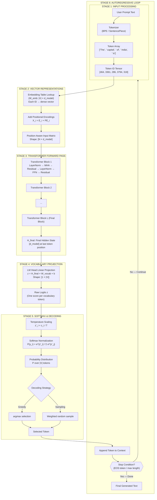
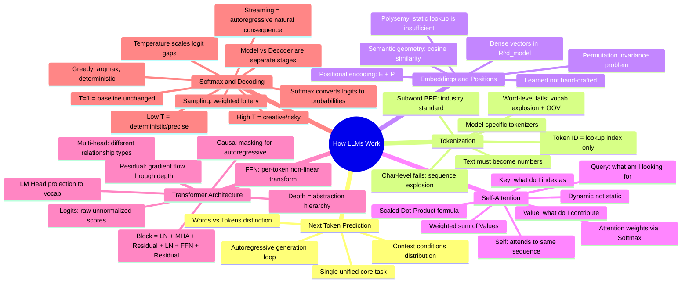

# Chapter 7: Complete LLM Pipeline, Key Takeaways & Engineering Insights

> **Chapter Goal:** Synthesize all preceding chapters into a single coherent end-to-end view of how an LLM processes input and generates output. Consolidate the 20 most important engineering insights from Lecture 02.

---

## 7.1 The Complete LLM Inference Pipeline

We have now covered every stage of the pipeline. Let's combine them into a single comprehensive view:



---

## 7.2 Stage-by-Stage Summary Reference Table

| Stage | Input | Operation | Output | Key Insight |
|-------|-------|-----------|--------|-------------|
| **1. Tokenization** | Raw string | BPE/SentencePiece segmentation + vocab lookup | Integer token IDs | Text → discrete indices; different tokenizers = different tokens |
| **2. Embedding** | Token IDs | Row lookup in $W_{\text{emb}}$ (learnable) | Dense vectors $\in \mathbb{R}^{d_{\text{model}}}$ | IDs are arbitrary; vectors carry learned semantic geometry |
| **3. Positional Encoding** | Token vectors | Element-wise add $\mathbf{E} + \mathbf{P}$ | Position-aware vectors | Injects sequence order into permutation-invariant attention |
| **4. Attention (×L)** | Position-aware vectors | Scaled Dot-Product: $\text{softmax}(\frac{QK^T}{\sqrt{d_k}})V$ | Context-infused vectors $Z$ | Each token dynamically gathers info from relevant others |
| **5. FFN (×L)** | Attention output | Two-layer MLP with GELU activation | Transformed vectors | Non-linear per-token feature transformation; ≈2/3 of params |
| **6. Residual + Norm** | All sub-layer inputs | Add + LayerNorm | Stabilized gradients | Enables training 100+ layer deep networks |
| **7. Final Hidden State** | All $L$ blocks processed | Extract last token position | $\mathbf{h}_{\text{final}} \in \mathbb{R}^{d_{\text{model}}}$ | Encodes synthesized understanding of entire preceding context |
| **8. LM Head Projection** | $\mathbf{h}_{\text{final}}$ | Linear: $\mathbf{z} = \mathbf{h} W_{\text{vocab}}$ | Logits $\mathbf{z} \in \mathbb{R}^{|V|}$ | Maps representation space to vocabulary space |
| **9. Temperature Scaling** | Logits $\mathbf{z}$ | Divide by $T$: $z_i' = z_i / T$ | Scaled logits | Controls sharpness/flatness of output distribution |
| **10. Softmax** | Scaled logits | $P(y_i) = e^{z_i'} / \sum e^{z_j'}$ | Probability distribution | Converts raw scores to valid normalized probabilities |
| **11. Decoding** | Probabilities | Greedy ($\arg\max$) or Sampling | One selected token ID | Model gives probabilities; decoder makes the actual choice |
| **12. Autoregressive Loop** | Selected token | Append to context → repeat | Next token | Entire pipeline reruns for every single generated token |

---

## 7.3 Conceptual Mindmap of Lecture 02



---

## 7.4 The 20 Fundamental Engineering Takeaways

### Foundations (1–5)

1. **One Core Task:** Every LLM does exactly one thing — predict the next token probability distribution given preceding context. All capabilities emerge as side effects of learning to do this well at scale.

2. **Context is Conditional:** The probability of every next token is conditioned on the *entire* preceding context window, not just the previous word. More specific context → sharper probability distribution → more useful outputs. This is why prompt engineering works.

3. **Autoregressive Generation:** LLMs generate incrementally — one token per forward pass. A 500-word response requires 700+ complete forward passes through all neural network layers.

4. **Token ≠ Word:** Tokens are atomic text units determined by the tokenizer. They can be subwords, symbols, spaces, or special markers. Never count words when estimating LLM costs — always count tokens.

5. **Emergent Capabilities:** Reasoning, coding, summarizing, translating — none of these capabilities are explicitly programmed. They emerge as necessary side-effects of learning to predict tokens well across trillions of training examples.

### Tokenization (6–9)

6. **Token ID ≠ Meaning:** Token IDs are lookup indices (like roll numbers). A higher ID carries no intrinsic semantic weight. Semantic meaning lives in the embedding vectors, not the IDs.

7. **Subword Tokenization Won:** BPE and WordPiece dominate modern LLMs because they balance vocabulary size ($\sim$32k–100k), handle OOV through decomposition, and produce reasonable sequence lengths.

8. **Model-Specific Tokenization:** Different model families (GPT, LLaMA, Gemini, Claude) use different tokenizers. The same sentence will have different token counts and IDs across models. Never transfer token count estimates between model families.

9. **The 4-Character Rule of Thumb:** "1 token ≈ 4 characters" is an empirical estimate for standard English prose, useful for rough cost calculations but not a structural definition.

### Embeddings & Representations (10–12)

10. **Embeddings Are Geometric:** The embedding table places tokens in a high-dimensional vector space where geometric proximity encodes semantic similarity. This enables vector arithmetic: King − Man + Woman ≈ Queen.

11. **Dimensions Are Learned, Not Labeled:** No human labels embedding dimensions. The model learns abstract mathematical directions (royalty axis, tense axis, domain axis) purely from next-token prediction during pre-training.

12. **Static vs. Dynamic Representations:** Embedding table lookups are static (same vector for `"bank"` in every context). Self-Attention creates dynamic context-specific representations by modifying each token's vector based on surrounding tokens.

### Self-Attention (13–15)

13. **Attention is Dynamic:** Attention weights are computed fresh for every input sequence. The model learns no fixed `"it" → animal` rule — it computes relevance from scratch every time. Changing one word can completely flip attention patterns.

14. **QKV Is a Learned Soft Database:** Query = what I'm searching for; Key = what I'm indexed as; Value = what I contribute when selected. Each token simultaneously serves all three roles.

15. **Scaling Factor Matters:** The $\frac{1}{\sqrt{d_k}}$ divisor prevents vanishing gradients caused by very large dot products in high-dimensional spaces. Without it, Softmax in high dimensions would collapse to one-hot and no gradient would flow.

### Transformer Architecture (16–17)

16. **Transformer ≠ Attention:** A Transformer block contains: Layer Norm + Multi-Head Attention + Residual Connection + Layer Norm + Feed-Forward Network + Residual Connection. All components are essential. FFN contains ~2/3 of total parameters.

17. **Depth Enables Abstraction:** Early layers capture local syntactic patterns; middle layers semantic composition; deep layers abstract causal and relational reasoning. You cannot achieve complex understanding in a single attention pass.

### Decoding & Generation (18–20)

18. **Logits Are Not Probabilities:** Logits are raw unnormalized scores that can be negative, positive, or zero and do not sum to 1. Softmax converts them to valid probabilities. Never confuse logits with probabilities in implementation.

19. **Model and Decoder Are Separate Systems:** The neural network only produces probability distributions. The decoding algorithm (greedy, sampling, beam search) is a separate component that makes the actual token selection. You can swap decoding strategies without touching the model.

20. **Temperature Is a Production Parameter:** Temperature is the single most impactful generation parameter available at inference time. Use $T < 1$ for precision-critical tasks (code, math, factual extraction). Use $T \approx 1$ for conversational chat. Use $T > 1$ for creative writing and brainstorming. Monitor hallucination rates carefully at $T > 1.3$.

---

## 7.5 Quick-Reference Engineering Cheat Sheet

```
TEXT INPUT
  ↓  tokenize (BPE)
TOKEN IDs
  ↓  embedding lookup (W_emb)
DENSE VECTORS  +  POSITIONAL ENCODINGS
  ↓  element-wise addition
POSITION-AWARE INPUT MATRIX  [N × d_model]
  ↓  [× L times:  LayerNorm → MHA → Residual → LayerNorm → FFN → Residual]
FINAL HIDDEN STATE  H_final  [d_model]
  ↓  linear projection (W_vocab)
LOGITS  [|V|]
  ↓  divide by Temperature T
SCALED LOGITS
  ↓  softmax
PROBABILITY DISTRIBUTION  P  [|V|]
  ↓  greedy argmax OR weighted sampling
SELECTED TOKEN ID
  ↓  decode to text, append to context
  ↓  REPEAT UNTIL EOS or max_length
GENERATED RESPONSE TEXT
```

---

## 7.6 In One Line

> An LLM takes a sequence of tokens, converts them to position-aware vectors, passes them through $L$ Transformer blocks where tokens iteratively exchange and refine contextual information, projects the final representation to a probability distribution over the entire vocabulary, samples one token, appends it to the sequence, and repeats — until the response is complete.
