# Lecture 02 Complete Notes: How Large Language Models Work
## From Tokens to Transformers

> Comprehensive consolidated notes synthesizing [](./Notes.pdf) and [](./Excalidraw-Notes.svg).

---

## 📚 Table of Contents

| Chapter | Title |
|---------|-------|
| [Chapter 1](#chapter-1-foundations-of-large-language-models--next-token-prediction) | Foundations of LLMs & Next-Token Prediction |
| [Chapter 2](#chapter-2-tokenization--from-raw-text-to-numbers) | Tokenization: From Raw Text to Numbers |
| [Chapter 3](#chapter-3-word-order-positional-encodings--vector-embeddings) | Word Order, Positional Encodings & Vector Embeddings |
| [Chapter 4](#chapter-4-self-attention-mechanism--the-qkv-framework) | Self-Attention Mechanism & the QKV Framework |
| [Chapter 5](#chapter-5-transformer-architecture--blocks-depth--vocabulary-projection) | Transformer Architecture: Blocks, Depth & Vocabulary Projection |
| [Chapter 6](#chapter-6-softmax-decoding-strategies--temperature) | Softmax, Decoding Strategies & Temperature |
| [Chapter 7](#chapter-7-complete-llm-pipeline-key-takeaways--engineering-insights) | Complete LLM Pipeline, Key Takeaways & Engineering Insights |

---

# Chapter 1: Foundations of Large Language Models & Next-Token Prediction

> **Chapter Goal:** Understand the single unifying idea behind every LLM — next-token prediction — and how a surprisingly simple mechanism gives rise to the complex behaviors we observe in systems like ChatGPT, Claude, and Gemini.

---

## 1.1 The One Core Task

At the most fundamental level, a **Large Language Model (LLM)** does not:
- Execute rule trees or `if-else` logic chains
- Query relational databases or knowledge graphs
- "Think" in the human sense of the word

Instead, every LLM is trained to do **exactly one thing**:

> **Given all preceding tokens in the context, predict a probability distribution over what single token should come next.**

This is called **next-token prediction** or **autoregressive language modeling**.

The remarkable insight of modern LLMs is that this deceptively simple task — when applied at massive scale across trillions of training tokens — gives rise to emergent capabilities: reasoning, summarization, translation, code generation, question answering, and more.

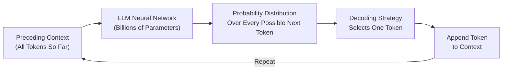

> [!NOTE]
> **Why does this work?** To predict the next word in "The capital of France is ___", a model must implicitly "know" geography. To predict the next token in a Python function signature, it must implicitly "know" programming syntax. All knowledge is captured as statistical patterns learned from the training corpus — not as explicit symbolic rules.

---

## 1.2 Context Is Everything: The Prompt Evolution Experiment

An LLM's prediction is never isolated. Every token probability is conditioned on the **entire preceding context**. As context grows more specific, the probability distribution narrows dramatically.

Consider the following staged prompt experiment drawn from the lecture:

### Stage 1 — Minimal Context
```
"I drink coffee every ___"
```
With only 5 tokens of context, the distribution is flat:

| Candidate | Probability |
|-----------|-------------|
| morning | 28% |
| day | 22% |
| evening | 18% |
| night | 15% |
| hour | 10% |
| others | 7% |

### Stage 2 — Expanded Context
```
"I drink coffee every morning before going to ___"
```
Adding a time constraint ("morning") and a spatial action ("going to") dramatically shifts the distribution:

| Candidate | Probability |
|-----------|-------------|
| work | 35% |
| office | 30% |
| college | 15% |
| gym | 10% |
| school | 6% |
| others | 4% |

### Stage 3 — Highly Specific Context
```
"I work remotely as a software engineer. Every morning I drink coffee before going to my ___"
```
The word "remotely" eliminates commuting destinations. "My" signals personal space. The distribution collapses:

| Candidate | Probability |
|-----------|-------------|
| **desk** | **72%** |
| workstation | 12% |
| computer | 8% |
| home office | 5% |
| others | 3% |

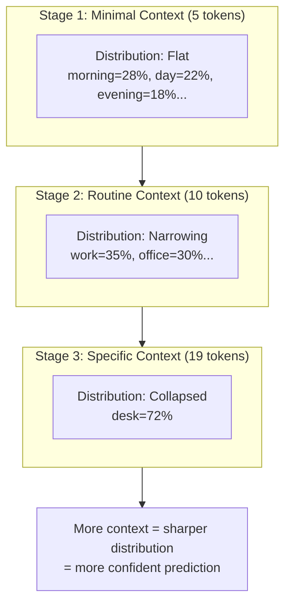

> [!IMPORTANT]
> **Engineering Takeaway:** This is why **prompt engineering works**. The more specific and targeted your prompt context, the more constrained the model's probability distribution becomes, and the more useful and accurate the output.

---

## 1.3 Next-Token Probability Distribution: A Worked Example

When the model receives:
```
"The capital of India is"
```

Internally, the model does **not** look up "India → capital → Delhi" in a dictionary. Instead, during training, it learned that the token sequence `["The", "capital", "of", "India", "is"]` is statistically followed by `"Delhi"` the vast majority of the time in its training corpus.

This knowledge manifests as a probability distribution at inference time:

| Token Candidate | Raw Logit Score | Softmax Probability | Interpretation |
|-----------------|----------------|---------------------|----------------|
| **Delhi** | +12.8 | **92%** | Strong pattern match from training |
| Kolkata | +7.1 | 4% | Major city, once a capital |
| Mumbai | +5.4 | 2% | Major city, frequently mentioned |
| Bangalore | +4.2 | 1% | Major tech hub |
| Others (entire vocab) | varies | 1% | Distributed across ~100k tokens |

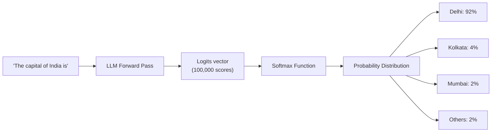

> [!NOTE]
> The model produces one probability score for **every single token in its vocabulary** — not just the plausible ones. A token like `"banana"` might receive a logit of `-8.4` and a probability of `0.00003%`. The Softmax function ensures all probabilities across the entire vocabulary sum to exactly `1.0 (100%)`.

---

## 1.4 The Autoregressive Generation Loop

The term **autoregressive** means: *a model that uses its own previous outputs as inputs to produce its next output*.

**Auto** = self  
**Regressive** = future predictions depend on preceding values

### Step-by-Step Trace: "The capital of India is"

**Iteration 1:**
- Context: `"The capital of India is"`
- Model output distribution: Delhi=92%, Kolkata=4%, others=4%
- Selected token: `"Delhi"` (highest probability)
- New context: `"The capital of India is Delhi"`

**Iteration 2:**
- Context: `"The capital of India is Delhi"`
- Model output distribution: `.`=75%, `,`=8%, `and`=5%, `which`=4%...
- Selected token: `"."`
- New context: `"The capital of India is Delhi."`

**Iteration 3:**
- Context: `"The capital of India is Delhi."`
- Model output distribution: `<EOS>`=60%, `It`=15%, `The`=10%...
- Selected token: `<EOS>` (End of Sequence token)
- **Generation stops.**

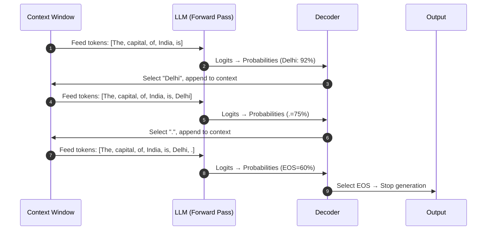

> [!IMPORTANT]
> **Critical Mental Model:** An LLM never generates a full response in one shot. It generates **one token at a time**, running a complete forward pass through its billions of parameters for each individual token. A 500-word response might require 700+ forward passes.

---

## 1.5 The First Correction: Words vs. Tokens

Beginners often describe LLMs as systems that "predict the next word." This is close, but **technically incorrect** and matters for engineering.

**LLMs predict the next *token*, not the next *word*.**

A token is **not necessarily a word**. It is the fundamental atomic unit of text that the model's tokenizer treats as a single discrete unit. Tokens can be:

- A full common word: `"cat"`, `"coffee"`, `"the"`
- A subword fragment: `"un"`, `"believ"`, `"able"` (from "unbelievable")
- A single character (in some tokenizers)
- Punctuation: `"."`, `"?"`, `"!"`
- Whitespace or newline characters
- Special system tokens: `"<|endoftext|>"`, `"[CLS]"`, `"<EOS>"`

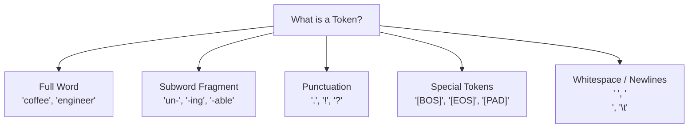

> [!TIP]
> **Practical Impact:** This is why AI API providers charge by **token count** not word count. A seemingly short sentence with technical jargon (like `"ChatGPT's tokenizer decomposes unbelievable into sub-units"`) uses far more tokens than a simple sentence of the same word count. Always estimate tokens, not words.

---

## 1.6 Why Emergent Complexity from Simple Prediction?

Students often wonder: *if all the model does is predict the next token, how does it write essays, debug code, and solve math problems?*

The answer lies in **what must be true for next-token prediction to work well**.

To predict the next token in:
```
"The bug in line 47 occurs because Python's integer division with '//' truncates towards ___"
```

The model must implicitly understand:
- What Python is
- What `//` means in Python
- What "truncates towards" means in arithmetic
- That the answer should be `"negative infinity"` (floor division behavior)

To generalize across billions of such patterns, the model must build internal representations of syntax, semantics, facts, reasoning chains, and world knowledge — all as a side-effect of learning to predict tokens well.

> [!NOTE]
> **This is the insight:** Prediction is not the goal — prediction is the *training signal*. The rich internal representations learned to minimize prediction error are the actual source of the model's capabilities.

---

## 1.7 Summary

| Concept | Key Insight |
|---------|-------------|
| **Core Task** | Next-token prediction conditioned on full context |
| **Context Sensitivity** | More context = narrower distribution = better predictions |
| **Probability Distribution** | Assigned to every token in vocabulary at each step |
| **Autoregressive Loop** | Model uses own output as input; generates one token per pass |
| **Token ≠ Word** | Tokens are atomic text units; may be subwords, punctuation, or special markers |
| **Emergent Capabilities** | Complex behaviors emerge as side-effects of learning to predict well at scale |


---

# Chapter 2: Tokenization — From Raw Text to Numbers

> **Chapter Goal:** Understand *exactly* how raw human text becomes the numerical input that a neural network can process. Master the trade-offs between different tokenization strategies and understand why subword tokenization became the industry standard.

---

## 2.1 Why Text Must First Become Numbers

A neural network is, at its core, a series of mathematical operations: matrix multiplications, dot products, element-wise additions, and non-linear activation functions. Every single operation inside a Transformer requires **numerical tensors** as input.

Raw text — the string `"Hello, world!"` — cannot be directly fed into these operations. There is no meaningful way to multiply the letter `H` by a weight matrix.

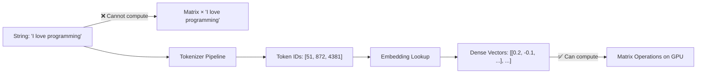

The solution is a two-stage process:
1. **Tokenization:** Split text into discrete units (tokens) and assign each a unique integer ID
2. **Embedding:** Map each integer ID to a dense, learned vector of floating-point numbers

This chapter covers Stage 1. Chapter 3 covers Stage 2.

---

## 2.2 The Three Things That Are Different

Before going further, it is critical to distinguish between three related but distinct objects:

| Object | Example | Description |
|--------|---------|-------------|
| **Original Text** | `"I love programming"` | The raw string as typed by the user |
| **Tokens** | `["I", " love", " programming"]` | Text segments the tokenizer identifies as atomic units |
| **Token IDs** | `[51, 872, 4381]` | Integer indices assigned to each token in the vocabulary lookup table |

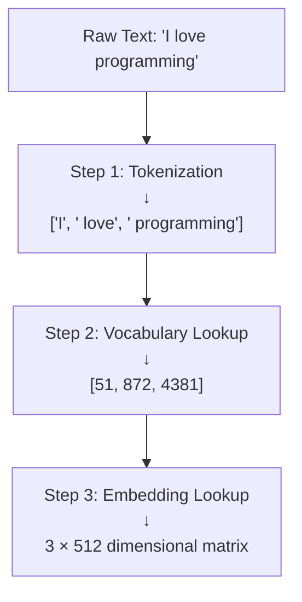

During generation, this pipeline runs in reverse: the model outputs a predicted token ID (e.g., `4381`), which is decoded back to its text representation (`" programming"`).

---

## 2.3 Token IDs Are Labels, Not Measurements

A critical misconception must be addressed immediately:

**A larger token ID does NOT mean a more important, frequent, or semantically heavier token.**

Token IDs are purely **arbitrary lookup indices** — like student roll numbers or product SKUs. They carry no intrinsic numerical meaning.

### The Roll Number Analogy (from Lecture)

In a university classroom:
- **Rohit** → Roll Number `104`
- **Aditya** → Roll Number `237`

The fact that $237 > 104$ tells us **nothing** about Aditya relative to Rohit — not intelligence, not age, not academic performance. These are just arbitrary identifiers assigned during enrollment.

The same is true for tokens:

| Token | Assigned ID | Does ID convey meaning? |
|-------|-------------|-------------------------|
| `cat` | `1` | No — just an index |
| `dog` | `2` | No — just an index |
| `apple` | `3` | No — just an index |
| `car` | `4` | No — `car ≠ 4 × cat` |
| `Rohit` | `104` | No — arbitrary assignment |
| `Aditya` | `237` | No — arbitrary assignment |

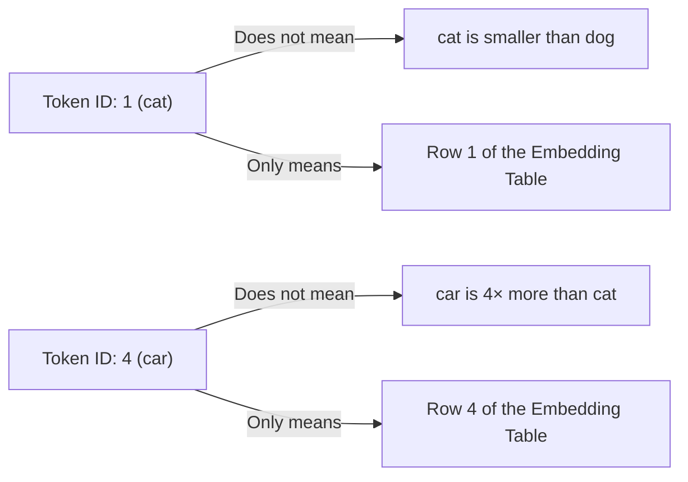

> [!IMPORTANT]
> **Key Principle:** $\text{Token ID} \neq \text{Semantic Meaning}$. Token IDs are scalar integer *lookup keys*, nothing more. The semantic meaning is stored in the **embedding vectors** they index — not in the IDs themselves.

---

## 2.4 What Exactly Is a Token?

A **token** is whatever unit of text the tokenizer treats as the smallest atomic building block.

### Common Myths Debunked

**Myth 1: "One word = one token"**

This is approximately true for simple, common English words, but breaks down often:
- The word `unbelievable` → might become 3 tokens: `["un", "believ", "able"]`
- A proper noun like `Anthropic` → might become 2 tokens: `["Anthr", "opic"]`
- Code like `print(x)` → might become 4+ tokens: `["print", "(", "x", ")"]`

**Myth 2: "1 token = 4 characters"**

The rule `1 token ≈ 4 characters` is a **rough empirical estimate** for standard English prose — useful for API cost estimation, but it is not a structural definition:
- A single character `é` in French text might be 2 tokens (due to UTF-8 byte encoding)
- A full common word like `"the"` = 1 token = 3 characters
- A rare technical term like `"glucocorticosteroid"` = many tokens

### What Tokens Can Be

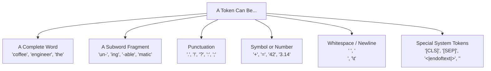

---

## 2.5 Why Not Simply Use Whole Words? (Word-Level Tokenization)

The simplest approach: assign every unique word in the language its own token.

```
cat → 1,   dog → 2,   computer → 3,   programming → 4,   automatically → 5 ...
```

### The Fatal Problems

**Problem 1: Vocabulary Explosion**

Languages are morphologically rich. A single root word generates dozens of surface forms, each needing its own entry:

| Root Word | Surface Forms Requiring Separate Entries |
|-----------|------------------------------------------|
| `automate` | `automate`, `automates`, `automated`, `automating`, `automation`, `automatic`, `automatically`, `automatons`... |
| `program` | `program`, `programs`, `programmed`, `programming`, `programmer`, `programmers`, `programmatic`... |

A vocabulary covering English with all morphological variants, technical jargon, proper nouns, code identifiers, and typos could easily exceed **1 million entries**. This makes the embedding matrix enormous.

**Problem 2: Out-of-Vocabulary (OOV) Failure**

New words appear constantly: brand names (`ChatGPT`, `TikTok`), technical terms (`tokenizer`, `embeddings`), slang, and domain-specific jargon. A fixed word vocabulary returns `<UNK>` (unknown) for these, completely losing their meaning.

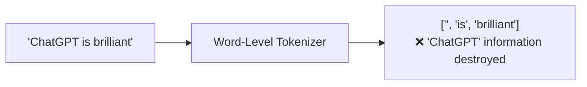

---

## 2.6 Why Not Use Individual Characters? (Character-Level Tokenization)

The opposite extreme: every character (`a`, `b`, `c`, `1`, `!`, space) is its own token.

### The Fatal Problem: Sequence Length Explosion

The word `"programming"` becomes 11 separate tokens: `p r o g r a m m i n g`

Self-attention in Transformers scales quadratically with sequence length: $O(N^2)$. If character tokenization expands a typical 100-word prompt into ~600 character tokens, the attention computation cost increases by $36×$.

This makes character-level models impractical for handling long documents, code files, or multi-turn conversations.

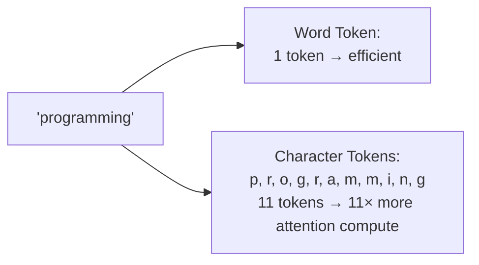

---

## 2.7 Subword Tokenization: The Industry Standard

Modern LLMs use **Subword Tokenization** — a middle ground that combines the benefits of both extremes.

**Core Principle:** Frequent words remain as single tokens. Rare or complex words are split into frequent subword chunks that already exist in the vocabulary.

### How It Works (BPE Example)

**Byte-Pair Encoding (BPE)** starts with individual characters and iteratively merges the most frequent adjacent pairs into new tokens:

```
Step 0: v-o-c-a-b-u-l-a-r-y  (character-level start)
Step 1: vo-ca-bu-la-ry        (merge most frequent pairs)
Step 2: vocab-ulary            (continue merging)
Step 3: vocabulary             (common enough → single token)
```

For a rare word like `"unbelievable"`:
```
un + believ + able → 3 tokens (all are frequent subwords)
```

For a common word like `"the"`:
```
the → 1 token (appears so frequently it stays whole)
```

### Tokenization Examples Across Models

```
"Automatically"
├── GPT-4 (cl100k):   ["Automatically"]          → 1 token
├── LLaMA-3 (Tiktoken):["Auto", "matically"]     → 2 tokens  
└── GPT-2 (original): ["Auto", "mat", "ically"]  → 3 tokens
```

Different tokenizers produce **different token splits** for the same text. This is a key engineering consideration when switching models.

### The Trade-Off Comparison Matrix

| Dimension | Word-Level | Character-Level | Subword (BPE/WordPiece) |
|-----------|-----------|-----------------|-------------------------|
| **Vocabulary Size** | Enormous (>1M) | Tiny (100–256) | Balanced (32k–100k) |
| **Sequence Length** | Minimal | Massive (+10×) | Optimal |
| **OOV Handling** | Fails (`<UNK>`) | Perfect | Perfect (decomposes) |
| **Morphology** | Poor (each form separate) | N/A | Good (shares subwords) |
| **Attention Compute** | Light | Very Heavy | Moderate |
| **Embedding Matrix Size** | Enormous | Tiny | Manageable |
| **Industry Usage** | Legacy NLP only | Rare | **All Modern LLMs** |

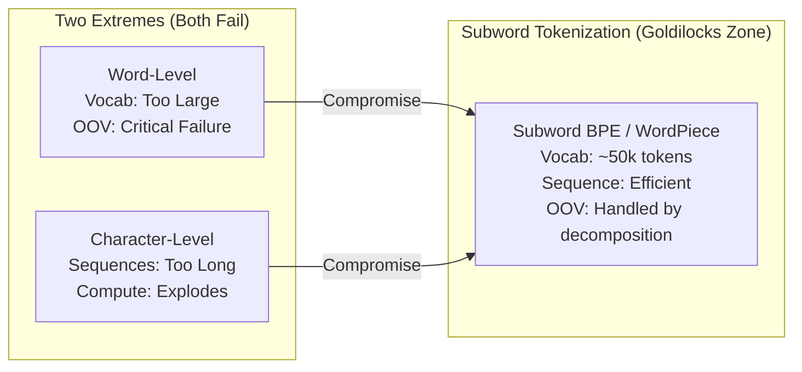

---

## 2.8 The Complete Tokenization Pipeline

Let's trace a real example end-to-end:

**Input Prompt:** `"Capital of India is Delhi"`

```
Step 1 — Raw String Input:
"Capital of India is Delhi"

Step 2 — Subword Segmentation by Tokenizer:
["Capital", " of", " India", " is", " Delhi"]
(Note: leading spaces are part of the token in many tokenizers like BPE)

Step 3 — Vocabulary Index Lookup:
[101, 25, 45, 11, 67]

Step 4 — Embedding Matrix Row Extraction:
Row 101 → [0.41, -0.82, 1.34, ...]  (512 or 4096-dim vector for "Capital")
Row 25  → [0.12,  0.55, -0.23, ...]  (vector for " of")
Row 45  → [-0.73, 0.92, 0.44, ...]  (vector for " India")
...
```

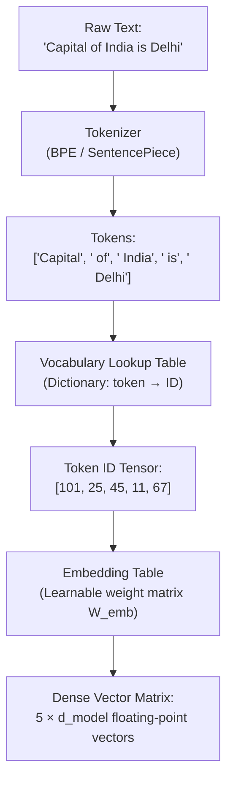

> [!TIP]
> **API Engineering Note:** Since every LLM family (OpenAI, Meta LLaMA, Google Gemini, Anthropic Claude) uses a different tokenizer with a different vocabulary, the same sentence produces **different token counts and different token IDs** across models. When calculating costs, always use the specific model's tokenizer. OpenAI's `tiktoken` library and Hugging Face's `tokenizers` library both provide accurate counts.

---

## 2.9 Summary

| Concept | Key Insight |
|---------|-------------|
| **Why Tokenize?** | Neural networks require numerical tensors; raw text strings cannot be used in matrix math |
| **Token vs. Token ID** | Token = text unit; Token ID = integer index into vocabulary lookup table |
| **Token ID ≠ Meaning** | IDs are roll numbers — arbitrary identifiers with no intrinsic value |
| **Token ≠ Word** | Tokens can be subwords, punctuation, whitespace, or special system tokens |
| **Word-Level Fails** | Vocabulary explosion + OOV failures on new words |
| **Character-Level Fails** | Sequence length explosion → quadratic attention compute explosion |
| **Subword Is Standard** | BPE/WordPiece balances vocabulary size, sequence length, and OOV handling |
| **Model-Specific** | Different models tokenize the same text differently — never assume token counts transfer across models |


---

# Chapter 3: Word Order, Positional Encodings & Vector Embeddings

> **Chapter Goal:** Understand why raw token IDs are insufficient, how position is injected, and how dense vector embeddings allow tokens to carry semantic meaning in a high-dimensional mathematical space.

---

## 3.1 The Permutation Problem: Why Order Is Critical

Consider these two sentences:

- **Sentence A:** `"Dog bites man."` → Token IDs: `[23, 34, 56]`  
- **Sentence B:** `"Man bites dog."` → Token IDs: `[56, 34, 23]`

The words are identical. The meanings are opposite — one is news, the other is barely worth reporting. Yet a model that only sees the **set** of token IDs would produce the **same representation** for both.

This problem is called **permutation invariance**: if your model is blind to order, the same three tokens produce the same representation regardless of their sequence.

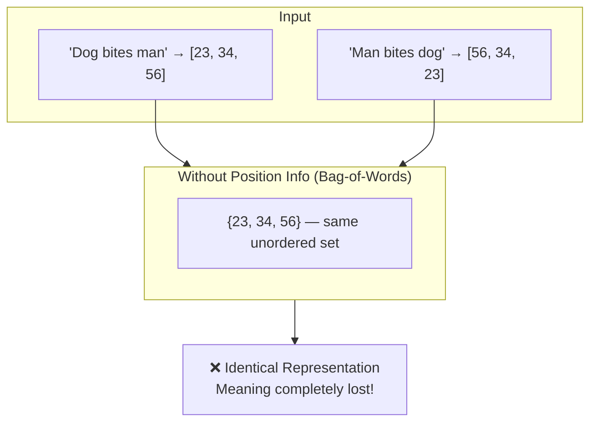

More examples where order is decisive:

| Sentence A | Sentence B | Same Tokens? | Same Meaning? |
|------------|------------|--------------|---------------|
| "Rohit teaches Aditya" | "Aditya teaches Rohit" | ✅ Yes | ❌ No |
| "The cat chased the dog" | "The dog chased the cat" | ✅ Yes | ❌ No |
| "I am fine, not sick" | "I am sick, not fine" | ✅ Yes | ❌ No |

**Self-attention is inherently permutation-invariant**. Without positional information, it treats every input as an unordered set. Positional encodings solve this.

---

## 3.2 Injecting Order: Positional Encodings

The solution is to **add** a positional signal to each token's representation before feeding it into the Transformer. This tells the model not just *what* each token is, but *where* it appears in the sequence.

### The Key Formula

$$\mathbf{X}_{\text{in}} = \mathbf{E}_{\text{token}} + \mathbf{P}_{\text{pos}}$$

Where:
- $\mathbf{E}_{\text{token}} \in \mathbb{R}^{d_{\text{model}}}$ = the dense semantic embedding of the token
- $\mathbf{P}_{\text{pos}} \in \mathbb{R}^{d_{\text{model}}}$ = the positional encoding for position $i$
- $\mathbf{X}_{\text{in}}$ = the position-aware input vector fed to the first Transformer block

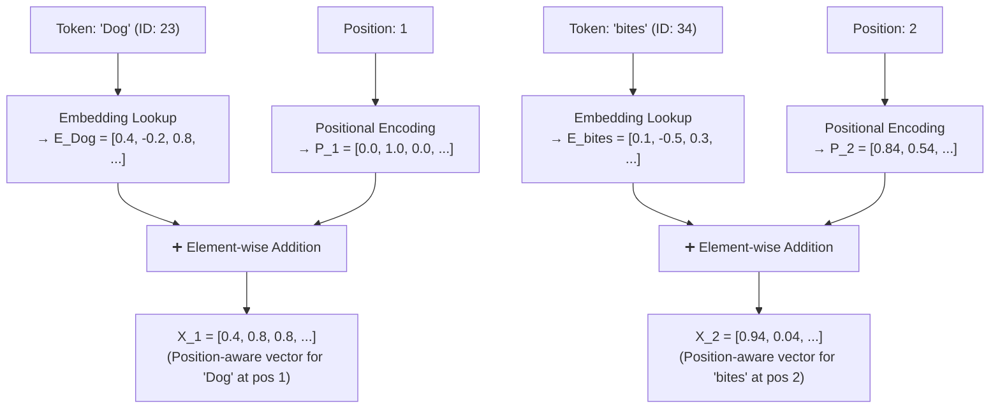

Now the model sees different vectors for `"Dog"` at position 1 vs. `"Dog"` at position 3 — even though the embedding is identical.

### Types of Positional Encoding

| Method | Used In | How It Works |
|--------|---------|-------------|
| **Sinusoidal PE** | Original Transformer (Vaswani 2017) | Fixed mathematical functions: $\sin/\cos$ at different frequencies for each dimension |
| **Learned PE** | GPT-2, BERT | Trainable vectors per position, learned alongside model weights |
| **RoPE (Rotary)** | LLaMA, Mistral, Gemma | Encodes position as rotation in complex space; enables better length generalization |
| **ALiBi** | MPT, BLOOM | Adds learned bias to attention scores based on relative distance |

> [!NOTE]
> The original 2017 Transformer paper used sinusoidal encodings with the formula:
> $$PE_{(pos, 2i)} = \sin\left(\frac{pos}{10000^{2i/d_{\text{model}}}}\right), \quad PE_{(pos, 2i+1)} = \cos\left(\frac{pos}{10000^{2i/d_{\text{model}}}}\right)$$
> Modern models typically use **learned** or **RoPE** positional encodings for better generalization to longer sequences.

---

## 3.3 Context Changes Meaning: The Polysemy Problem

Even with position added, a raw integer token ID cannot capture **context-dependent meaning**. Consider the single word `"bank"`:

- `"I deposited money at the **bank**."` → financial institution
- `"We sat on the **bank** of the river."` → sloping riverside edge

The token `"bank"` has the same integer ID in both sentences. If we look up a fixed vector in an embedding table, we get the **exact same vector** regardless of context. This means a static embedding table lookup cannot distinguish these two meanings.

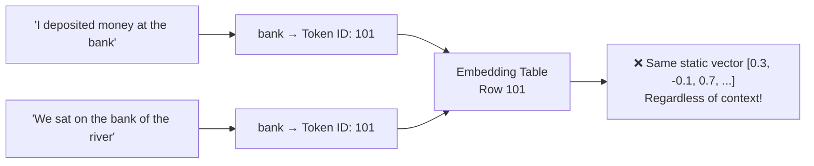

The solution is **not** to create two separate entries for financial-bank and river-bank. That approach explodes for truly ambiguous words (hundreds of word senses in a full language). 

The solution is **Self-Attention** (Chapter 4), which dynamically modifies a token's representation based on surrounding context. But first, we need to understand what these vectors actually represent.

---

## 3.4 Dense Vector Embeddings: Giving Tokens Geometric Meaning

A **token embedding** is a dense, continuous, high-dimensional vector that places the token in a geometric vector space $\mathbb{R}^{d_{\text{model}}}$, where geometrically close vectors correspond to semantically related concepts.

### Why Not Use Sparse One-Hot Vectors?

A naive approach: represent each token as a one-hot vector of length $|V|$ (vocabulary size):
```
cat  = [1, 0, 0, 0, 0, ...]  (50,000-dim vector, all zeros except position 1)
dog  = [0, 1, 0, 0, 0, ...]
```

Problems:
- **Enormous dimensionality:** 50,000+ dimensions per token
- **No geometric relationships:** `cat` and `dog` are equidistant in this space (both are distance $\sqrt{2}$ apart from each other and from everything else)
- **No generalization:** Model cannot infer that knowledge about cats might apply to dogs

### Dense Embeddings: Compact and Relational

Instead, every token is mapped to a compact dense vector (e.g., 512 or 4096 dimensions), where the **geometric relationships encode semantic relationships**:

### Conceptual Feature Dimension Illustration

Imagine (hypothetically) that word vectors had human-interpretable dimensions:

| Word | Royalty | Food | Living Being | Technology | Simplified Vector |
|------|---------|------|--------------|------------|-------------------|
| **King** | 0.95 | 0.01 | 0.90 | 0.02 | `[0.95, 0.01, 0.90, 0.02]` |
| **Queen** | 0.96 | 0.01 | 0.90 | 0.02 | `[0.96, 0.01, 0.90, 0.02]` |
| **Banana** | 0.00 | 0.99 | 0.20 | 0.00 | `[0.00, 0.99, 0.20, 0.00]` |
| **Laptop** | 0.00 | 0.00 | 0.00 | 0.98 | `[0.00, 0.00, 0.00, 0.98]` |

From this, observe:
- **King** and **Queen** → nearly identical vectors → geometrically close → semantically related ✅
- **King** and **Laptop** → very different vectors → geometrically distant → semantically unrelated ✅
- **Cosine similarity**: $\cos(\text{King}, \text{Queen}) \approx 0.99$, $\cos(\text{King}, \text{Laptop}) \approx 0.01$

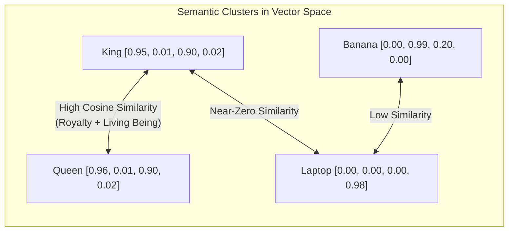

### The Famous Word Arithmetic (Word2Vec Era)

Dense embeddings enable mathematical word relationships:

$$\text{vector}(\text{King}) - \text{vector}(\text{Man}) + \text{vector}(\text{Woman}) \approx \text{vector}(\text{Queen})$$

This is geometry, not lookup. The vector space has learned directional axes for concepts like gender, royalty, and so on — all without ever being explicitly told what these concepts are.

---

## 3.5 Embeddings Are Learned, Not Hand-Crafted

An important point from the lecture: **no human hand-crafts these dimension values**.

Real LLMs do not have dimensions labeled "Royalty" or "Food". Instead, the model has a weight matrix $W_{\text{emb}} \in \mathbb{R}^{|V| \times d_{\text{model}}}$ (the embedding table), and these weights are **learned entirely from data** via backpropagation during pre-training.

For a model with $d_{\text{model}} = 4096$ (e.g., LLaMA-2 7B):

$$\mathbf{E}_{\text{king}} = [0.41, -0.82, 1.34, 0.15, \ldots, -0.09] \in \mathbb{R}^{4096}$$

These 4096 numbers are not interpretable by humans. They are abstract mathematical directions in a high-dimensional space that emerge from the model learning to predict tokens well. The geometric structure that emerges — Royalty axis, Gender axis, Tense axis, etc. — is a byproduct of learning, not deliberate design.

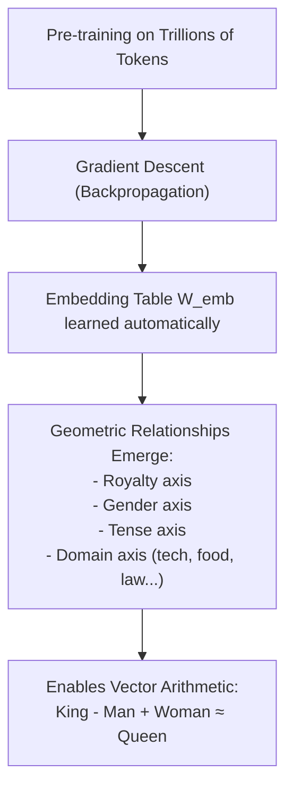

---

## 3.6 The Complete Input Pipeline

Putting it all together, the input processing pipeline for the Transformer is:

```
Raw Text: "The cat sat on the mat"
     ↓
Tokenization: ["The", " cat", " sat", " on", " the", " mat"]
     ↓
Token IDs:    [101,   234,   567,   890,   101,   432]
     ↓
Embedding Lookup: Each ID → dense vector ∈ ℝ^{d_model}
     ↓
Positional Encoding: PE_1, PE_2, PE_3, PE_4, PE_5, PE_6
     ↓
Addition: X_i = E_token_i + PE_i
     ↓
Position-Aware Input Matrix: [X_1, X_2, X_3, X_4, X_5, X_6] ∈ ℝ^{6 × d_model}
     ↓
Input to First Transformer Block
```

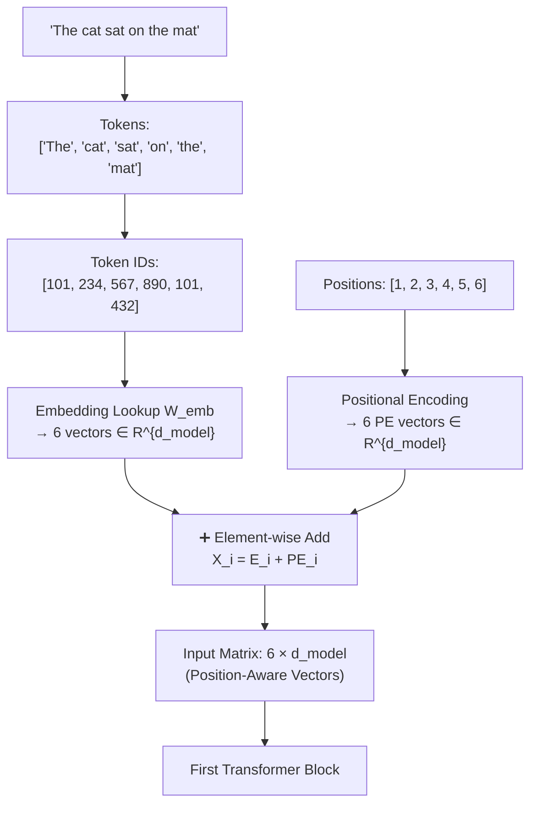

> [!NOTE]
> Notice that token `"The"` appears at positions 1 and 5 in the sentence `"The cat sat on the mat"`. It has the **same token ID** (101) both times and therefore the **same base embedding**. But after adding different positional encodings ($PE_1 \neq PE_5$), the model receives distinct input vectors for each occurrence. This is how position awareness works.

---

## 3.7 Summary

| Concept | Key Insight |
|---------|-------------|
| **Permutation Problem** | Self-attention is order-blind without explicit positional signals |
| **Positional Encoding** | Position vectors added to embeddings: $\mathbf{X}_{\text{in}} = \mathbf{E} + \mathbf{P}$ |
| **Static vs. Dynamic** | Embedding table gives static lookup; Self-Attention creates dynamic, context-aware representations |
| **Polysemy** | Same word ID always fetches same static vector — context-dependent meaning requires Attention |
| **Dense Embeddings** | Compact floating-point vectors where geometric distance encodes semantic similarity |
| **Learned Dimensions** | Embedding dimensions are not human-labeled; they emerge from training |
| **Word Arithmetic** | Vector geometry enables analogical reasoning: King − Man + Woman ≈ Queen |


---

# Chapter 4: Self-Attention Mechanism & the QKV Framework

> **Chapter Goal:** Understand how Self-Attention enables every token to dynamically gather relevant information from all other tokens in the sequence — building the context-aware representations that make LLMs powerful. Master the Query, Key, Value framework and the mathematics of Scaled Dot-Product Attention.

---

## 4.1 The Problem That Attention Solves

We established in Chapter 3 that embedding table lookups are **static**: the word `"bank"` always returns the same vector regardless of whether it appears in `"deposited money at the bank"` or `"sat on the bank of the river"`.

To build contextual representations, we need a mechanism that allows each token to **look at all other tokens in the sequence** and decide:
1. Which other tokens are relevant to me?
2. How much weight should I give to each of them?
3. What information should I gather from them?

This mechanism is **Self-Attention**.

$$\underbrace{\mathbf{E}_{\text{bank}}}_{\text{static}} + \underbrace{\text{context from surrounding tokens}}_{\text{dynamic}} \longrightarrow \underbrace{\mathbf{Z}_{\text{bank}}}_{\text{context-aware}}$$

---

## 4.2 Attention Is Dynamic: Reference Resolution

The clearest illustration of why static representations fail comes from **reference resolution** — figuring out what a pronoun like "it" or "his" refers to.

### Example from Lecture

Consider: `"Rohit gave Aditya his laptop because his computer was broken."`

**Question:** Which "his" refers to whom?
- The first `"his"` → belongs to **Aditya** (Rohit gave Aditya *his own* laptop — Aditya's laptop)
- The second `"his"` → belongs to **Aditya** (Aditya's computer was broken)

To resolve `"his"`, the model must attend to `"Aditya"` more heavily than `"Rohit"`. The attention weights might look like:

| Token | Attention Weight for "his" |
|-------|---------------------------|
| Rohit | 30% |
| gave | 1% |
| **Aditya** | **60%** |
| laptop | 5% |
| because | 1% |
| computer | 3% |

### The Classic Sentence Pair (from PDF)

- **Sentence A:** `"The animal didn't cross the street because it was too **tired**."`  
  → `"it"` refers to: **the animal** (animals get tired, not streets)

- **Sentence B:** `"The animal didn't cross the street because it was too **wide**."`  
  → `"it"` refers to: **the street** (streets are wide, not animals)

Changing one word (`tired` → `wide`) completely flips the reference of `"it"`. A static lookup has no hope of capturing this. Attention weights change dynamically for every input sequence.

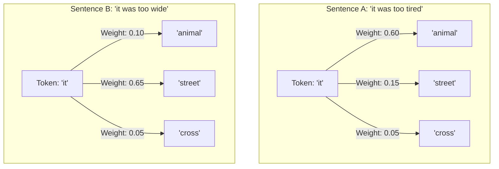

> [!IMPORTANT]
> **Attention is computed fresh for every new input.** The model does not hardcode rules like `"it" → animal`. It computes relevance scores on the fly based on the specific sequence at hand. This is what makes it *dynamic*.

---

## 4.3 The Query, Key, Value (QKV) Framework

Self-attention achieves this dynamic computation through three learned linear projections for every token: **Query (Q)**, **Key (K)**, and **Value (V)**.

### The Search Engine Analogy (from Lecture)

The easiest way to understand QKV is through the analogy of a **search engine**:

You search: `"best Java programming course"`

| Component | Search Engine | Self-Attention |
|-----------|---------------|----------------|
| **Query (Q)** | Your search query text | "What information am I looking for?" |
| **Key (K)** | Page titles, tags, metadata indexed by the search engine | "What kind of information do I contain?" |
| **Value (V)** | The actual web page content returned when matched | "Here is the information I can contribute" |

The search engine compares your **Query** against all **Keys**, computes relevance scores, and returns the **Values** of the most relevant results.

```mermaid
flowchart LR
    Q["Query: 'best Java course'\n(What I'm looking for)"] -->|"Compare against"| K["Keys: Page Titles & Tags\n(What each page is about)"]
    K --> Scores["Relevance Scores"]
    Scores --> W["Attention Weights\n(Normalized probabilities)"]
    W -->|"Weight and combine"| V["Values: Page Contents\n(Actual information)"]
    V --> Result["Contextual Result\n(Weighted combination of relevant content)"]
```

### The Multi-Faceted Person Analogy (from Lecture)

Consider describing a person — let's say **Aditya**. Depending on the question asked, you examine different aspects:

| Question | Relevant "Key" Aspect of Aditya |
|----------|--------------------------------|
| "Who knows Java?" | Technical skills: Java ✅, FDE ✅, CD Fundamentals ✅ |
| "Who lives closest?" | Location: India, Delhi, Remote worker |
| "Who should teach?" | Communication skills + Knowledge + Availability |

Aditya is the same person, but **you extract different information depending on the task**. Q, K, and V give each token three separate learned projections so the model can ask different questions (Q), be findable via different criteria (K), and contribute different content (V).

---

## 4.4 Every Token Produces Its Own Q, K, and V

For the sentence: `"The cat sat on the mat."`

Token IDs: `[23, 34, 45, 56, 67, 78]`

After the position-aware embeddings are computed, each token vector $\mathbf{x}_i$ is linearly projected to produce three vectors:

$$Q_i = \mathbf{x}_i W_Q, \quad K_i = \mathbf{x}_i W_K, \quad V_i = \mathbf{x}_i W_V$$

Where $W_Q, W_K, W_V \in \mathbb{R}^{d_{\text{model}} \times d_k}$ are learned weight matrices shared across all tokens.

```
Token "The":  Q_The,  K_The,  V_The
Token "cat":  Q_cat,  K_cat,  V_cat
Token "sat":  Q_sat,  K_sat,  V_sat
Token "on":   Q_on,   K_on,   V_on
Token "the":  Q_the,  K_the,  V_the
Token "mat":  Q_mat,  K_mat,  V_mat
```

From the Excalidraw notes:
```
"on" → position 56 → produces:
  Q_on = [0.2, 0.4, -0.5]
  K_on = [0.3, 0.7, 0.9]
  V_on = [-0.9, 0.99, -0.6]
```

---

## 4.5 Computing Attention Weights: A Token-Level Trace

Let's trace exactly what happens when computing the updated representation for the token `"on"` in the sentence `"The cat sat on the mat"`:

**Step 1: Compute relevance scores (dot products)**

`"on"` uses its Query $Q_{\text{on}}$ and computes a dot product with the Key of **every other token**:

```
Q_on · K_The  → Low score  → "The" is not very relevant to "on"
Q_on · K_cat  → Medium     → "cat" (the subject) has some relevance
Q_on · K_sat  → High       → "sat" is very relevant (on what? on where sat)
Q_on · K_the  → Low        → "the" is a filler
Q_on · K_mat  → Very High  → "mat" is the direct object of "on"
```

```mermaid
flowchart TD
    Qon["Query of 'on': Q_on = [0.2, 0.4, -0.5]"]
    
    Qon --> S1["Q_on · K_The  → Score: 0.1\n(Low relevance)"]
    Qon --> S2["Q_on · K_cat  → Score: 0.5\n(Medium relevance)"]
    Qon --> S3["Q_on · K_sat  → Score: 1.8\n(High relevance)"]
    Qon --> S4["Q_on · K_the  → Score: 0.2\n(Low relevance)"]
    Qon --> S5["Q_on · K_mat  → Score: 2.4\n(Very High relevance)"]
```

**Step 2: Scale by $\frac{1}{\sqrt{d_k}}$**

If $d_k = 3$ (our toy example), we divide all scores by $\sqrt{3} \approx 1.73$:
- $0.1 / 1.73 = 0.058$
- $0.5 / 1.73 = 0.289$
- $1.8 / 1.73 = 1.040$
- $0.2 / 1.73 = 0.116$
- $2.4 / 1.73 = 1.387$

**Step 3: Apply Softmax to get attention weights**

Softmax converts scaled scores into weights that sum to 1:

| Token | Scaled Score | Attention Weight $w_i$ |
|-------|-------------|------------------------|
| The | 0.058 | 3% |
| cat | 0.289 | 9% |
| sat | 1.040 | 20% |
| the | 0.116 | 4% |
| **mat** | **1.387** | **64%** |

**Step 4: Compute weighted sum of Values**

$$Z_{\text{on}} = 0.03 \cdot V_{\text{The}} + 0.09 \cdot V_{\text{cat}} + 0.20 \cdot V_{\text{sat}} + 0.04 \cdot V_{\text{the}} + 0.64 \cdot V_{\text{mat}}$$

```mermaid
flowchart TD
    W1["w=0.03"] --> WeightedV1["0.03 × V_The"]
    W2["w=0.09"] --> WeightedV2["0.09 × V_cat"]
    W3["w=0.20"] --> WeightedV3["0.20 × V_sat"]
    W4["w=0.04"] --> WeightedV4["0.04 × V_the"]
    W5["w=0.64"] --> WeightedV5["0.64 × V_mat  ← dominant"]
    
    WeightedV1 & WeightedV2 & WeightedV3 & WeightedV4 & WeightedV5 --> Sum["Z_on = Weighted Sum\n(Context-aware vector for 'on')"]
```

The resulting vector $Z_{\text{on}}$ now carries contextual information about `"mat"` being the object of `"on"` — without any explicit programming of grammar rules.

---

## 4.6 The Full Scaled Dot-Product Attention Formula

Generalizing to all tokens simultaneously using matrix notation:

$$\text{Attention}(Q, K, V) = \text{softmax}\left(\frac{QK^T}{\sqrt{d_k}}\right) V$$

where:
- $Q \in \mathbb{R}^{N \times d_k}$ — matrix of Query vectors for all $N$ tokens
- $K \in \mathbb{R}^{N \times d_k}$ — matrix of Key vectors for all $N$ tokens
- $V \in \mathbb{R}^{N \times d_v}$ — matrix of Value vectors for all $N$ tokens
- $QK^T \in \mathbb{R}^{N \times N}$ — attention score matrix (every token vs. every token)
- $\text{softmax}(\cdot)$ applied row-wise to normalize each token's scores to sum to 1

```mermaid
flowchart TD
    X["Input Matrix X\n(N tokens × d_model)"]
    WQ["Weight W_Q"] 
    WK["Weight W_K"]
    WV["Weight W_V"]
    
    X --> QM["Q = X · W_Q"]
    X --> KM["K = X · W_K"]
    X --> VM["V = X · W_V"]
    
    WQ --> QM
    WK --> KM
    WV --> VM
    
    QM & KM --> QKT["Q · K^T\n(N×N score matrix)"]
    QKT --> Scale["Divide by √d_k\n(Stabilize gradients)"]
    Scale --> SM["Softmax (row-wise)\n(N×N attention weights)"]
    SM --> Dot["Multiply by V\n(Weighted sum of Values)"]
    VM --> Dot
    Dot --> Z["Z: Context-aware Output\n(N tokens × d_v)"]
```

### Why Scale by $\sqrt{d_k}$?

Without the scaling factor, the dot products $QK^T$ grow in magnitude as $d_k$ increases. Large values push Softmax into regions where gradients vanish (all probability mass concentrates on one token), making training unstable. Dividing by $\sqrt{d_k}$ keeps the variance of dot products constant regardless of dimension size.

---

## 4.7 Why "Self"-Attention?

The word **self** is crucial. In self-attention, every token attends to **tokens from the same sequence** (including itself). There is no external memory or separate encoder — the sequence attends to itself.

This distinguishes it from cross-attention, used in encoder-decoder architectures (like the original Transformer for machine translation), where the decoder attends to the encoder's output.

---

## 4.8 Grounded Industry Example: E-Commerce Urgency

The weighted sum computation in attention is the same mathematical operation as computing an urgency signal from customer support features.

Consider an e-commerce support system evaluating whether a ticket is urgent:

| Feature | Input Value | Learned Weight | Contribution |
|---------|-------------|----------------|-------------|
| $x_1$: Query contains "urgent" | 1 (true) | $w_1 = 0.40$ | 0.40 |
| $x_2$: Payment was declined | 1 (true) | $w_2 = 0.45$ | 0.45 |
| $x_3$: Account is locked | 0 (false) | $w_3 = 0.15$ | 0.00 |

$$Z = w_1 x_1 + w_2 x_2 + w_3 x_3 = 0.40 + 0.45 + 0.00 = 0.85 \text{ (High urgency)}$$

```mermaid
flowchart LR
    x1["x1: 'urgent' keyword = 1"] -->|"w1=0.40"| Sum["Z = Σ(w_i × x_i) = 0.85"]
    x2["x2: Payment declined = 1"] -->|"w2=0.45"| Sum
    x3["x3: Account locked = 0"] -->|"w3=0.15"| Sum
    Sum --> Gate{{"Z > 0.7 threshold?"}}
    Gate -->|"Yes"| High["🔴 High Priority Queue"]
    Gate -->|"No"| Std["🟢 Standard Queue"]
```

In self-attention, **every token** performs exactly this computation — but instead of 3 features with fixed weights, each token attends to up to $N$ other tokens with **learned dynamic weights** that change for every input sequence.

---

## 4.9 Summary

| Concept | Key Insight |
|---------|-------------|
| **Why Attention?** | Static embeddings cannot represent context-dependent meaning; attention provides dynamic context fusion |
| **Dynamic, Not Static** | Attention weights are computed fresh for every input — the model learns no fixed rules |
| **Query (Q)** | "What information am I searching for?" |
| **Key (K)** | "What type of information do I index/provide?" |
| **Value (V)** | "What actual content do I contribute when selected?" |
| **Attention Formula** | $\text{softmax}\left(\frac{QK^T}{\sqrt{d_k}}\right)V$ |
| **Scaling Factor** | $\frac{1}{\sqrt{d_k}}$ prevents gradient vanishing in softmax from large dot products |
| **Self-Attention** | Tokens attend to other tokens in the **same** sequence |
| **Output** | Each token gets a new context-aware vector $Z_i = \sum_j w_{ij} V_j$ |


---

# Chapter 5: Transformer Architecture — Blocks, Depth & Vocabulary Projection

> **Chapter Goal:** Understand the complete internal anatomy of a Transformer block (not just self-attention), why depth is necessary for abstract reasoning, how representations evolve through stacked layers, and how the final hidden state is converted into vocabulary scores called logits.

---

## 5.1 Correcting a Common Misconception

One of the most persistent mistakes in AI discourse is equating:

$$\text{Transformer} \equiv \text{Self-Attention}$$

**This is wrong.** Self-Attention is one important component *inside* a Transformer block — but a Transformer block contains several more operations that are equally essential.

| Component | Common Misconception | Reality |
|-----------|---------------------|---------|
| Self-Attention | "This is the Transformer" | One sub-layer of one block |
| FFN | Often completely forgotten | Applies non-linear transformation to each token independently |
| Layer Norm | Usually ignored | Critical for training stability |
| Residual Connection | Rarely mentioned | Essential for gradient flow in deep networks |

---

## 5.2 Anatomy of a Single Transformer Block

Each Transformer block (also called a "layer" or "decoder block" in GPT-style models) contains four operations applied sequentially:

```mermaid
flowchart TD
    H_in["H_in: Input Hidden States (N × d_model)"]
    H_in --> LN1["1. Layer Normalization\n(Normalize each token's vector to unit variance)"]
    LN1 --> MHA["2. Multi-Head Self-Attention\nQ, K, V projections → Attention → Z"]
    MHA --> Res1["3. Residual Connection\nH_mid = H_in + Z\n(Add original input to attention output)"]
    H_in --> Res1
    Res1 --> LN2["4. Layer Normalization\n(Normalize again before FFN)"]
    LN2 --> FFN["5. Feed-Forward Network\n(Two linear layers with ReLU/GELU activation)\nFFN(x) = max(0, xW_1 + b_1)W_2 + b_2"]
    FFN --> Res2["6. Residual Connection\nH_out = H_mid + FFN_output"]
    Res2 --> H_out["H_out: Output Hidden States (N × d_model)\n(Richer, more context-aware representations)"]
```

### Understanding Each Component

#### ① Layer Normalization
Normalizes the values within each token vector to have zero mean and unit variance. Without this, gradients can explode or vanish during training of deep networks.

$$\text{LayerNorm}(\mathbf{x}) = \gamma \cdot \frac{\mathbf{x} - \mu}{\sigma + \epsilon} + \beta$$

#### ② Multi-Head Self-Attention
The attention mechanism from Chapter 4, but run in parallel across $h$ independent "heads". Each head learns to attend to different types of relationships simultaneously.

**Multi-Head Attention:**
$$\text{MultiHead}(Q, K, V) = \text{Concat}(\text{head}_1, \ldots, \text{head}_h) W^O$$
$$\text{head}_i = \text{Attention}(Q W_i^Q, K W_i^K, V W_i^V)$$

Why multiple heads? 
- Head 1 might focus on **syntactic relationships** (subject-verb agreement)
- Head 2 might focus on **coreference** (pronoun resolution)
- Head 3 might focus on **positional proximity** (nearby token relationships)
- Head 4 might focus on **semantic role** (agent-patient relationships)

Having multiple heads allows the model to simultaneously track multiple types of linguistic relationships.

#### ③ Residual (Skip) Connection
The input to the attention layer is **added back** to the attention output:
$$H_{\text{mid}} = H_{\text{in}} + Z_{\text{attention}}$$

This allows information to **bypass** the attention computation. Without residual connections, deep networks suffer from the degradation problem — very deep networks perform worse than shallower ones because gradient signals become negligible by the time they reach early layers.

> [!NOTE]
> Residual connections are what make training 96-layer networks (GPT-3) or 200+ layer networks possible. The gradient flows directly through the addition operation to all earlier layers.

#### ④ Feed-Forward Network (FFN)
After attention allows tokens to exchange information, the FFN applies a **non-linear transformation independently to each token**. It expands the representation to a much higher dimension (typically $4 \times d_{\text{model}}$) and then contracts back:

$$\text{FFN}(\mathbf{x}) = \text{GELU}(\mathbf{x} W_1 + b_1) W_2 + b_2$$

The FFN does **not** mix information across tokens (attention already handled that). It applies token-level feature transformations — effectively processing the enriched contextual representation from attention and extracting higher-level features.

> [!TIP]
> The FFN contains about **2/3 of a Transformer model's total parameters**. In GPT-style models, FFN expansion ratio is typically 4×: if $d_{\text{model}} = 4096$, the FFN inner dimension is $16384$.

---

## 5.3 Why Many Layers? The Abstraction Hierarchy

A single Transformer block applies one round of attention and one FFN transformation. But complex language understanding requires building up **hierarchical abstractions** over multiple steps.

### The Development Example (from Lecture)

Consider: `"The developer couldn't deploy the application because the server ran out of memory."`

| Processing Stage | What the Model Understands |
|-----------------|---------------------------|
| Early layers (1-4) | "server" and "memory" are co-occurring technical terms |
| Middle layers (5-15) | "server ran out of memory" is a resource failure event |
| Deep layers (16-32) | The entire sentence describes a deployment failure *caused by* resource exhaustion |

```mermaid
flowchart TD
    L0["Layer 0: Initial Embeddings\n'developer', 'couldn't', 'deploy', 'server', 'memory'"]
    L0 --> L1["Layers 1-4: Basic Syntactic Relationships\n'server' ↔ 'ran out' ↔ 'memory'\n'application' is the direct object of 'deploy'"]
    L1 --> L2["Layers 5-15: Semantic Composition\n'ran out of memory' = resource failure\n'couldn't deploy' = deployment failure"]
    L2 --> L3["Layers 16-32: Causal Reasoning\n'Deployment failure BECAUSE server resource failure'\n(Causal relationship fully understood)"]
    L3 --> Hfinal["H_final: Full Contextual State\nRich representation encoding all relationships"]
```

### The Photo Editing Analogy (from Lecture)

Think of processing an image with professional photo editing software — not one big operation, but a sequential pipeline of refinements:

```
Raw Camera Sensor Data
    ↓ Exposure Correction
    ↓ Shadow/Highlight Recovery
    ↓ Contrast Adjustment
    ↓ Color Calibration
    ↓ Noise Reduction
    ↓ Sharpening & Detail
Final Polished Image
```

Similarly, each Transformer block is one refinement step:
```
Raw Token Embeddings
    ↓ Block 1: Identify adjacent word relationships
    ↓ Block 2: Identify phrase-level structure
    ↓ Block 3: Identify clause boundaries
    ↓ Block N-1: Identify semantic roles
    ↓ Block N: Assemble full contextual meaning
Final Hidden State H_final
```

---

## 5.4 Tracking Token States Through the Stack

At every layer $l$, every token $i$ has its own hidden state vector $\mathbf{h}_i^{(l)} \in \mathbb{R}^{d_{\text{model}}}$.

These hidden states evolve as they pass through each block:

```mermaid
sequenceDiagram
    autonumber
    participant Input as Input Tokens [N]
    participant B1 as Block 1
    participant B2 as Block 2
    participant Bmid as Blocks 3 ... L-1
    participant BL as Block L (Final)
    participant LMHead as LM Head

    Input->>B1: H^(0): Initial position-aware embeddings
    B1->>B2: H^(1): After 1st attention + FFN
    B2->>Bmid: H^(2): Richer relationships captured
    Bmid->>BL: H^(L-1): Near-final representations
    BL->>LMHead: H^(L): Full contextual hidden states
    Note over LMHead: Only the LAST token position's\nfinal hidden state is used\nfor next-token prediction
```

> [!IMPORTANT]
> In a **decoder-only** GPT-style model (which generates text left-to-right), each token can only attend to tokens that come **before it** in the sequence. This is enforced with a **causal mask** — a triangular mask applied to the attention score matrix that sets future positions to $-\infty$ before Softmax (so they receive 0 attention weight). This prevents the model from "cheating" by looking at future tokens during both training and inference.

**Scale of Modern Models:**

| Model | Layers | d_model | FFN Dim | Attention Heads |
|-------|--------|---------|---------|-----------------|
| GPT-2 (small) | 12 | 768 | 3,072 | 12 |
| GPT-3 | 96 | 12,288 | 49,152 | 96 |
| LLaMA-3 8B | 32 | 4,096 | 14,336 | 32 |
| LLaMA-3 70B | 80 | 8,192 | 28,672 | 64 |

---

## 5.5 From Hidden State to Vocabulary Scores

After all $L$ Transformer blocks have been applied, each token has a final hidden state vector. For **next-token prediction**, we use the hidden state of the **last token position** in the sequence.

For the prompt `"The capital of India is"`, after all layers, the vector at the final position (after `"is"`) is:

$$\mathbf{h}_{\text{final}} = [0.4, -1.2, 0.8, \ldots, 0.15] \in \mathbb{R}^{d_{\text{model}}}$$

This vector needs to be converted into a score for every candidate in the vocabulary (e.g., 100,000 tokens). This is done with a final **linear projection** called the **Language Model (LM) Head**:

$$\mathbf{z} = \mathbf{h}_{\text{final}} W_{\text{vocab}} + \mathbf{b}$$

Where $W_{\text{vocab}} \in \mathbb{R}^{d_{\text{model}} \times |V|}$ maps the $d_{\text{model}}$-dimensional hidden state to a $|V|$-dimensional score vector.

```mermaid
flowchart LR
    Hfinal["H_final\n[1 × 4096]"]
    Wvocab["W_vocab\n[4096 × 100,000]"]
    Hfinal --> MatMul["Matrix Multiplication"]
    Wvocab --> MatMul
    MatMul --> Logits["Logits z\n[1 × 100,000]\n(One score per vocabulary token)"]
```

---

## 5.6 Understanding Logits

The output vector $\mathbf{z}$ is called **logits** (from logistic regression terminology, where "logit" refers to the log-odds before applying sigmoid/softmax).

Each entry $z_i$ is an unnormalized raw score indicating how compatible token $i$ is with being the next token after the current context.

For the prompt `"The capital of India is"`:

| Vocabulary Token | Raw Logit $z_i$ | Meaning |
|-----------------|----------------|---------|
| **Delhi** | **+12.8** | Extremely high compatibility |
| Mumbai | +8.1 | Moderate compatibility |
| Kolkata | +5.2 | Some compatibility |
| Punjab | +3.4 | Low compatibility |
| banana | -4.1 | Very incompatible |
| `<EOS>` | -8.3 | Should not end here |

**Critical properties of logits:**
- They can be **any real number** — negative, zero, positive
- They do **not** sum to 1.0
- They are **not** probabilities
- Larger values indicate stronger preference for that token
- Converting to probabilities requires Softmax (covered in Chapter 6)

```mermaid
flowchart LR
    Z["Logits z: [+12.8, +8.1, +5.2, +3.4, -4.1, ...]"]
    Z -->|"NOT probabilities yet"| Not["❌ Cannot be used directly"]
    Z --> Softmax["Softmax Transformation"]
    Softmax --> Prob["Probabilities: [92%, 5%, 2%, 1%, 0.00003%, ...]"]
    Prob -->|"Valid probability distribution"| Use["✅ Can be used for sampling/greedy selection"]
```

> [!IMPORTANT]
> **The LM Head weight matrix is often tied to the Embedding Matrix.** In many LLM implementations, $W_{\text{vocab}} = W_{\text{emb}}^T$ (the transpose of the embedding table). This is called **weight tying** and reduces parameter count while also ensuring that the model's final projection is geometrically consistent with its input embedding space.

---

## 5.7 Summary

| Concept | Key Insight |
|---------|-------------|
| **Transformer Block Components** | Layer Norm → Multi-Head Attention → Residual → Layer Norm → FFN → Residual |
| **Multi-Head Attention** | Multiple attention heads capture different relationship types simultaneously |
| **FFN** | Non-linear per-token transformation; contains ~2/3 of model parameters |
| **Residual Connections** | Enable gradient flow through 100+ layers; essential for deep training |
| **Layer Normalization** | Stabilizes training by keeping activations in a reasonable range |
| **Why Many Layers?** | Each layer adds one refinement step; deep stacks build hierarchical abstractions |
| **Causal Masking** | Prevents tokens from attending to future positions during autoregressive generation |
| **LM Head** | Linear projection from $d_{\text{model}}$ → $|V|$; produces one score per vocabulary token |
| **Logits** | Raw unnormalized scores; not probabilities; can be negative; don't sum to 1 |


---

# Chapter 6: Softmax, Decoding Strategies & Temperature

> **Chapter Goal:** Understand how raw logit scores are converted to probability distributions (Softmax), how a token is actually selected (decoding strategies), and how Temperature controls the trade-off between determinism and diversity. Then see why all of this enables ChatGPT-style streaming.

---

## 6.1 From Logits to Probabilities: The Softmax Function

In Chapter 5, we computed a vector of raw unnormalized scores $\mathbf{z}$ (logits) — one per vocabulary token. These numbers are not usable as-is because they are not probabilities (they can be negative, don't sum to 1, and have no bounded range).

The **Softmax function** converts this raw score vector into a valid probability distribution:

$$P(y_i \mid \text{context}) = \frac{e^{z_i}}{\displaystyle\sum_{j=1}^{|V|} e^{z_j}}$$

### Why Exponentiation?

The exponential function $e^x$ serves three purposes:
1. **Positivity:** Makes all values positive regardless of sign ($e^{-4.1} > 0$)
2. **Amplification:** Disproportionately amplifies larger values, increasing contrast
3. **Monotonicity:** Preserves ranking (if $z_i > z_j$ then $e^{z_i} > e^{z_j}$)

### Worked Computation Example

For the prompt `"The capital of India is"` with logits:

| Token | Logit $z_i$ | $e^{z_i}$ | Probability $P(y_i)$ |
|-------|-------------|-----------|----------------------|
| **Delhi** | +12.8 | 361,999 | **92.0%** |
| Mumbai | +8.1 | 3,294 | 5.0% (drops exponentially) |
| Kolkata | +5.2 | 181 | 2.0% |
| Punjab | +3.4 | 30 | 1.0% |
| banana | -4.1 | 0.017 | ≈ 0.000004% |
| **Total** | — | ~365,504 | **100.0%** |

```mermaid
flowchart LR
    L["Logits:\n+12.8, +8.1, +5.2, +3.4, -4.1"] -->|"Apply e^x"| E["Exponentials:\n362k, 3.3k, 181, 30, 0.017"]
    E -->|"Divide by sum (normalise)"| P["Probabilities:\n92%, 5%, 2%, 1%, ≈0%"]
```

**Key property:** The probabilities across all $|V|$ vocabulary tokens sum exactly to $1.0$ (100%).

> [!NOTE]
> Even a token like `"banana"` (logit = -4.1) still receives a tiny but non-zero probability. This means: in theory, the model could output `"banana"` as the next token after `"The capital of India is"`. In practice, this happens with probability of 0.000004% — which is why responses are almost always sensible, but never guaranteed to be perfect.

---

## 6.2 Two Separate Stages: Model vs. Decoder

A critical architectural separation is often missed:

**Stage 1 — The Neural Network (Model):**
- Runs the forward pass through all $L$ Transformer blocks
- Projects the final hidden state through the LM Head
- Applies Softmax to produce probabilities
- **Output:** Probability distribution $P(y \mid \text{context})$ over all $|V|$ vocabulary tokens

**Stage 2 — The Decoding Strategy:**
- Receives the probability distribution
- Applies an algorithm to **select one token**
- Has no access to model internals — only sees the probability vector
- **Output:** One selected token ID

```mermaid
flowchart TD
    subgraph NN["Stage 1: Neural Network"]
        Forward["Transformer Forward Pass\n(All L blocks)"]
        LMHead["LM Head Projection"]
        SM["Softmax"]
        Forward --> LMHead --> SM --> Dist["P(y|context)\n(100k probabilities)"]
    end
    
    subgraph Decoder["Stage 2: Decoding Strategy"]
        Dist --> Strategy{"Decoding Algorithm"}
        Strategy -->|"Greedy"| G["argmax → always take highest"]
        Strategy -->|"Sampling"| S["Weighted random draw"]
        Strategy -->|"Beam Search"| B["Track top-k sequences"]
        G & S & B --> Selected["Selected Token ID"]
    end
    
    Selected --> Append["Append to Context"]
    Append -->|"Repeat"| Forward
```

> [!IMPORTANT]
> The model **never** selects a token. The model **only** provides a probability distribution. The decoding algorithm, running on the application layer (outside the model), makes the actual token selection. This separation is architecturally important because it means you can swap decoding strategies without modifying the model.

---

## 6.3 Greedy Decoding

The simplest possible decoding strategy: **always select the token with the highest probability**.

$$\hat{y} = \arg\max_{i} P(y_i \mid \text{context})$$

For the distribution:
```
Java: 40%,  Python: 35%,  C++: 10%,  JavaScript: 8%,  Rust: 4%,  Other: 3%
```

Greedy always picks: **Java (40%)** — without exception.

```mermaid
flowchart LR
    Dist["Probabilities:\nJava=40%, Python=35%, C++=10%..."] --> Greedy["Greedy Decoder\n(argmax)"] --> Pick["Selected: Java\n(Always, deterministically)"]
```

### Advantages
- ✅ Fast and simple
- ✅ Deterministic — same input always produces same output
- ✅ Never selects obviously wrong tokens

### Disadvantages
- ❌ **Repetition loops:** Greedy can get stuck repeating the same phrase indefinitely because each highest-probability token feeds back into making the same token likely again
- ❌ **Lacks diversity:** All generations from the same prompt are identical
- ❌ **Locally optimal, globally suboptimal:** The token with highest probability at step $t$ might lead to a worse overall sequence than a slightly lower-probability choice would have

> [!TIP]
> Greedy decoding is appropriate when you want **deterministic, reproducible outputs** — e.g., code generation where correctness matters more than variety, or factual extraction tasks.

---

## 6.4 Sampling (Stochastic Decoding)

Instead of always taking the maximum, sampling treats probabilities as a **weighted lottery**. Each token gets lottery tickets proportional to its probability:

```
Java:       40 tickets
Python:     35 tickets  
C++:        10 tickets
JavaScript:  8 tickets
Rust:        4 tickets
Other:       3 tickets
─────────────────────
Total:      100 tickets
```

**One ticket is drawn at random.**

Java is most likely to be drawn (40% chance), but Python (35%), C++ (10%), or even Rust (4%) can be selected.

```mermaid
flowchart TD
    Bowl["Lottery Bowl\n100 Tickets Total"]
    Bowl --> Draw["Draw 1 Ticket"]
    Draw --> Outcome{"Drawn Ticket"}
    Outcome -->|"40% chance"| J["Java"]
    Outcome -->|"35% chance"| Py["Python"]
    Outcome -->|"10% chance"| CPP["C++"]
    Outcome -->|"8% chance"| JS["JavaScript"]
    Outcome -->|"4% chance"| Rust["Rust"]
```

### Why This Explains Non-Deterministic LLM Responses

**This is the root cause of why asking an LLM the same question twice can give different answers.**

When sampling is enabled (as it is by default in ChatGPT, Claude, and most production LLMs):
- The same probability distribution is generated each time
- But the random lottery draw selects a different token each run
- This small difference at each step compounds: different token → different next distribution → different next token → exponentially diverging responses

> [!NOTE]
> Sampling with the full distribution including very low probability tokens can occasionally produce surprising or wrong outputs. Advanced sampling techniques like **Top-K Sampling** (only sample from top $K$ tokens by probability) and **Top-P / Nucleus Sampling** (only sample from the top tokens whose cumulative probability exceeds $P$) restrict the lottery pool to reduce but not eliminate variance.

---

## 6.5 Temperature: Shaping the Probability Distribution

**Temperature ($T$)** is a hyperparameter that reshapes the probability distribution *before* Softmax is applied, controlling the trade-off between confidence and creativity.

### The Formula

Every logit $z_i$ is divided by Temperature $T$ before Softmax:

$$P(y_i \mid \text{context}) = \frac{e^{z_i / T}}{\displaystyle\sum_{j=1}^{|V|} e^{z_j / T}}$$

$$\text{Adjusted Logit: } z_i' = \frac{z_i}{T}$$

### Working Through the Three Cases

Starting logits:
```
Python: 5,   Java: 4,   JavaScript: 3,   C++: 2,   Rust: 1
```

#### Case 1: T = 1.0 (Baseline — No Change)

$$\frac{5}{1}=5, \quad \frac{4}{1}=4, \quad \frac{3}{1}=3, \quad \frac{2}{1}=2, \quad \frac{1}{1}=1$$

Logits unchanged. Distribution reflects the model's raw learned preferences.

#### Case 2: T = 0.5 (Low Temperature — Sharpen)

$$\frac{5}{0.5}=10, \quad \frac{4}{0.5}=8, \quad \frac{3}{0.5}=6, \quad \frac{2}{0.5}=4, \quad \frac{1}{0.5}=2$$

Notice: gaps between logits **doubled** ($5-4=1 \rightarrow 10-8=2$). After Softmax, the top token becomes dramatically more dominant.

#### Case 3: T = 2.0 (High Temperature — Flatten)

$$\frac{5}{2}=2.5, \quad \frac{4}{2}=2.0, \quad \frac{3}{2}=1.5, \quad \frac{2}{2}=1.0, \quad \frac{1}{2}=0.5$$

Notice: gaps between logits **halved** ($5-4=1 \rightarrow 2.5-2.0=0.5$). After Softmax, lower-ranked tokens receive relatively more probability mass.

### Side-by-Side Probability Comparison

| Token | T = 0.5 (Sharp) | T = 1.0 (Baseline) | T = 2.0 (Flat) |
|-------|----------------|--------------------|-----------------| 
| **Python** | **88%** | **65%** | **40%** |
| Java | 10% | 24% | 27% |
| JavaScript | 1.5% | 8% | 18% |
| C++ | 0.4% | 3% | 12% |
| Rust | 0.1% | 0.5% | 3% |

```mermaid
flowchart TD
    Raw["Raw Logits: [5, 4, 3, 2, 1]"]
    Raw --> T05["T = 0.5 (Low)\nAdjusted: [10, 8, 6, 4, 2]\nSoftmax: [88%, 10%, 1.5%, 0.4%, 0.1%]\nBehavior: Highly deterministic"]
    Raw --> T10["T = 1.0 (Baseline)\nAdjusted: [5, 4, 3, 2, 1]\nSoftmax: [65%, 24%, 8%, 3%, 0.5%]\nBehavior: Standard"]
    Raw --> T20["T = 2.0 (High)\nAdjusted: [2.5, 2.0, 1.5, 1.0, 0.5]\nSoftmax: [40%, 27%, 18%, 12%, 3%]\nBehavior: More diverse"]
```

### When to Use Each Temperature Setting

| Temperature Range | Distribution Shape | Best Used For | Risks |
|------------------|--------------------|---------------|-------|
| **T = 0 → 0.3** | Nearly deterministic | Code generation, math, factual Q&A | Repetitive, robotic |
| **T = 0.5 → 0.8** | Sharp but varied | Technical writing, summaries | Some variance |
| **T = 1.0** | Model's natural distribution | Baseline, chat | Balanced |
| **T = 1.2 → 1.5** | Flat, creative | Creative writing, brainstorming | Some nonsense |
| **T > 2.0** | Near-uniform | Experimental, research | High hallucination rate |

> [!CAUTION]
> **Temperature = 0** is equivalent to Greedy Decoding (Softmax approaches a one-hot distribution). **Temperature → ∞** approaches a completely uniform distribution where every token is equally likely — fully random noise output.

---

## 6.6 Why ChatGPT Streams Text

You have likely noticed that ChatGPT, Claude, and Gemini display responses word-by-word as they are generated, rather than all at once. This is called **token streaming**.

Token streaming is **not** a special architectural feature — it is a natural consequence of **autoregressive generation**:

Because the model generates **one token at a time**, each token becomes available immediately after it is sampled. The application server can emit each generated token to the frontend via a streaming connection (Server-Sent Events or WebSockets) as soon as it is selected — without waiting for the full response to complete.

```mermaid
sequenceDiagram
    autonumber
    participant GPU as GPU Server (LLM)
    participant API as API Server
    participant SSE as SSE Connection
    participant UI as Browser (Chat UI)

    GPU->>API: Token 1: "Java" (sampled)
    API->>SSE: stream: "Java"
    SSE->>UI: Display: "Java"
    GPU->>API: Token 2: " is" (sampled)
    API->>SSE: stream: " is"
    SSE->>UI: Display: "Java is"
    GPU->>API: Token 3: " a" (sampled)
    API->>SSE: stream: " a"
    SSE->>UI: Display: "Java is a"
    GPU->>API: Token 4: " programming" (sampled)
    API->>SSE: stream: " programming"
    SSE->>UI: Display: "Java is a programming"
    GPU->>API: Token 5: " language" (sampled)
    API->>SSE: stream: " language"
    UI->>UI: Display: "Java is a programming language"
```

### Two Key Concepts to Keep Separate

| Concept | What It Is | Who Controls It |
|---------|-----------|-----------------|
| **Autoregressive Generation** | Token-by-token forward passes through the model | Model architecture |
| **UI Streaming** | Network protocol delivering tokens to frontend incrementally | Application server + client |

You can have autoregressive generation **without** streaming (waiting for the full response before displaying), and you could theoretically stream any pre-generated response too. They are independent concerns.

---

## 6.7 Summary

| Concept | Key Insight |
|---------|-------------|
| **Softmax** | Converts logits to probabilities via $P(y_i) = e^{z_i} / \sum e^{z_j}$ |
| **Model vs. Decoder** | Model produces probabilities; decoding algorithm selects the actual token |
| **Greedy Decoding** | Always select $\arg\max$ — deterministic, no diversity, risk of loops |
| **Sampling** | Weighted lottery — probabilistic, naturally diverse, explains non-determinism |
| **Temperature ($T$)** | Adjusts logit scale before Softmax: $z_i' = z_i / T$ |
| **Low T (< 1)** | Sharpens distribution → higher confidence → more predictable output |
| **High T (> 1)** | Flattens distribution → more variety → creative but risky |
| **T = 1** | Baseline — model's raw learned distribution unchanged |
| **Streaming** | Consequence of autoregressive generation; tokens delivered as available |


---

# Chapter 7: Complete LLM Pipeline, Key Takeaways & Engineering Insights

> **Chapter Goal:** Synthesize all preceding chapters into a single coherent end-to-end view of how an LLM processes input and generates output. Consolidate the 20 most important engineering insights from Lecture 02.

---

## 7.1 The Complete LLM Inference Pipeline

We have now covered every stage of the pipeline. Let's combine them into a single comprehensive view:

```mermaid
flowchart TD
    subgraph Stage1["STAGE 1: INPUT PROCESSING"]
        U["User Prompt Text"]
        U --> Tok["Tokenizer\n(BPE / SentencePiece)"]
        Tok --> Tokens["Token Array\n['The', ' capital', ' of', ' India', ' is']"]
        Tokens --> IDs["Token ID Tensor\n[464, 3361, 286, 3794, 318]"]
    end

    subgraph Stage2["STAGE 2: VECTOR REPRESENTATIONS"]
        IDs --> Emb["Embedding Table Lookup\n(W_emb: |V| × d_model)\nEach ID → dense vector"]
        Emb --> PE["Add Positional Encodings\nX_i = E_i + PE_i"]
        PE --> Xinput["Position-Aware Input Matrix\nShape: [N × d_model]"]
    end

    subgraph Stage3["STAGE 3: TRANSFORMER FORWARD PASS"]
        Xinput --> B1["Transformer Block 1\nLayerNorm → MHA → Residual → LayerNorm → FFN → Residual"]
        B1 --> B2["Transformer Block 2"]
        B2 --> Bdots["..."]
        Bdots --> BL["Transformer Block L (Final Block)"]
        BL --> Hfinal["H_final: Final Hidden State\n[d_model] at last token position"]
    end

    subgraph Stage4["STAGE 4: VOCABULARY PROJECTION"]
        Hfinal --> LMHead["LM Head Linear Projection\nz = H_final × W_vocab + b\nShape: [1 × |V|]"]
        LMHead --> Logits["Raw Logits z\n(One score per vocabulary token)"]
    end

    subgraph Stage5["STAGE 5: SOFTMAX & DECODING"]
        Logits --> TempScale["Temperature Scaling\nz'_i = z_i / T"]
        TempScale --> SoftmaxFn["Softmax Normalization\nP(y_i) = e^{z'_i} / Σ e^{z'_j}"]
        SoftmaxFn --> ProbDist["Probability Distribution\nP over |V| tokens"]
        ProbDist --> Decode{"Decoding Strategy"}
        Decode -->|"Greedy"| ArgMax["argmax selection"]
        Decode -->|"Sampling"| Sample["Weighted random sample"]
        ArgMax --> SelToken["Selected Token"]
        Sample --> SelToken
    end

    subgraph Stage6["STAGE 6: AUTOREGRESSIVE LOOP"]
        SelToken --> Append["Append Token to Context"]
        Append --> Check{{"Stop Condition?\n(EOS token / max length)"}}
        Check -->|"No — Continue"| Stage1
        Check -->|"Yes — Done"| Output["Final Generated Text"]
    end
```

---

## 7.2 Stage-by-Stage Summary Reference Table

| Stage | Input | Operation | Output | Key Insight |
|-------|-------|-----------|--------|-------------|
| **1. Tokenization** | Raw string | BPE/SentencePiece segmentation + vocab lookup | Integer token IDs | Text → discrete indices; different tokenizers = different tokens |
| **2. Embedding** | Token IDs | Row lookup in $W_{\text{emb}}$ (learnable) | Dense vectors $\in \mathbb{R}^{d_{\text{model}}}$ | IDs are arbitrary; vectors carry learned semantic geometry |
| **3. Positional Encoding** | Token vectors | Element-wise add $\mathbf{E} + \mathbf{P}$ | Position-aware vectors | Injects sequence order into permutation-invariant attention |
| **4. Attention (×L)** | Position-aware vectors | Scaled Dot-Product: $\text{softmax}(\frac{QK^T}{\sqrt{d_k}})V$ | Context-infused vectors $Z$ | Each token dynamically gathers info from relevant others |
| **5. FFN (×L)** | Attention output | Two-layer MLP with GELU activation | Transformed vectors | Non-linear per-token feature transformation; ≈2/3 of params |
| **6. Residual + Norm** | All sub-layer inputs | Add + LayerNorm | Stabilized gradients | Enables training 100+ layer deep networks |
| **7. Final Hidden State** | All $L$ blocks processed | Extract last token position | $\mathbf{h}_{\text{final}} \in \mathbb{R}^{d_{\text{model}}}$ | Encodes synthesized understanding of entire preceding context |
| **8. LM Head Projection** | $\mathbf{h}_{\text{final}}$ | Linear: $\mathbf{z} = \mathbf{h} W_{\text{vocab}}$ | Logits $\mathbf{z} \in \mathbb{R}^{|V|}$ | Maps representation space to vocabulary space |
| **9. Temperature Scaling** | Logits $\mathbf{z}$ | Divide by $T$: $z_i' = z_i / T$ | Scaled logits | Controls sharpness/flatness of output distribution |
| **10. Softmax** | Scaled logits | $P(y_i) = e^{z_i'} / \sum e^{z_j'}$ | Probability distribution | Converts raw scores to valid normalized probabilities |
| **11. Decoding** | Probabilities | Greedy ($\arg\max$) or Sampling | One selected token ID | Model gives probabilities; decoder makes the actual choice |
| **12. Autoregressive Loop** | Selected token | Append to context → repeat | Next token | Entire pipeline reruns for every single generated token |

---

## 7.3 Conceptual Mindmap of Lecture 02

```mermaid
mindmap
  root((How LLMs Work))
    Next Token Prediction
      Single unified core task
      Context conditions distribution
      Autoregressive generation loop
      Words vs Tokens distinction
    Tokenization
      Text must become numbers
      Token ID = lookup index only
      Word-level fails: vocab explosion + OOV
      Char-level fails: sequence explosion
      Subword BPE: industry standard
      Model-specific tokenizers
    Embeddings and Positions
      Dense vectors in R^d_model
      Learned not hand-crafted
      Semantic geometry: cosine similarity
      Polysemy: static lookup is insufficient
      Positional encoding: E + P
      Permutation invariance problem
    Self-Attention
      Dynamic not static
      Query: what am I looking for
      Key: what do I index as
      Value: what do I contribute
      Scaled Dot-Product formula
      Attention weights via Softmax
      Weighted sum of Values
      Self: attends to same sequence
    Transformer Architecture
      Block = LN + MHA + Residual + LN + FFN + Residual
      Multi-head: different relationship types
      FFN: per-token non-linear transform
      Residual: gradient flow through depth
      Causal masking for autoregressive
      Depth = abstraction hierarchy
      LM Head projection to vocab
      Logits: raw unnormalized scores
    Softmax and Decoding
      Softmax converts logits to probabilities
      Model vs Decoder are separate stages
      Greedy: argmax, deterministic
      Sampling: weighted lottery
      Temperature scales logit gaps
      Low T = deterministic/precise
      High T = creative/risky
      T=1 = baseline unchanged
      Streaming = autoregressive natural consequence
```

---

## 7.4 The 20 Fundamental Engineering Takeaways

### Foundations (1–5)

1. **One Core Task:** Every LLM does exactly one thing — predict the next token probability distribution given preceding context. All capabilities emerge as side effects of learning to do this well at scale.

2. **Context is Conditional:** The probability of every next token is conditioned on the *entire* preceding context window, not just the previous word. More specific context → sharper probability distribution → more useful outputs. This is why prompt engineering works.

3. **Autoregressive Generation:** LLMs generate incrementally — one token per forward pass. A 500-word response requires 700+ complete forward passes through all neural network layers.

4. **Token ≠ Word:** Tokens are atomic text units determined by the tokenizer. They can be subwords, symbols, spaces, or special markers. Never count words when estimating LLM costs — always count tokens.

5. **Emergent Capabilities:** Reasoning, coding, summarizing, translating — none of these capabilities are explicitly programmed. They emerge as necessary side-effects of learning to predict tokens well across trillions of training examples.

### Tokenization (6–9)

6. **Token ID ≠ Meaning:** Token IDs are lookup indices (like roll numbers). A higher ID carries no intrinsic semantic weight. Semantic meaning lives in the embedding vectors, not the IDs.

7. **Subword Tokenization Won:** BPE and WordPiece dominate modern LLMs because they balance vocabulary size ($\sim$32k–100k), handle OOV through decomposition, and produce reasonable sequence lengths.

8. **Model-Specific Tokenization:** Different model families (GPT, LLaMA, Gemini, Claude) use different tokenizers. The same sentence will have different token counts and IDs across models. Never transfer token count estimates between model families.

9. **The 4-Character Rule of Thumb:** "1 token ≈ 4 characters" is an empirical estimate for standard English prose, useful for rough cost calculations but not a structural definition.

### Embeddings & Representations (10–12)

10. **Embeddings Are Geometric:** The embedding table places tokens in a high-dimensional vector space where geometric proximity encodes semantic similarity. This enables vector arithmetic: King − Man + Woman ≈ Queen.

11. **Dimensions Are Learned, Not Labeled:** No human labels embedding dimensions. The model learns abstract mathematical directions (royalty axis, tense axis, domain axis) purely from next-token prediction during pre-training.

12. **Static vs. Dynamic Representations:** Embedding table lookups are static (same vector for `"bank"` in every context). Self-Attention creates dynamic context-specific representations by modifying each token's vector based on surrounding tokens.

### Self-Attention (13–15)

13. **Attention is Dynamic:** Attention weights are computed fresh for every input sequence. The model learns no fixed `"it" → animal` rule — it computes relevance from scratch every time. Changing one word can completely flip attention patterns.

14. **QKV Is a Learned Soft Database:** Query = what I'm searching for; Key = what I'm indexed as; Value = what I contribute when selected. Each token simultaneously serves all three roles.

15. **Scaling Factor Matters:** The $\frac{1}{\sqrt{d_k}}$ divisor prevents vanishing gradients caused by very large dot products in high-dimensional spaces. Without it, Softmax in high dimensions would collapse to one-hot and no gradient would flow.

### Transformer Architecture (16–17)

16. **Transformer ≠ Attention:** A Transformer block contains: Layer Norm + Multi-Head Attention + Residual Connection + Layer Norm + Feed-Forward Network + Residual Connection. All components are essential. FFN contains ~2/3 of total parameters.

17. **Depth Enables Abstraction:** Early layers capture local syntactic patterns; middle layers semantic composition; deep layers abstract causal and relational reasoning. You cannot achieve complex understanding in a single attention pass.

### Decoding & Generation (18–20)

18. **Logits Are Not Probabilities:** Logits are raw unnormalized scores that can be negative, positive, or zero and do not sum to 1. Softmax converts them to valid probabilities. Never confuse logits with probabilities in implementation.

19. **Model and Decoder Are Separate Systems:** The neural network only produces probability distributions. The decoding algorithm (greedy, sampling, beam search) is a separate component that makes the actual token selection. You can swap decoding strategies without touching the model.

20. **Temperature Is a Production Parameter:** Temperature is the single most impactful generation parameter available at inference time. Use $T < 1$ for precision-critical tasks (code, math, factual extraction). Use $T \approx 1$ for conversational chat. Use $T > 1$ for creative writing and brainstorming. Monitor hallucination rates carefully at $T > 1.3$.

---

## 7.5 Quick-Reference Engineering Cheat Sheet

```
TEXT INPUT
  ↓  tokenize (BPE)
TOKEN IDs
  ↓  embedding lookup (W_emb)
DENSE VECTORS  +  POSITIONAL ENCODINGS
  ↓  element-wise addition
POSITION-AWARE INPUT MATRIX  [N × d_model]
  ↓  [× L times:  LayerNorm → MHA → Residual → LayerNorm → FFN → Residual]
FINAL HIDDEN STATE  H_final  [d_model]
  ↓  linear projection (W_vocab)
LOGITS  [|V|]
  ↓  divide by Temperature T
SCALED LOGITS
  ↓  softmax
PROBABILITY DISTRIBUTION  P  [|V|]
  ↓  greedy argmax OR weighted sampling
SELECTED TOKEN ID
  ↓  decode to text, append to context
  ↓  REPEAT UNTIL EOS or max_length
GENERATED RESPONSE TEXT
```

---

## 7.6 In One Line

> An LLM takes a sequence of tokens, converts them to position-aware vectors, passes them through $L$ Transformer blocks where tokens iteratively exchange and refine contextual information, projects the final representation to a probability distribution over the entire vocabulary, samples one token, appends it to the sequence, and repeats — until the response is complete.


---

