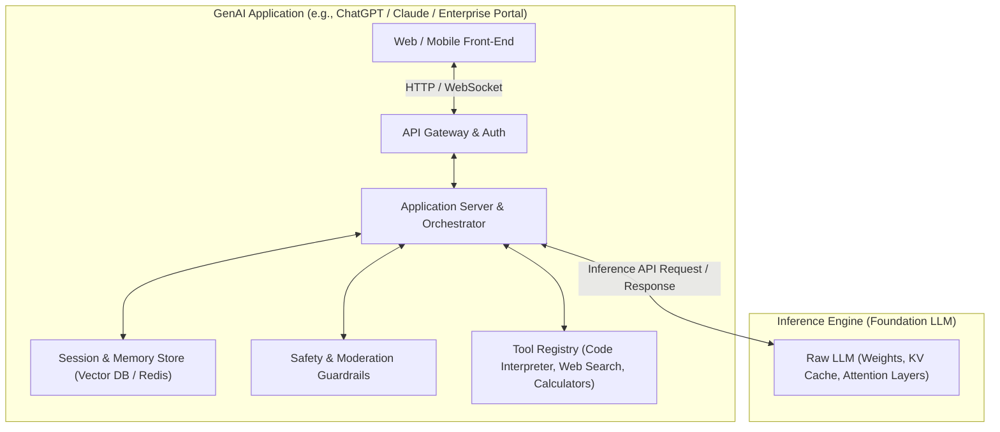
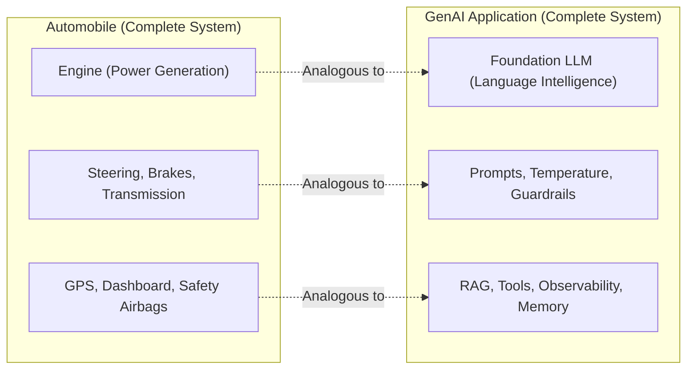
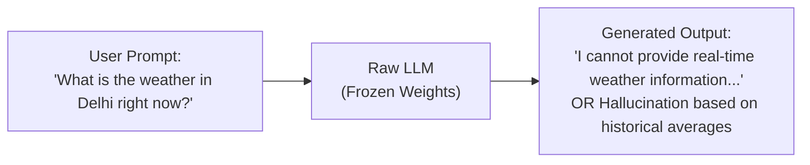
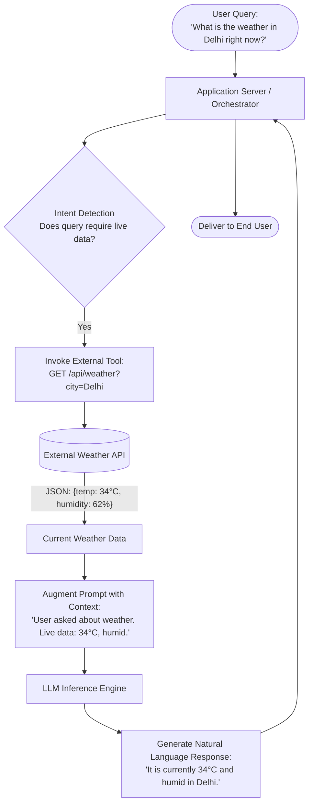
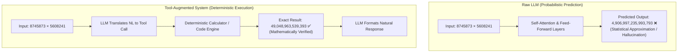
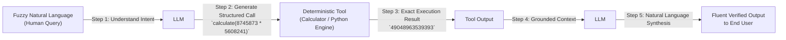
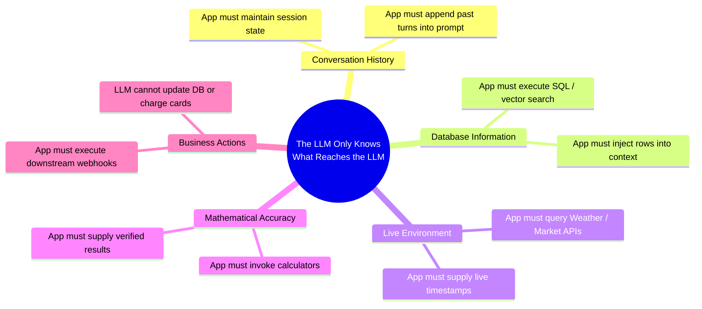
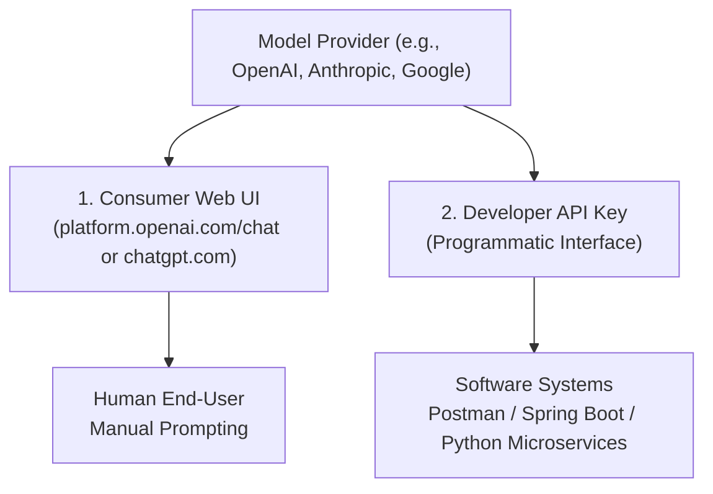

# Chapter 1: GenAI Applications vs. Raw LLMs & The Engine Analogy

> **Chapter Goal:** Establish the foundational distinction between a raw Large Language Model and a production Generative AI application, master the "Engine vs. Car" architectural mental model, understand why LLMs require external deterministic tools, and internalize the cardinal rule of GenAI engineering: *"The LLM only knows what reaches the LLM."*

---

## 1.1 The Crucial Distinction: ChatGPT is More Than an LLM

When software engineers and end users open ChatGPT, Claude, Gemini, or DeepSeek and type a prompt such as:

```text
"Explain Docker to me like I am a beginner."
```

it is easy to succumb to the illusion that the browser is directly conversing with a neural network. In consumer interfaces, the interaction feels immediate and singular: text goes in, text streams out.

However, from an engineering perspective:

> **ChatGPT and an LLM are NOT the same thing.**
> 
> - **An LLM is a core capability** — an autoregressive statistical engine trained to predict probability distributions over tokens.
> - **A GenAI application is the complete software system** — engineered around that capability to manage context, enforce security, provide memory, execute tools, orchestrate workflows, and interface with users.

When you interact with ChatGPT, you are interacting with a complex, distributed cloud application. The underlying model (such as GPT-4o, Claude 3.5 Sonnet, or Gemini 1.5 Pro) is merely one component inside a broader software ecosystem.



---

## 1.2 The Engine vs. Car Architectural Analogy

To intuitively grasp why raw models cannot serve production use cases on their own, consider the analogy of an automobile:

```
Car ────────► GenAI Application
Engine ─────► Large Language Model (LLM)
```

An engine is an extraordinary feat of mechanical engineering. It combusts fuel, rotates a crankshaft, and generates raw mechanical horsepower. However, an engine sitting on a garage workbench is **not** a car:
- You cannot sit in an engine.
- You cannot steer an engine.
- You cannot brake an engine to avoid a collision.
- An engine does not know where you want to go.

To transform raw rotational power into safe, dependable transportation, an automobile manufacturer builds an entire vehicle around the engine:

| Automotive Component | Function in a Vehicle | Corresponding GenAI Application Component | Function in AI Engineering |
| :--- | :--- | :--- | :--- |
| **Engine** | Generates raw mechanical torque | **Raw Foundation LLM** | Generates next-token probability distributions |
| **Transmission & Gears** | Regulates speed and torque delivery | **Decoding Strategies & Temperature** | Converts raw logits into calibrated token outputs |
| **Steering Wheel** | Directs path and trajectory | **System Prompts & Orchestrator** | Enforces persona, operational scope, and task directives |
| **Brakes & Seatbelts** | Halts vehicle and protects passengers | **Safety Guardrails & Moderation** | Filters PII, toxic content, prompt injection, and hallucinations |
| **Fuel Tank & Sensors** | Supplies energy and monitors state | **Context Window & Token Budgeter** | Manages prompt tokens, KV cache limits, and context limits |
| **GPS / Navigation** | Identifies optimal routes to destinations | **RAG & Search Services** | Dynamically retrieves enterprise data to guide output |
| **Dashboard Gauges** | Displays speed, RPM, and engine heat | **Observability & Telemetry** | Tracks latency, token cost, drift, and call metrics |
| **Specialized Tools** | AC, windshield wipers, cruise control | **External Tool Calling (APIs)** | Weather APIs, calculators, SQL engines, compilers |



As a **Forward Deployed Engineer (FDE)**, your primary objective is rarely to train a foundation engine from scratch. Your responsibility is to **engineer the vehicle**: architecting the harness, information pipelines, deterministic guardrails, and integrations that enable the model to solve high-value enterprise problems reliably.

---

## 1.3 Raw LLM vs. Tool-Augmented GenAI Application

To see the operational contrast in practice, examine how a user query is handled by a raw LLM versus an application equipped with external tools.

### Scenario: Real-Time Information Retrieval
Consider the user prompt:
```text
"What is the weather in Delhi right now?"
```

### Approach A: The Raw LLM
A raw model has access only to two sources of information:
1. The static weights learned during pre-training.
2. The exact text contained in the incoming request prompt.



Because foundation models are frozen after training, the raw LLM has no physical sensors, internet connection, or knowledge of the world past its training cutoff date. It must either refuse the query or hallucinate plausible-sounding weather.

### Approach B: GenAI Application with External Tools
In a production application, the software orchestrator intercepts the query and coordinates with deterministic systems:



In this architecture:
- **The LLM provides language intelligence:** Synthesizing unstructured natural language and formulating human-readable explanations.
- **The application provides factual grounding:** Fetching verified, real-time deterministic state from live APIs.

---

## 1.4 Why Do LLMs Need Tools? The Deterministic vs. Probabilistic Divide

Large Language Models are probabilistic token predictors. They calculate the likelihood of subsequent tokens based on statistical co-occurrence across high-dimensional semantic space:

$$P(w_t \mid w_1, w_2, \dots, w_{t-1})$$

While this probabilistic nature makes LLMs brilliant at reasoning over nuanced prose, summarizing ambiguous documents, and translating languages, it makes them fundamentally unreliable for **strict deterministic computation**.

### The Mathematical Hallucination Problem
Consider the multiplication of two seven-digit integers from the lecture diagrams:

$$\mathbf{8{,}745{,}873 \times 5{,}608{,}241 = 49{,}048{,}963{,}539{,}393}$$

If you submit this calculation to a raw foundation LLM without tools:
- The model breaks the numbers into subword or digit tokens.
- It attempts to predict the next number token based on attention patterns across intermediate layers.
- It might produce a plausible-looking result such as:

$$\mathbf{4{,}906{,}997{,}235{,}993{,}793} \quad \text{(INCORRECT)}$$

Notice how deceptively close the hallucinated digits appear. The model reproduced the correct order of magnitude, the starting digit `49`, and the trailing digit `3`, because its attention layers captured the general statistical structure of multi-digit arithmetic. But in enterprise systems (finance, billing, inventory, compliance), "almost right" is completely unacceptable.



### The LLM as a Semantic Router & Translation Bridge
Computers already possess flawless, deterministic tools:
- **Calculators & Math Engines:** Exact arithmetic.
- **Relational Databases & SQL:** ACID-compliant data persistence and filtering.
- **Compilers & Interpreters:** Exact code execution.
- **REST APIs & Microservices:** Real-time business transactions.

However, traditional programs demand **rigid, structured inputs** (JSON, SQL syntax, typed function arguments). Humans communicate in **fuzzy, ambiguous natural language**.

This reveals the primary role of the LLM in modern software architecture: **The LLM acts as a translation bridge between human ambiguity and deterministic computer execution.**



---

## 1.5 The Cutoff Date Problem

Another fundamental limitation documented in the lecture diagrams is the **Knowledge Cutoff**:

```
Model Training Cutoff: e.g., Mid 2024
Current Enterprise Production Time: 2026
```

Between 2024 and 2026, real-world state changes continuously:
- New compliance laws and tax regulations are enacted.
- Internal company microservices are refactored.
- Product catalogs and pricing tiers change.
- Customer account records are updated every second.

An enterprise application cannot function if its core reasoning system believes it is still operating in 2024. The surrounding application must supply current state, current timestamps, and live domain data to bridge the temporal gap.

---

## 1.6 The Cardinal Principle of GenAI Engineering

Every architecture pattern in modern Generative AI engineering descends from one foundational truth:

> [!IMPORTANT]
> ### The Cardinal Rule
> **The LLM only knows what reaches the LLM.**

An LLM is not omniscient. It does not possess a telepathic link to your database, your session cookies, your company wiki, or the live operating system. If a piece of data is not explicitly serialized into the token stream of the prompt context window, **it does not exist for the model**.



### Context Injection Responsibilities Matrix

| Required Capability | What the Raw LLM Has | Engineering Obligation of the Application |
| :--- | :--- | :--- |
| **Multi-Turn Chat History** | Zero memory between API calls (stateless) | Must persist conversation history (e.g. in PostgreSQL or Redis) and prepend relevant turns into each request payload. |
| **Enterprise Knowledge (Wiki, Docs)** | Static knowledge of public web up to cutoff | Must perform Retrieval-Augmented Generation (RAG): chunk, embed, index, vector search, and inject relevant text into the prompt. |
| **Customer Account State** | Zero knowledge of proprietary user records | Must query CRM / user profile microservices and inject customer tier, subscription status, and open tickets into context. |
| **Deterministic Calculations** | Probabilistic approximation (prone to math errors) | Must provide function calling to a sandbox calculator or Python REPL. |
| **Transactional Side Effects** | Zero capability to mutate external systems | Must interpret model output, validate permissions, and call external payment, email, or order fulfillment APIs. |

---

## 1.7 Two Ways to Interact with an LLM

As illustrated in the lecture Excalidraw diagrams, there are two distinct ways to access modern language models:



1. **Consumer Web Interface (`platform.openai.com/chat` or `chatgpt.com`):**
   - Designed for human experimentation and ad-hoc queries.
   - Closed ecosystem where the vendor manages conversation history, UI rendering, and internal tools.
   - Unsuitable for embedding into proprietary enterprise software.

2. **Programmatic API Key (`Authorization: Bearer <API_KEY>`):**
   - Designed for software-to-software communication.
   - Completely stateless: every HTTP request is an isolated event.
   - Empowers developers to build custom enterprise GenAI systems using Postman, curl, Python, or Java (Spring AI).

In the subsequent chapter, we will transition from consumer interfaces to developer APIs by examining how to communicate with an LLM directly over HTTP.
