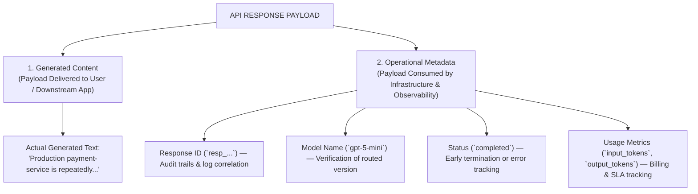
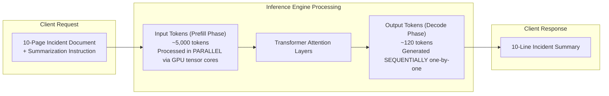
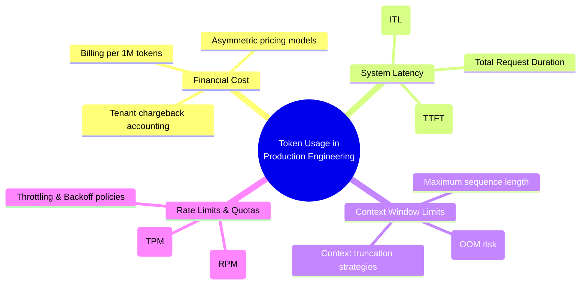
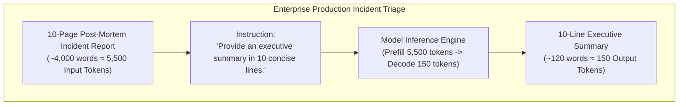

# Chapter 3: Token Economics, Metadata & Production Engineering

> **Chapter Goal:** Deconstruct the anatomy of an LLM API JSON response, master the architectural difference between input (prefill) and output (decode) token streams, and analyze how token metrics govern the four core production engineering constraints: usage accounting, financial cost, generation latency, and context window limits.

---

## 3.1 Anatomy of an LLM API JSON Response

When an LLM provider completes inference and responds to an API request, the HTTP `200 OK` response payload contains far more than just raw generated text. 

A standard production response separates clean generated text from operational system metadata:

```json
{
  "id": "resp_01j8k9x4m2nb7v5c1p9q3w8z",
  "object": "response",
  "status": "completed",
  "model": "gpt-5-mini",
  "output": [
    {
      "type": "message",
      "role": "assistant",
      "content": [
        {
          "type": "output_text",
          "text": "Production payment-service is repeatedly restarting and causing intermittent 502 errors. Manual restarts only temporarily resolve the issue."
        }
      ]
    }
  ],
  "usage": {
    "input_tokens": 150,
    "output_tokens": 40,
    "total_tokens": 190
  }
}
```



### The Architectural Division of Responsibilities
1. **The Generated Content:** Extracted and forwarded to the frontend UI or mapped to downstream business logic.
2. **The Metadata:** Recorded into enterprise telemetry, APM systems (Datadog, Prometheus, Dynatrace), and billing pipelines to monitor cost per customer tenant and verify SLA compliance.

---

## 3.2 The Two Token Streams: Input Tokens vs. Output Tokens

In Lecture 02, tokens were explored as linguistic subwords and integer IDs in a vocabulary ($V \approx 100{,}000$). In production engineering, tokens are divided into two fundamentally distinct streams:

```
REQUEST  ──► [ Input Tokens  ] ──► [ Model Inference ] ──► [ Output Tokens ] ──► RESPONSE
               (What Model Reads)                            (What Model Writes)
```



### Mechanical & Algorithmic Differences

| Attribute | Input Tokens (Prompt / Prefill Phase) | Output Tokens (Generation / Decode Phase) |
| :--- | :--- | :--- |
| **Definition** | The text supplied by the user, system prompts, retrieved context, and conversation history. | The new tokens generated by the model during the forward pass. |
| **Hardware Execution** | **Compute-Bound:** All input tokens are projected into matrices and processed **in parallel** in a single GPU forward pass. | **Memory-Bandwidth Bound:** Tokens are generated **autoregressively, one token at a time**, requiring a full memory read of all weights and KV cache for each token. |
| **Latency Profile** | Low marginal latency per token ($O(1)$ batch forward pass). | High latency per token ($O(N)$ sequential steps governed by memory clock cycles). |
| **Pricing Ratio** | Substantially cheaper (typically $1\times$). | Substantially more expensive (typically $3\times$ to $4\times$ the price of input tokens). |

---

## 3.3 Token Usage as a Core Engineering Concern

In production systems, tokens are not theoretical mathematical abstractions. Tokens directly dictate the **economics, performance, and stability** of your software system.



### 1. Financial Cost Modeling
Unlike traditional web APIs billed per request, LLM APIs are billed per token consumed:

$$\text{Total Cost} = \left( N_{\text{input}} \times P_{\text{input}} \right) + \left( N_{\text{output}} \times P_{\text{output}} \right)$$

Where:
- $N_{\text{input}}$ = Total number of prompt tokens (including system prompts, tools schemas, chat history).
- $N_{\text{output}}$ = Total number of completion tokens generated.
- $P_{\text{input}}$ = Unit price per input token (typically stated per 1 Million tokens).
- $P_{\text{output}}$ = Unit price per output token (typically $3\times - 4\times$ higher than $P_{\text{input}}$).

#### Numerical Example:
Suppose an enterprise support summarizer handles $100{,}000$ support tickets per day:
- Average input tokens per ticket: $1{,}200$ tokens
- Average output summary tokens: $80$ tokens
- Pricing: $\$0.15$ per 1M input tokens, $\$0.60$ per 1M output tokens

$$\text{Daily Input Tokens} = 100{,}000 \times 1{,}200 = 120{,}000{,}000 \text{ tokens} \implies 120 \times \$0.15 = \$18.00$$

$$\text{Daily Output Tokens} = 100{,}000 \times 80 = 8{,}000{,}000 \text{ tokens} \implies 8 \times \$0.60 = \$4.80$$

$$\text{Total Daily Cost} = \$18.00 + \$4.80 = \$22.80/\text{day} \quad (\$684.00/\text{month})$$

If an inexperienced engineer carelessly includes unnecessary verbose logs or redundant prompt boilerplate, increasing input tokens from $1{,}200$ to $10{,}000$ tokens per ticket, the monthly bill multiplies from $\$684$ to over $\$4{,}500$ without adding any business value.

---

### 2. Latency & User Experience Metrics

End-to-end response time in LLM applications is broken down into two critical metrics:

```mermaid
gantt
    title LLM Request Latency Profile
    dateFormat  X
    axisFormat %s s
    section Network
    HTTP Request Transit :0, 200
    section Prefill Phase
    Tokenization & Prompt Evaluation (TTFT) :200, 600
    section Decode Phase
    Token 1 Generation :600, 650
    Token 2 Generation :650, 700
    Token 3 Generation :700, 750
    Token 4 Generation :750, 800
    Token N Generation :800, 1500
    section Return
    HTTP Response Transit :1500, 1650
```



1. **Time To First Token (TTFT):** The duration from when the request is sent until the first token is generated. This is determined by network round-trip time, tokenization speed, and prompt prefill computation.
2. **Inter-Token Latency (ITL) / Time Per Output Token (TPOT):** The time required to generate each subsequent token. Because generation is sequential, total decode time scales linearly with the number of generated tokens:

$$\text{Total Latency} \approx \text{TTFT}(N_{\text{input}}) + \left( N_{\text{output}} \times \text{ITL} \right) + \Delta t_{\text{network}}$$

> [!TIP]
> **Engineering Rule of Thumb:** If an application feels slow, constraining $N_{\text{output}}$ (e.g., instructing the model: *"Summarize in exactly 2 bullet points"*) yields a direct, linear reduction in total latency.

---

### 3. Context Window Saturation & Memory Footprint
Every foundation model has a fixed maximum context limit (e.g., 32k, 128k, or 1M tokens). This limit represents the **sum of input and output tokens**:

$$N_{\text{input}} + N_{\text{output}} \le C_{\text{max\_context}}$$

If an application submits a prompt of $32{,}700$ tokens to a model with a $32{,}768$ token window:
- Only $68$ tokens remain for the generated response.
- The model will abruptly cut off in mid-sentence with `finish_reason: "length"`, corrupting data integrity.
- In self-hosted inference (vLLM / TensorRT-LLM), the **Key-Value (KV) Cache** grows linearly with context length, threatening GPU out-of-memory (OOM) crashes.

---

### 4. Quotas & Rate Limiting (TPM vs. RPM)
Cloud providers enforce two independent rate-limiting thresholds:
- **Requests Per Minute (RPM):** Maximum number of HTTP calls permitted per minute.
- **Tokens Per Minute (TPM):** Maximum total tokens (input + output) allowed across all calls within a rolling 60-second window.

Even if your application sends only 10 requests per minute (well below a 500 RPM threshold), if each request submits a massive 100k-token legal brief, you will instantly exceed a 500k TPM quota and receive `HTTP 429 Too Many Requests`.

---

## 3.4 Production Case Study: The 10-Page Incident Report

Consider an incident management platform processing major production outages:



### Token Ledger Breakdown

| Phase | Content | Word Count | Token Count | Cost ($0.15/M in, $0.60/M out) | Latency Profile |
| :--- | :--- | :--- | :--- | :--- | :--- |
| **Input (Prefill)** | Incident history, container metrics, stack traces, instruction | ~4,000 words | **5,500 tokens** | $\$0.000825$ | Processed in parallel (~250 ms) |
| **Output (Decode)** | 10 bullet points with root cause and mitigation steps | ~120 words | **150 tokens** | $\$0.000090$ | Generated autoregressively (~30 ms/tok ≈ 4,500 ms) |
| **Total** | Full request round-trip | ~4,120 words | **5,650 tokens** | **$\$0.000915$** | **~4.95 seconds** |

### Key Architectural Takeaway
Notice the extreme asymmetry:
- **Input tokens accounted for 97% of the data volume and 90% of the cost.**
- **Output tokens accounted for only 3% of the data volume, but 95% of the total request latency.**

Understanding these token mechanics is what separates an amateur prompt writer from an enterprise Forward Deployed Engineer. In Chapter 4, we move beyond Postman and build our automated Java microservice using **Spring AI**.
