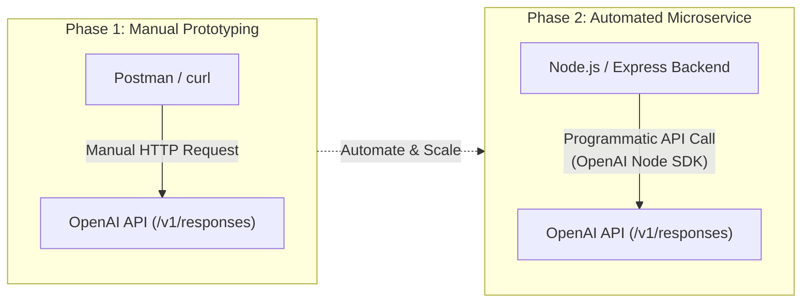
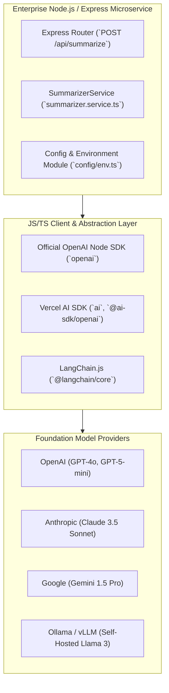
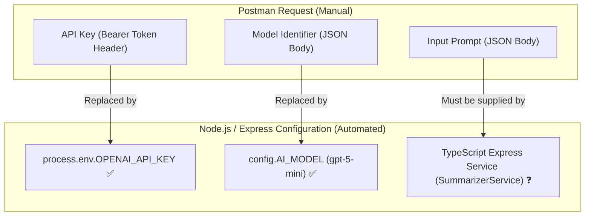

# Chapter 4: Node.js & Express Architecture and JS/TS Environment Setup

> **Chapter Goal:** Transition from manual Postman experimentation to production Node.js & Express applications, understand the JavaScript/TypeScript AI ecosystem, initialize a modern TypeScript project with strict typing, implement enterprise secret management via `.env`, configure models declaratively, and map Postman request parameters into Node.js application architecture.

---

## 4.1 Moving from Postman to Production Node.js Applications

In Chapter 2, Postman demonstrated that communicating with an LLM is fundamentally an HTTP API exchange. However, enterprise systems cannot rely on manual API clients:

- Postman cannot be triggered by real-time customer traffic, asynchronous webhooks, or message brokers (Kafka, RabbitMQ, SQS).
- Postman cannot run input validation, database persistence, retry loops, or distributed tracing.
- Manual queries cannot integrate with web frontends or backend microservices.

To operationalize AI capabilities, our **application backend must initiate, control, and monitor the communication**.



---

## 4.2 The JavaScript / TypeScript AI Ecosystem

In modern full-stack and microservice architectures, **Node.js with TypeScript and Express** is one of the most widely deployed application runtimes. To interact with foundation models cleanly, the JS/TS ecosystem provides multiple tiers of client libraries:

```
OpenAI / Anthropic / Google Gemini
                 ↓
      Actual Foundation Models

        OpenAI Node SDK (openai) / Vercel AI SDK
                 ↓
  JS/TS Abstractions & Client Runtimes for AI
```



### Essential Principles:
- **Client SDKs do NOT generate intelligence:** They do not contain model weights or neural networks.
- **The model provider runs inference:** OpenAI, Anthropic, or local inference engines (vLLM/Ollama) execute the forward pass.
- **The SDK provides idiomatic tooling:** It provides TypeScript interfaces, network retry policies, connection pooling, streaming primitives (AsyncIterables), and structured schema validation.

---

## 4.3 Initializing the Node.js + Express TypeScript Project

To build our production support ticket summarizer, we set up a modern Node.js application configured with TypeScript, Express, and the official OpenAI SDK.

### Step 1: Initialize Project & Install Dependencies

```bash
mkdir support-summarizer-service
cd support-summarizer-service

# Initialize package.json
npm init -y
```

Install runtime dependencies:
```bash
npm install express dotenv openai zod
```

Install TypeScript and developer tooling:
```bash
npm install -D typescript @types/node @types/express tsx
```

### Step 2: Configure `package.json`

```json
{
  "name": "support-summarizer-service",
  "version": "1.0.0",
  "type": "module",
  "scripts": {
    "dev": "tsx watch src/server.ts",
    "build": "tsc",
    "start": "node dist/server.js"
  },
  "dependencies": {
    "dotenv": "^16.4.5",
    "express": "^4.21.0",
    "openai": "^4.67.0",
    "zod": "^3.23.8"
  },
  "devDependencies": {
    "@types/express": "^4.17.21",
    "@types/node": "^22.7.4",
    "tsx": "^4.19.1",
    "typescript": "^5.6.2"
  }
}
```

### Step 3: Configure `tsconfig.json`

```json
{
  "compilerOptions": {
    "target": "ES2022",
    "module": "NodeNext",
    "moduleResolution": "NodeNext",
    "lib": ["ES2022"],
    "outDir": "./dist",
    "rootDir": "./src",
    "strict": true,
    "esModuleInterop": true,
    "skipLibCheck": true,
    "forceConsistentCasingInFileNames": true
  },
  "include": ["src/**/*"]
}
```

---

## 4.4 Enterprise Secret Management: Configuring the API Key

Recall what we manually provided in Postman:

```
Authorization ──► Bearer Token ──► API Key
```

Our Node.js application requires the exact same credential to authorize outgoing HTTP requests against the provider's API. Instead of manually assembling `Authorization: Bearer <token>` headers on every request, the OpenAI SDK automatically reads the key from the environment variable:

```bash
process.env.OPENAI_API_KEY
```

### The Correct Pattern: Environment Variables & `.env`
Create a `.env` file in the root directory (and add it to `.gitignore`):

```ini
# .env file (DO NOT COMMIT TO GIT)
PORT=8080
OPENAI_API_KEY=sk-proj-xxxxxxxxxxxxxxxxxxxxxxxxxxxxxxxx
AI_MODEL=gpt-5-mini
AI_TEMPERATURE=0.3
```

Ensure `.gitignore` contains:
```gitignore
node_modules/
dist/
.env
```

Supply the key in production via container secrets, AWS Secrets Manager, or shell export:

```bash
export OPENAI_API_KEY="sk-proj-xxxxxxxxxxxxxxxxxxxxxxxxxxxxxxxx"
```

### The Dangerous Anti-Pattern: Hardcoded Secrets

> [!CAUTION]
> **NEVER HARDCODE API CREDENTIALS IN TYPESCRIPT FILES:**
> ```typescript
> // DANGEROUS ANTI-PATTERN: DO NOT DO THIS
> const openai = new OpenAI({
>   apiKey: "sk-proj-98721349817239481729384719283749" // ❌ SECURITY DISASTER
> });
> ```
> **Why this is catastrophic:**
> 1. Automated scanners (GitGuardian, Trufflehog, GitHub Secret Scanning) detect committed keys within seconds.
> 2. Leaked keys are instantly hijacked by botnets to burn thousands of dollars in GPU inference credits.
> 3. Keys committed to Git history persist indefinitely even after deletion commits, requiring immediate key revocation and repository scrubbing.

---

## 4.5 Declarative Configuration Module

In production, hardcoding environment variables throughout business logic leads to subtle bugs and runtime crashes. A Forward Deployed Engineer centralizes and validates all configuration upon application startup.

Create `src/config/env.ts` with strict validation using **Zod**:

```typescript
import dotenv from 'dotenv';
import { z } from 'zod';

// Load variables from .env
dotenv.config();

const envSchema = z.object({
  PORT: z.coerce.number().default(8080),
  OPENAI_API_KEY: z.string().min(1, 'OPENAI_API_KEY is required in environment'),
  AI_MODEL: z.string().default('gpt-5-mini'),
  AI_TEMPERATURE: z.coerce.number().min(0).max(2).default(0.3),
});

export const config = envSchema.parse({
  PORT: process.env.PORT,
  OPENAI_API_KEY: process.env.OPENAI_API_KEY,
  AI_MODEL: process.env.AI_MODEL,
  AI_TEMPERATURE: process.env.AI_TEMPERATURE,
});
```

If the developer forgets to set `OPENAI_API_KEY`, the application fails fast immediately on boot with a clear error message, rather than failing mid-transaction during customer traffic.

---

## 4.6 The Transition Matrix: What Have We Replaced So Far?

Let us evaluate the architectural progression from our manual Postman request to our automated Node.js environment:



### Transition State Table

| Request Prerequisite | In Postman | In Node.js / Express Architecture | Status |
| :--- | :--- | :--- | :--- |
| **1. Endpoint** | Hardcoded URL (`https://api.openai.com/v1/responses`) | Handled automatically by OpenAI client SDK | **Automated** ✅ |
| **2. API Key (Who?)** | Manually pasted Bearer Token | `process.env.OPENAI_API_KEY` validated by Zod | **Automated** ✅ |
| **3. Model (Which?)** | `"model": "gpt-5-mini"` in JSON | `config.AI_MODEL: 'gpt-5-mini'` | **Automated** ✅ |
| **4. Input (What?)** | `"input": "Summarize..."` in JSON | **Where will dynamic customer text come from?** | **In Progress** 🔄 |

Both the network endpoint, security credentials, and model choice are now completely externalized into declarative application configuration.

The only remaining question is: **How does our Express code dynamically accept incoming customer support tickets and dispatch them to the model?** 

This brings us to the core implementation in Chapter 5: building the **`SummarizerService`** and Express REST route.
