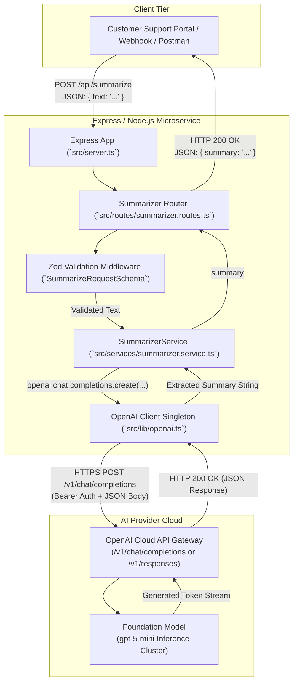
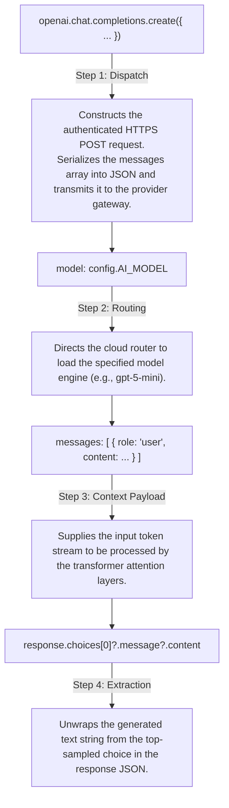

# Chapter 5: Building the Production Support Ticket Summarizer

> **Chapter Goal:** Implement a production-grade Support Ticket Summarizer microservice using Node.js, Express, and TypeScript; encapsulate the OpenAI client singleton; build a strongly-typed `SummarizerService`; expose an enterprise REST API endpoint with Zod schema validation; and trace the complete request lifecycle from client ingestion to cloud inference.

---

## 5.1 Architecture of the Production Support Summarizer in Express

In Chapter 4, we initialized our TypeScript project and configured environment variables in `src/config/env.ts`. Now, we construct the application layers that connect incoming customer data to LLM inference.

We are implementing a clean, modular three-tier architecture:



---

## 5.2 The OpenAI Client Singleton (`src/lib/openai.ts`)

In Node.js, creating a new SDK client instance on every incoming HTTP request is an anti-pattern. A single client instance should be created and shared across the application. This ensures:
- **Connection Pooling & HTTP Keep-Alive:** Avoids repeated TLS handshake overhead on every incoming ticket.
- **Thread Safety in Node's Event Loop:** The client is stateless and manages asynchronous requests via standard promises.

Create `src/lib/openai.ts`:

```typescript
import OpenAI from 'openai';
import { config } from '../config/env.js';

// Export a configured singleton instance of the OpenAI SDK
export const openai = new OpenAI({
  apiKey: config.OPENAI_API_KEY,
  maxRetries: 3, // Automatic exponential backoff on HTTP 429/500 errors
  timeout: 30000, // 30-second timeout to prevent hanging connections
});
```

---

## 5.3 Deconstructing the OpenAI SDK Invocation

Let us examine the core invocation syntax in the Node.js SDK:

```typescript
const response = await openai.chat.completions.create({
  model: config.AI_MODEL,
  messages: [
    {
      role: 'user',
      content: `Summarize this support ticket:\n\nPayment was deducted but my order is still processing.`,
    },
  ],
  temperature: config.AI_TEMPERATURE,
});

const summary = response.choices[0]?.message?.content ?? '';
```

Rather than memorizing this as arbitrary syntax, understand the exact responsibility of each component:



### Comparison: Node.js SDK vs. Postman Operations

| Node.js SDK Call | Conceptual Operation | Equivalent Action in Postman |
| :--- | :--- | :--- |
| `openai.chat.completions.create({...})` | Transmit HTTP request | Click the blue **Send** button |
| `model: 'gpt-5-mini'` | Specify model | Add `"model": "gpt-5-mini"` to JSON body |
| `messages: [{ role: 'user', content }]` | Provide input text | Add `"input": "..."` or `"messages"` to body |
| `apiKey: process.env.OPENAI_API_KEY` | Authenticate | Add `Authorization: Bearer <key>` header |
| `response.choices[0].message.content` | Unpack generated text | Inspect generated content in response tab |

---

## 5.4 Dynamic Prompt Parameterization in `SummarizerService`

In production, support tickets are dynamic strings submitted by real customers. We encapsulate the summarization logic inside a dedicated service class in `src/services/summarizer.service.ts`:

```typescript
import { openai } from '../lib/openai.js';
import { config } from '../config/env.js';

export class SummarizerService {
  /**
   * Generates a concise two-sentence executive summary of an incoming customer ticket.
   *
   * @param ticket - The raw text of the customer support ticket.
   * @returns A promise resolving to the generated summary string.
   */
  async summarize(ticket: string): Promise<string> {
    const prompt = `Summarize this support ticket in two sentences:\n\n${ticket}`;

    const completion = await openai.chat.completions.create({
      model: config.AI_MODEL,
      messages: [
        {
          role: 'user',
          content: prompt,
        },
      ],
      temperature: config.AI_TEMPERATURE,
    });

    const summary = completion.choices[0]?.message?.content;

    if (!summary) {
      throw new Error('LLM failed to return a valid summary response.');
    }

    return summary.trim();
  }
}

// Export singleton service instance
export const summarizerService = new SummarizerService();
```

---

## 5.5 Exposing the Summarizer as an Express REST API

To enable external microservices, web portals, and webhooks to utilize our summarizer, we expose a standard REST endpoint using Express.

### Step 1: Define Request Validation Schema (`src/routes/summarizer.routes.ts`)
Using **Zod**, we reject empty, invalid, or malformed requests before they ever reach the paid OpenAI API:

```typescript
import { Router, Request, Response, NextFunction } from 'express';
import { z } from 'zod';
import { summarizerService } from '../services/summarizer.service.js';

export const summarizerRouter = Router();

// Define input validation schema
const summarizeRequestSchema = z.object({
  text: z
    .string({ required_error: 'Field "text" is required.' })
    .min(10, 'Ticket text must be at least 10 characters long.')
    .max(20000, 'Ticket text exceeds maximum character limit of 20,000.'),
});

// POST /api/summarize
summarizerRouter.post(
  '/summarize',
  async (req: Request, res: Response, next: NextFunction): Promise<void> => {
    try {
      // 1. Validate incoming JSON body
      const parsed = summarizeRequestSchema.safeParse(req.body);

      if (!parsed.success) {
        res.status(400).json({
          error: 'Validation failed',
          details: parsed.error.flatten().fieldErrors,
        });
        return;
      }

      // 2. Delegate to SummarizerService
      const summary = await summarizerService.summarize(parsed.data.text);

      // 3. Return HTTP 200 OK with structured response
      res.status(200).json({
        success: true,
        summary,
      });
    } catch (error) {
      next(error);
    }
  }
);
```

### Step 2: Assemble Express Application (`src/server.ts`)
Create the application entry point with JSON body parsing, CORS support, and global error handling:

```typescript
import express, { Request, Response, NextFunction } from 'express';
import { config } from './config/env.js';
import { summarizerRouter } from './routes/summarizer.routes.js';

const app = express();

// Middleware: parse incoming application/json bodies
app.use(express.json({ limit: '2mb' }));

// Health check endpoint
app.get('/health', (_req: Request, res: Response) => {
  res.status(200).json({ status: 'UP', model: config.AI_MODEL });
});

// Mount AI feature routes
app.use('/api', summarizerRouter);

// Global error-handling middleware
app.use((err: Error, _req: Request, res: Response, _next: NextFunction) => {
  console.error('Unhandled Application Error:', err);
  res.status(500).json({
    error: 'Internal Server Error',
    message: err.message || 'An unexpected error occurred while processing the request.',
  });
});

// Start HTTP server
app.listen(config.PORT, () => {
  console.log(`🚀 Support Summarizer Microservice running on port ${config.PORT}`);
  console.log(`🤖 Configured AI Model: ${config.AI_MODEL}`);
});
```

---

## 5.6 End-to-End Execution Trace & Call Stack

Let us follow the lifecycle of a production request:

### Step 1: Customer Submits Ticket via HTTP POST
An automated incident intake pipeline triggers our REST endpoint:

```bash
curl -X POST http://localhost:8080/api/summarize \
  -H "Content-Type: application/json" \
  -d '{
    "text": "Payment was deducted three days ago but the order still shows Payment Processing. I contacted support twice and need the product tomorrow for my daughters birthday."
  }'
```

### Step 2: Express Middleware & Schema Validation
1. `express.json()` parses the raw TCP stream into `req.body`.
2. `summarizeRequestSchema.safeParse(req.body)` checks that `text` exists and satisfies length constraints.

### Step 3: Service Invocation
The route handler calls:
```typescript
const summary = await summarizerService.summarize(parsed.data.text);
```

### Step 4: OpenAI SDK Dispatch
1. `openai.chat.completions.create(...)` constructs an authenticated HTTP POST payload to `https://api.openai.com/v1/chat/completions`.
2. The payload contains `model: 'gpt-5-mini'` and the formatted prompt in the `messages` array.
3. The TLS socket transmits the request to OpenAI's edge gateway.

### Step 5: Inference & Delivery
1. The cloud gateway validates the Bearer token, checks token rate limits, and routes to GPU clusters.
2. The transformer processes input tokens and autoregressively generates the summary:
   ```text
   "The customer was charged three days ago but their order remains in processing. They urgently need the item tomorrow for a birthday after two previous support inquiries."
   ```
3. Express formats the response and returns HTTP `200 OK`:
   ```json
   {
     "success": true,
     "summary": "The customer was charged three days ago but their order remains in processing. They urgently need the item tomorrow for a birthday after two previous support inquiries."
   }
   ```

We have successfully engineered our first production-ready GenAI API in Node.js & Express! In Chapter 6, we analyze how to capture rich token metadata and resolve a critical prompt injection vulnerability present in our current implementation.
