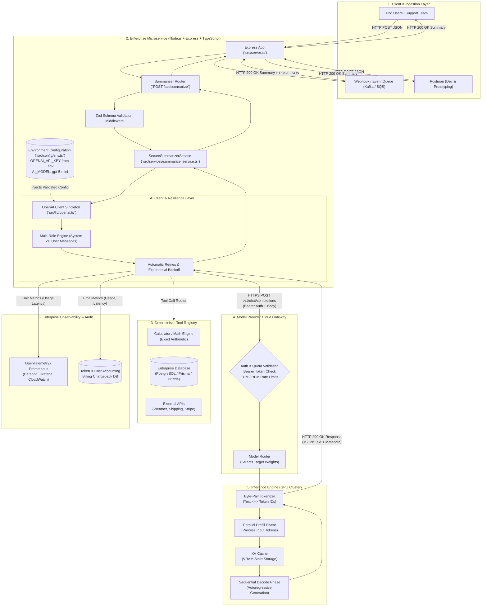

# Chapter 7: Complete Application Pipeline & Key Takeaways

> **Chapter Goal:** Synthesize the entire Lecture 03 journey into a unified master enterprise architecture diagram, compare the three integration tiers (Postman vs. Raw HTTP vs. Node.js & Express AI SDKs), review the complete conceptual mindmap, and deliver 20 actionable engineering principles for Forward Deployed Engineers.

---

## 7.1 Master Architecture Diagram: Enterprise GenAI Application Topology

The diagram below captures the complete end-to-end architecture of a production Generative AI application, integrating client entry points, Node.js & Express microservices, security configurations, cloud inference pipelines, external deterministic tools, and telemetry.



---

## 7.2 Comparative Synthesis: Postman vs. Raw HTTP vs. Node.js & Express AI SDKs

Understanding when and why to transition between integration paradigms is a vital skill for an enterprise engineer:

| Dimension | Tier 1: Postman / curl | Tier 2: Raw HTTP Client (`fetch` / `axios`) | Tier 3: Node.js & Express with AI SDKs |
| :--- | :--- | :--- | :--- |
| **Primary Purpose** | Ad-hoc manual prototyping & endpoint verification. | Quick internal scripting or lightweight throwaways. | Enterprise production services, resilient microservices. |
| **Execution Mode** | Manual human interaction. | Programmatic, manual JSON assembly. | Programmatic, modular, strongly-typed TypeScript. |
| **Credential Safety** | Environment variables in Postman workspace. | Must manually read `process.env`. | Validated on boot with Zod schemas in `src/config/env.ts`. |
| **Model Portability** | None (manual URL and body editing per provider). | Extremely poor (tightly coupled to provider-specific schemas). | **Exceptional** (swap providers via unified SDKs like Vercel AI SDK). |
| **Streaming Support** | Primitive SSE console output. | High manual complexity (custom chunked stream parser). | **Native** (simple `for await (const chunk of stream)` async loops). |
| **Structured Output** | None (manual visual JSON inspection). | Manual JSON parsing & fragile regex sanitization. | **Native** (Zod-based `response_format` and typed schemas). |
| **Tool / Function Calling**| None. | High manual complexity (manual schema authoring & loop handling). | **Native** (typed function schemas with automated multi-turn execution). |
| **Observability & Audit** | Manual eyeball inspection of headers. | Requires manual interceptor development. | **Native** (automatic integration with OpenTelemetry and APM). |
| **Maintenance Burden** | High for production workloads. | High as requirements scale. | **Minimal** (maintained by open-source foundation SDK teams). |

---

## 7.3 Conceptual Mindmap of Lecture 03

```mermaid
mindmap
  root(("Talking to an LLM<br/>from Your Application"))
    1. GenAI App vs. Raw LLM
      ::icon(fa fa-car)
      Raw LLM is an Engine (Power)
      GenAI App is the Vehicle (Controls)
      Static weights & cutoff date (2024 vs 2026)
      The Cardinal Rule: LLM only knows what reaches it
    2. Need for External Tools
      ::icon(fa fa-wrench)
      Probabilistic prediction vs. deterministic computation
      Math failure: 8,745,873 x 5,608,241 hallucination
      LLM as Translation Bridge (NL to Structured Calls)
      Tools: Calculator, DB, Weather, Compilers
    3. API Architecture & Postman
      ::icon(fa fa-network-wired)
      Standard HTTP client-server model
      Four Invariant Components: Endpoint, Auth, Model, Input
      Postman validation workflow (Bearer token, JSON body)
      Enterprise case study: 2-line ticket summarizer
    4. Token Economics
      ::icon(fa fa-coins)
      Input Tokens (Prefill, parallel, compute-bound)
      Output Tokens (Decode, sequential, memory-bound)
      The 4 Engineering Pillars: Cost, Latency, Limits, Quotas
      Time to First Token (TTFT) vs. Inter-Token Latency (ITL)
    5. Node.js & Express TS Setup
      ::icon(fa fa-node-js)
      Client runtime over foundation model providers
      Dependencies: express, dotenv, openai, zod, tsx
      Secure secret management via .env and Zod validation
      Centralized configuration module (src/config/env.ts)
    6. Express Microservice Architecture
      ::icon(fa fa-code)
      OpenAI Client Singleton (src/lib/openai.ts)
      Strongly-typed SummarizerService implementation
      Express REST route (POST /api/summarize) with Zod validation
      Global error middleware & health check endpoints
    7. Metadata & Prompt Hygiene
      ::icon(fa fa-shield-alt)
      Extracting Usage & finish_reason in TypeScript
      The string concatenation flaw: Instructions + User Data
      Prompt injection & Goal hijacking risks
      Multi-role architecture: System vs. User vs. Assistant
```

---

## 7.4 20 Essential Forward Deployed Engineering Takeaways

1. **ChatGPT is an Application, Not Just a Model:** An LLM is a capability; a GenAI application is the complete software vehicle engineered around that capability to manage context, enforce safety, and execute actions.
2. **The Engine vs. Car Mental Model:** An engine generates raw horsepower, but you cannot steer or brake without the rest of the car. The LLM generates language tokens; your application provides memory, tools, guardrails, and user interfaces.
3. **The Cardinal Law of GenAI Engineering:** *The LLM only knows what reaches the LLM.* If session history, database rows, live weather, or current timestamps are not serialized into the prompt context window, the model cannot access them.
4. **LLMs are Probabilistic, Not Deterministic:** Language models predict next-token probability distributions; they do not perform arithmetic. Never rely on raw LLM inference for mission-critical calculations, math, or exact financial figures.
5. **The Semantic Router Pattern:** The primary superpower of an LLM in enterprise architectures is acting as a natural language bridge—translating ambiguous human intent into structured deterministic tool invocations (JSON/SQL).
6. **LLM Communication is Standard HTTP:** There is no magic protocol connecting applications to cloud AI. Interacting with foundation models is fundamentally an HTTP POST request carrying JSON over TLS.
7. **The Four Invariant Request Components:** Every LLM API request requires four answers: **Where?** (Endpoint), **Who?** (Authentication/API Key), **Which engine?** (Model Identifier), and **What to process?** (Input Payload).
8. **Always Prototype in Postman First:** Before writing complex backend microservice code, validate your prompt, target model, and response quality using an API client like Postman or curl.
9. **Never Hardcode API Credentials:** Committing API keys to source repositories leads to immediate key compromise and massive financial losses. Always inject credentials through environment variables (`OPENAI_API_KEY`) and validate them on startup with Zod.
10. **JSON Responses Contain Two Tiers of Data:** Every API response separates clean **Generated Content** (for end users) from **Operational Metadata** (for audit logs, tracing, and billing).
11. **Understand the Asymmetry of Input vs. Output Tokens:** Input tokens are prefilled in parallel on GPU tensor cores; output tokens are generated sequentially one by one. Output tokens take vastly longer to produce and typically cost $3\times$ to $4\times$ more per token.
12. **Tokens are an Operational Constraint:** Tokens govern four non-negotiable production metrics: financial billing cost, generation latency, context window saturation, and rate-limiting quotas (TPM/RPM).
13. **Latency is Dominated by Output Token Count:** Total generation time scales linearly with output token length: $\text{Total Latency} \approx \text{TTFT} + (N_{\text{output}} \times \text{ITL})$. If your service is slow, constrain output token length in your instructions.
14. **Use Client Singletons in Node.js:** Avoid instantiating `new OpenAI()` on every HTTP request. Maintain a configured client singleton to preserve HTTP keep-alive connections and reuse connection pools across Express requests.
15. **Validate Input Payloads Early:** Use runtime validation libraries like **Zod** in Express middleware to reject empty, invalid, or overly large payloads before making expensive cloud API calls.
16. **Deconstruct the SDK Parameters:** Understand what every property accomplishes: `model` directs traffic to target GPU clusters; `messages` supplies the conversational token context; `temperature` regulates output probability entropy.
17. **Access Telemetry via `response.usage`:** Production microservices should not discard response metadata. Extract `prompt_tokens`, `completion_tokens`, and `finish_reason` to log into APM dashboards and billing ledgers.
18. **The Danger of String Concatenation:** Concatenating application instructions with untrusted user text (`const prompt = "Summarize: " + ticket`) creates severe prompt injection vulnerabilities where malicious user data can hijack model behavior.
19. **Enforce Role-Based Privilege Separation:** Treat untrusted user data as unprivileged payload. Use **System Messages** (`role: 'system'`) to define immutable business rules and **User Messages** (`role: 'user'`) strictly for external input data.
20. **The FDE Mission:** Forward Deployed Engineers do not merely write prompts. FDEs architect robust, grounded, observable, and secure production systems that harness probabilistic AI models to deliver deterministic enterprise value.
